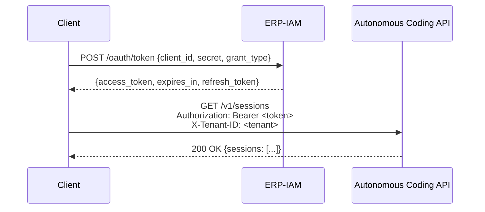

# ERP-Autonomous-Coding -- API Reference

## Document Information

| Field | Value |
|-------|-------|
| Module | ERP-Autonomous-Coding |
| Version | 1.0.0 |
| Last Updated | 2026-02-23 |
| Base URL | `https://api.erp.dev/autonomous-coding/v1` |
| Auth | Bearer JWT (via ERP-IAM) |

---

## 1. Authentication

All API requests require a valid JWT obtained from ERP-IAM and a tenant identifier.

```
Authorization: Bearer <jwt-token>
X-Tenant-ID: <tenant-uuid>
Content-Type: application/json
```



---

## 2. Health & Discovery

### GET /healthz

Health check endpoint. No authentication required.

**Response (200)**:
```json
{
  "status": "healthy",
  "service": "autonomous-coding-api",
  "version": "1.0.0",
  "uptime_seconds": 86400
}
```

### GET /v1/capabilities

Returns module capabilities and feature flags.

**Response (200)**:
```json
{
  "module": "ERP-Autonomous-Coding",
  "version": "1.0.0",
  "capabilities": [
    "autonomous_coding",
    "code_generation",
    "code_review",
    "test_generation",
    "github_integration",
    "gitlab_integration",
    "bitbucket_integration",
    "azure_devops_integration",
    "jetbrains_plugin",
    "vscode_extension",
    "vim_neovim_plugin",
    "emacs_package",
    "sandboxed_execution",
    "ci_cd_orchestration",
    "security_scanning",
    "erp_module_development",
    "pr_management",
    "issue_triage",
    "code_refactoring",
    "cli_tool"
  ],
  "integration_mode": "standalone_plus_suite",
  "aidd_governance": "enforced"
}
```

---

## 3. Sessions API

### POST /v1/sessions

Create a new autonomous coding session.

**Request**:
```json
{
  "prompt": "Add user profile API endpoint with email validation",
  "repository_id": "repo-uuid-123",
  "branch": "main",
  "config": {
    "max_iterations": 10,
    "auto_create_pr": true,
    "sandbox_image": "python:3.12",
    "review_threshold": 80,
    "timeout_minutes": 30
  }
}
```

**Response (201)**:
```json
{
  "id": "session-uuid-456",
  "status": "initializing",
  "prompt": "Add user profile API endpoint with email validation",
  "repository_id": "repo-uuid-123",
  "created_at": "2026-02-23T10:00:00Z",
  "estimated_duration_seconds": 300,
  "trace_url": "/v1/sessions/session-uuid-456/trace"
}
```

### GET /v1/sessions

List sessions with pagination and filtering.

**Query Parameters**:
| Parameter | Type | Default | Description |
|-----------|------|---------|-------------|
| `page` | integer | 1 | Page number |
| `per_page` | integer | 20 | Items per page (max 100) |
| `status` | string | all | Filter: initializing, planning, generating, executing, reviewing, completed, failed |
| `repository_id` | uuid | none | Filter by repository |
| `since` | datetime | none | Filter sessions after this time |

**Response (200)**:
```json
{
  "sessions": [
    {
      "id": "session-uuid-456",
      "status": "completed",
      "prompt": "Add user profile API endpoint",
      "repository_id": "repo-uuid-123",
      "iteration_count": 3,
      "pr_url": "https://github.com/org/repo/pull/42",
      "review_score": 92,
      "started_at": "2026-02-23T10:00:00Z",
      "completed_at": "2026-02-23T10:05:32Z"
    }
  ],
  "total": 142,
  "page": 1,
  "per_page": 20
}
```

### GET /v1/sessions/{id}

Get detailed session information.

**Response (200)**:
```json
{
  "id": "session-uuid-456",
  "status": "completed",
  "prompt": "Add user profile API endpoint with email validation",
  "repository_id": "repo-uuid-123",
  "branch": "agent/user-profile-api",
  "iteration_count": 3,
  "tasks": [
    {"id": "task-1", "title": "Create User model", "status": "completed"},
    {"id": "task-2", "title": "Add validation logic", "status": "completed"},
    {"id": "task-3", "title": "Create API handler", "status": "completed"},
    {"id": "task-4", "title": "Write unit tests", "status": "completed"}
  ],
  "files_changed": [
    "models/user.py",
    "handlers/profile.py",
    "validators/email.py",
    "tests/test_profile.py"
  ],
  "review": {
    "score": 92,
    "security_score": 95,
    "quality_score": 90,
    "coverage_delta": "+12.3%"
  },
  "pr": {
    "id": "pr-uuid-789",
    "url": "https://github.com/org/repo/pull/42",
    "status": "open"
  },
  "sandbox": {
    "id": "sandbox-uuid-012",
    "image": "python:3.12",
    "resource_usage": {
      "cpu_seconds": 45.2,
      "memory_peak_mb": 512,
      "disk_used_mb": 234
    }
  },
  "started_at": "2026-02-23T10:00:00Z",
  "completed_at": "2026-02-23T10:05:32Z"
}
```

### GET /v1/sessions/{id}/trace

Get the agent's reasoning trace.

**Response (200)**:
```json
{
  "session_id": "session-uuid-456",
  "steps": [
    {
      "step": 1,
      "action": "analyze_codebase",
      "reasoning": "Scanning project structure to understand existing patterns...",
      "tool_calls": [
        {"tool": "file_search", "args": {"pattern": "*.py"}, "result": "Found 47 Python files"}
      ],
      "duration_ms": 1200,
      "timestamp": "2026-02-23T10:00:01Z"
    },
    {
      "step": 2,
      "action": "plan_implementation",
      "reasoning": "Based on existing FastAPI patterns, I will create a new handler...",
      "tool_calls": [],
      "duration_ms": 3400,
      "timestamp": "2026-02-23T10:00:02Z"
    },
    {
      "step": 3,
      "action": "generate_code",
      "reasoning": "Creating User model with email validation using pydantic...",
      "tool_calls": [
        {"tool": "file_write", "args": {"path": "models/user.py"}, "result": "File created"}
      ],
      "duration_ms": 5600,
      "timestamp": "2026-02-23T10:00:06Z"
    }
  ],
  "total_steps": 12,
  "total_duration_ms": 332000
}
```

### POST /v1/sessions/{id}/cancel

Cancel a running session.

**Response (200)**:
```json
{
  "id": "session-uuid-456",
  "status": "cancelled",
  "cancelled_at": "2026-02-23T10:03:00Z"
}
```

---

## 4. Reviews API

### POST /v1/reviews

Trigger a code review on a diff or PR.

**Request**:
```json
{
  "repository_id": "repo-uuid-123",
  "pull_request_id": "pr-uuid-789",
  "checks": ["sast", "secrets", "dependencies", "style", "complexity", "coverage", "performance", "aidd"]
}
```

**Response (201)**:
```json
{
  "id": "review-uuid-345",
  "status": "in_progress",
  "checks_requested": 8,
  "estimated_seconds": 45
}
```

### GET /v1/reviews/{id}

**Response (200)**:
```json
{
  "id": "review-uuid-345",
  "status": "completed",
  "overall_score": 88,
  "scores": {
    "security": 95,
    "style": 90,
    "complexity": 82,
    "coverage": 85,
    "performance": 88,
    "aidd_compliance": 100
  },
  "findings_count": {
    "critical": 0,
    "high": 1,
    "medium": 3,
    "low": 5,
    "info": 12
  },
  "summary": "Code is generally well-structured. One high-severity dependency vulnerability found in lodash@4.17.20. Three medium complexity violations in billing_calculator.py."
}
```

### GET /v1/reviews/{id}/findings

**Response (200)**:
```json
{
  "findings": [
    {
      "id": "finding-001",
      "severity": "high",
      "category": "dependency_vulnerability",
      "title": "CVE-2024-1234 in lodash@4.17.20",
      "description": "Prototype pollution vulnerability",
      "file": "package.json",
      "line": 15,
      "recommendation": "Upgrade lodash to >= 4.17.21",
      "tool": "trivy"
    },
    {
      "id": "finding-002",
      "severity": "medium",
      "category": "complexity",
      "title": "Cyclomatic complexity 22 exceeds threshold 15",
      "description": "Function calculate_billing has too many branches",
      "file": "billing_calculator.py",
      "line": 45,
      "recommendation": "Extract conditional logic into separate functions",
      "tool": "review-engine"
    }
  ]
}
```

---

## 5. Repositories API

### POST /v1/repositories

Connect a repository.

**Request**:
```json
{
  "provider": "github",
  "owner": "my-org",
  "name": "my-repo",
  "auth": {
    "type": "github_app",
    "installation_id": 12345678
  },
  "webhooks": {
    "events": ["push", "pull_request", "pull_request_review", "check_run", "issues"]
  },
  "settings": {
    "default_branch": "main",
    "auto_review": true,
    "aidd_required": true
  }
}
```

### GET /v1/repositories

List connected repositories.

### DELETE /v1/repositories/{id}

Disconnect a repository and remove webhooks.

---

## 6. Sandboxes API

### GET /v1/sandboxes

List active sandbox containers.

**Response (200)**:
```json
{
  "sandboxes": [
    {
      "id": "sandbox-uuid-012",
      "session_id": "session-uuid-456",
      "image": "python:3.12",
      "status": "running",
      "resource_limits": {
        "cpu_cores": 2,
        "memory_mb": 4096,
        "disk_mb": 10240,
        "network": "isolated"
      },
      "started_at": "2026-02-23T10:00:05Z"
    }
  ],
  "pool_stats": {
    "warm_containers": 15,
    "active_containers": 8,
    "max_containers": 100
  }
}
```

### GET /v1/sandboxes/{id}/logs

Stream sandbox execution logs (SSE).

```
GET /v1/sandboxes/{id}/logs
Accept: text/event-stream

data: {"timestamp": "2026-02-23T10:00:10Z", "stream": "stdout", "line": "Running pytest..."}
data: {"timestamp": "2026-02-23T10:00:11Z", "stream": "stdout", "line": "test_user.py::test_create_user PASSED"}
data: {"timestamp": "2026-02-23T10:00:11Z", "stream": "stdout", "line": "test_user.py::test_invalid_email PASSED"}
data: {"timestamp": "2026-02-23T10:00:12Z", "stream": "stdout", "line": "3 passed in 1.23s"}
```

---

## 7. Task Planner API

### POST /v1/planner/decompose

Decompose a task into subtasks.

**Request**:
```json
{
  "prompt": "Add multi-currency support to the billing module",
  "repository_id": "repo-uuid-123",
  "context": {
    "affected_modules": ["billing", "invoicing", "payments"],
    "constraints": ["backward compatible", "no downtime migration"]
  }
}
```

**Response (200)**:
```json
{
  "plan_id": "plan-uuid-567",
  "tasks": [
    {
      "id": "task-1",
      "title": "Add Currency model and migration",
      "order": 1,
      "parallelizable": false,
      "estimated_minutes": 5,
      "files": ["models/currency.py", "migrations/0045_add_currency.sql"],
      "dependencies": []
    },
    {
      "id": "task-2",
      "title": "Implement currency conversion service",
      "order": 2,
      "parallelizable": true,
      "estimated_minutes": 8,
      "files": ["services/currency_converter.py"],
      "dependencies": ["task-1"]
    }
  ],
  "dependency_graph": {
    "task-1": [],
    "task-2": ["task-1"],
    "task-3": ["task-1", "task-2"],
    "task-4": ["task-3"],
    "task-5": ["task-3"],
    "task-6": ["task-4", "task-5"],
    "task-7": ["task-6"]
  },
  "total_estimated_minutes": 35,
  "parallelism_factor": 2.1
}
```

---

## 8. Webhooks API

### POST /v1/webhooks/github

Receives GitHub webhook events. Verified via webhook secret HMAC-SHA256 signature.

**Headers**:
```
X-GitHub-Event: pull_request
X-Hub-Signature-256: sha256=<signature>
X-GitHub-Delivery: <delivery-id>
```

**Supported Events**: `push`, `pull_request`, `pull_request_review`, `pull_request_review_comment`, `check_run`, `check_suite`, `issues`, `issue_comment`

### POST /v1/webhooks/gitlab

Receives GitLab webhook events. Verified via secret token header.

### POST /v1/webhooks/bitbucket

Receives Bitbucket webhook events.

### POST /v1/webhooks/azure-devops

Receives Azure DevOps service hook events.

---

## 9. IDE WebSocket API

### WS /v1/ide/connect

Establishes a bidirectional WebSocket connection for IDE plugin communication.

**Client -> Server Messages**:
```json
{
  "type": "request",
  "id": "msg-001",
  "action": "hover",
  "params": {
    "file": "src/handlers/users.py",
    "line": 42,
    "character": 15
  }
}
```

**Server -> Client Messages**:
```json
{
  "type": "response",
  "id": "msg-001",
  "result": {
    "contents": {
      "kind": "markdown",
      "value": "```python\ndef create_user(request: CreateUserRequest) -> User\n```\nCreates a new user with email validation."
    },
    "range": {
      "start": {"line": 42, "character": 4},
      "end": {"line": 42, "character": 15}
    }
  }
}
```

**Supported Actions**: `hover`, `definition`, `references`, `completions`, `diagnostics`, `codeActions`, `formatting`, `executeCommand`, `streamSession`

---

## 10. Error Responses

All error responses follow this format:

```json
{
  "error": {
    "code": "VALIDATION_ERROR",
    "message": "Invalid repository ID format",
    "details": [
      {"field": "repository_id", "issue": "Must be a valid UUID"}
    ],
    "request_id": "req-uuid-890",
    "timestamp": "2026-02-23T10:00:00Z"
  }
}
```

| HTTP Status | Error Code | Description |
|-------------|-----------|-------------|
| 400 | VALIDATION_ERROR | Invalid request parameters |
| 401 | UNAUTHORIZED | Missing or invalid JWT |
| 403 | FORBIDDEN | Insufficient permissions or entitlements |
| 404 | NOT_FOUND | Resource not found |
| 409 | CONFLICT | Resource state conflict (e.g., session already running) |
| 429 | RATE_LIMITED | Too many requests |
| 500 | INTERNAL_ERROR | Unexpected server error |
| 502 | DEPENDENCY_ERROR | External dependency unavailable |
| 504 | TIMEOUT | Request processing timeout |

---

## 11. Rate Limits

| Endpoint Category | Limit | Window | Burst |
|-------------------|-------|--------|-------|
| Session creation | 10 | 1 minute | 3 |
| Session queries | 100 | 1 minute | 20 |
| Review triggers | 20 | 1 minute | 5 |
| Webhook processing | 1000 | 1 minute | 100 |
| IDE WebSocket messages | 500 | 1 minute | 50 |
| Sandbox operations | 50 | 1 minute | 10 |

Rate limit headers are included in all responses:
```
X-RateLimit-Limit: 100
X-RateLimit-Remaining: 95
X-RateLimit-Reset: 1708696800
```
