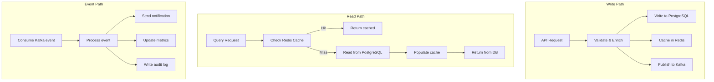
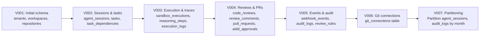

# ERP-Autonomous-Coding -- Data Model Document

## Document Information

| Field | Value |
|-------|-------|
| Module | ERP-Autonomous-Coding |
| Version | 1.0.0 |
| Last Updated | 2026-02-23 |
| Database | PostgreSQL 16 |

---

## 1. Entity-Relationship Diagram

```mermaid
erDiagram
    TENANT ||--o{ WORKSPACE : owns
    WORKSPACE ||--o{ REPOSITORY : contains
    WORKSPACE ||--o{ AGENT_SESSION : hosts
    REPOSITORY ||--o{ AGENT_SESSION : targets
    AGENT_SESSION ||--o{ TASK : decomposes_into
    AGENT_SESSION ||--o{ REASONING_STEP : logs
    AGENT_SESSION ||--o{ SANDBOX_EXECUTION : uses
    AGENT_SESSION ||--o{ CODE_REVIEW : triggers
    AGENT_SESSION |o--o| PULL_REQUEST : creates
    TASK ||--o{ TASK_DEPENDENCY : has
    PULL_REQUEST ||--o{ REVIEW_COMMENT : receives
    PULL_REQUEST ||--o{ AIDD_APPROVAL : requires
    REPOSITORY ||--o{ WEBHOOK_EVENT : receives
    REPOSITORY ||--o{ GIT_CONNECTION : configured_with
    TENANT ||--o{ AUDIT_LOG : generates
    WORKSPACE ||--o{ REVIEW_RULE : configures
    SANDBOX_EXECUTION ||--o{ EXECUTION_LOG : produces

    TENANT {
        uuid id PK
        varchar name
        varchar plan_tier
        jsonb settings
        jsonb resource_quotas
        boolean active
        timestamp created_at
        timestamp updated_at
    }

    WORKSPACE {
        uuid id PK
        uuid tenant_id FK
        varchar name
        text description
        jsonb default_config
        timestamp created_at
        timestamp updated_at
    }

    REPOSITORY {
        uuid id PK
        uuid workspace_id FK
        varchar provider
        varchar owner
        varchar name
        varchar default_branch
        varchar clone_url
        jsonb settings
        boolean auto_review
        boolean aidd_required
        timestamp connected_at
        timestamp last_synced_at
    }

    GIT_CONNECTION {
        uuid id PK
        uuid repository_id FK
        varchar provider
        varchar auth_type
        bytea encrypted_credentials
        varchar webhook_secret
        varchar webhook_id
        timestamp created_at
        timestamp expires_at
    }

    AGENT_SESSION {
        uuid id PK
        uuid workspace_id FK
        uuid repository_id FK
        uuid user_id
        varchar status
        text prompt
        varchar branch_name
        varchar agent_model
        integer iteration_count
        integer max_iterations
        jsonb config
        jsonb result
        jsonb files_changed
        timestamp started_at
        timestamp completed_at
        integer duration_ms
    }

    TASK {
        uuid id PK
        uuid session_id FK
        uuid plan_id
        varchar title
        text description
        varchar status
        integer order_index
        boolean parallelizable
        jsonb plan
        jsonb affected_files
        integer estimated_minutes
        timestamp started_at
        timestamp completed_at
    }

    TASK_DEPENDENCY {
        uuid id PK
        uuid task_id FK
        uuid depends_on_task_id FK
    }

    REASONING_STEP {
        uuid id PK
        uuid session_id FK
        integer step_number
        varchar action_type
        text reasoning
        jsonb tool_calls
        jsonb tool_results
        integer duration_ms
        integer token_count
        timestamp created_at
    }

    SANDBOX_EXECUTION {
        uuid id PK
        uuid session_id FK
        varchar container_id
        varchar image
        varchar status
        jsonb resource_limits
        jsonb resource_usage
        jsonb filesystem_diff
        varchar network_policy
        integer exit_code
        timestamp started_at
        timestamp terminated_at
    }

    EXECUTION_LOG {
        uuid id PK
        uuid sandbox_id FK
        varchar stream
        text content
        timestamp timestamp
    }

    CODE_REVIEW {
        uuid id PK
        uuid session_id FK
        uuid repository_id FK
        varchar status
        float overall_score
        float security_score
        float quality_score
        float coverage_delta
        float complexity_score
        jsonb findings_summary
        integer findings_critical
        integer findings_high
        integer findings_medium
        integer findings_low
        timestamp started_at
        timestamp completed_at
    }

    REVIEW_COMMENT {
        uuid id PK
        uuid review_id FK
        uuid pull_request_id FK
        varchar severity
        varchar category
        varchar file_path
        integer line_number
        text title
        text comment
        text recommendation
        varchar tool
    }

    PULL_REQUEST {
        uuid id PK
        uuid session_id FK
        uuid repository_id FK
        varchar provider_pr_id
        varchar provider_pr_url
        varchar branch
        varchar target_branch
        varchar status
        text title
        text description
        jsonb ci_status
        timestamp created_at
        timestamp merged_at
        timestamp closed_at
    }

    AIDD_APPROVAL {
        uuid id PK
        uuid pull_request_id FK
        uuid approver_user_id
        varchar decision
        text reason
        jsonb metadata
        timestamp requested_at
        timestamp decided_at
    }

    WEBHOOK_EVENT {
        uuid id PK
        uuid repository_id FK
        varchar provider
        varchar event_type
        varchar delivery_id
        jsonb payload
        varchar processing_status
        text error_message
        timestamp received_at
        timestamp processed_at
    }

    REVIEW_RULE {
        uuid id PK
        uuid workspace_id FK
        varchar name
        varchar category
        varchar severity
        jsonb pattern
        boolean enabled
        timestamp created_at
    }

    AUDIT_LOG {
        uuid id PK
        uuid tenant_id FK
        uuid user_id
        uuid session_id
        varchar action
        varchar resource_type
        uuid resource_id
        jsonb details
        varchar ip_address
        timestamp created_at
    }
```



---

## 2. Table Specifications

### 2.1 Core Tables

#### tenants

| Column | Type | Nullable | Default | Description |
|--------|------|----------|---------|-------------|
| id | UUID | No | gen_random_uuid() | Primary key |
| name | VARCHAR(255) | No | | Tenant display name |
| plan_tier | VARCHAR(50) | No | 'starter' | starter, professional, enterprise |
| settings | JSONB | Yes | '{}' | Tenant-level configuration |
| resource_quotas | JSONB | Yes | '{}' | Max sessions, sandboxes, storage |
| active | BOOLEAN | No | true | Soft delete flag |
| created_at | TIMESTAMPTZ | No | now() | Creation timestamp |
| updated_at | TIMESTAMPTZ | No | now() | Last update timestamp |

**Indexes**: `idx_tenants_active` on (active), `idx_tenants_plan_tier` on (plan_tier)

#### agent_sessions

| Column | Type | Nullable | Default | Description |
|--------|------|----------|---------|-------------|
| id | UUID | No | gen_random_uuid() | Primary key |
| workspace_id | UUID | No | | FK to workspaces |
| repository_id | UUID | No | | FK to repositories |
| user_id | UUID | No | | User who created session |
| status | VARCHAR(30) | No | 'initializing' | Session state |
| prompt | TEXT | No | | User's natural language prompt |
| branch_name | VARCHAR(255) | Yes | | Created branch name |
| agent_model | VARCHAR(100) | No | 'claude-sonnet-4-20250514' | Claude model used |
| iteration_count | INTEGER | No | 0 | Current iteration |
| max_iterations | INTEGER | No | 10 | Max allowed iterations |
| config | JSONB | Yes | '{}' | Session configuration |
| result | JSONB | Yes | | Final result payload |
| files_changed | JSONB | Yes | '[]' | List of changed file paths |
| started_at | TIMESTAMPTZ | No | now() | Session start time |
| completed_at | TIMESTAMPTZ | Yes | | Session completion time |
| duration_ms | INTEGER | Yes | | Total duration in ms |

**Indexes**:
- `idx_sessions_workspace_status` on (workspace_id, status)
- `idx_sessions_repo` on (repository_id)
- `idx_sessions_user` on (user_id)
- `idx_sessions_started_at` on (started_at DESC)

**Partitioning**: Range-partitioned by `started_at` (monthly partitions)

---

## 3. Data Flow Diagram



---

## 4. Caching Strategy

| Entity | Cache Key Pattern | TTL | Invalidation |
|--------|-------------------|-----|-------------|
| Session status | `session:{id}:status` | 30s | On status change |
| Session detail | `session:{id}` | 60s | On any update |
| Repository config | `repo:{id}:config` | 300s | On settings change |
| Workspace repos | `workspace:{id}:repos` | 300s | On repo connect/disconnect |
| Sandbox pool stats | `sandbox:pool:stats` | 10s | On pool change |
| Review result | `review:{id}` | 600s | Immutable after completion |
| User entitlements | `user:{id}:entitlements` | 300s | On plan change |

---

## 5. Migration Strategy



All migrations use idempotent, forward-only SQL scripts managed by `golang-migrate/migrate` for the Go services and `alembic` for the Python services. Each migration is tested in CI against a throwaway PostgreSQL instance.

---

## 6. Data Retention Policy

| Data Category | Retention Period | Archival Strategy | Deletion Method |
|---------------|-----------------|-------------------|-----------------|
| Active sessions | Indefinite | N/A | Soft delete |
| Completed sessions | 1 year | Archive to S3 (Parquet) | Partition drop |
| Reasoning traces | 90 days | Archive to S3 (JSON) | Partition drop |
| Sandbox execution logs | 30 days | Archive to Loki | TTL-based deletion |
| Webhook events | 7 days | None | TTL-based deletion |
| Audit logs | 7 years | Archive to S3 (Parquet) | Partition drop |
| Review findings | 1 year | Archive to S3 | Partition drop |
| Git credentials | Until rotation | N/A | Vault TTL |

---

## 7. Data Security

### 7.1 Encryption

| Layer | Method | Key Management |
|-------|--------|---------------|
| At rest (PostgreSQL) | AES-256 (TDE or filesystem encryption) | KMS managed |
| At rest (S3 archives) | AES-256-GCM (SSE-KMS) | AWS KMS / Vault |
| In transit | TLS 1.3 | Auto-rotated certificates |
| Git credentials | AES-256-GCM | Vault Transit engine |
| Sensitive JSONB fields | Application-level encryption | Vault Transit engine |

### 7.2 Row-Level Security

```sql
-- Example RLS policy for tenant isolation
ALTER TABLE agent_sessions ENABLE ROW LEVEL SECURITY;

CREATE POLICY tenant_isolation ON agent_sessions
    USING (workspace_id IN (
        SELECT id FROM workspaces WHERE tenant_id = current_setting('app.tenant_id')::uuid
    ));
```

All tables with tenant-scoped data implement Row-Level Security (RLS) policies enforced at the PostgreSQL level, ensuring that even direct database access cannot cross tenant boundaries.
