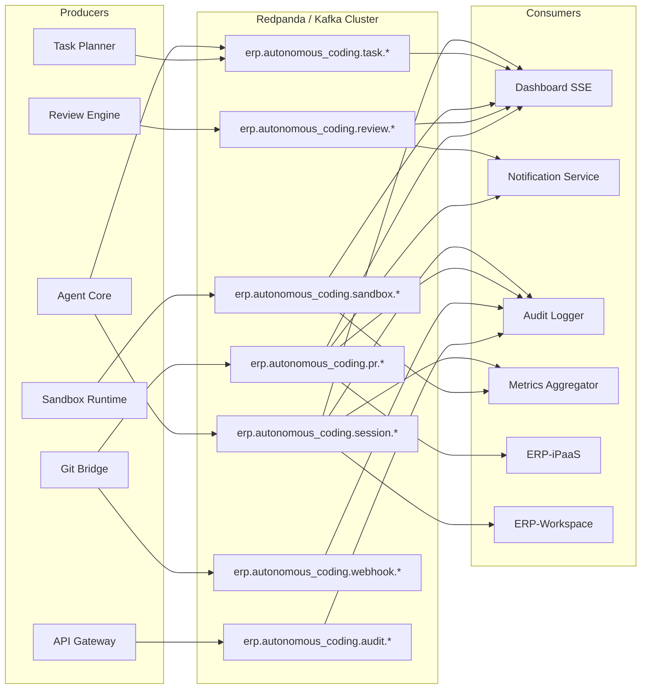
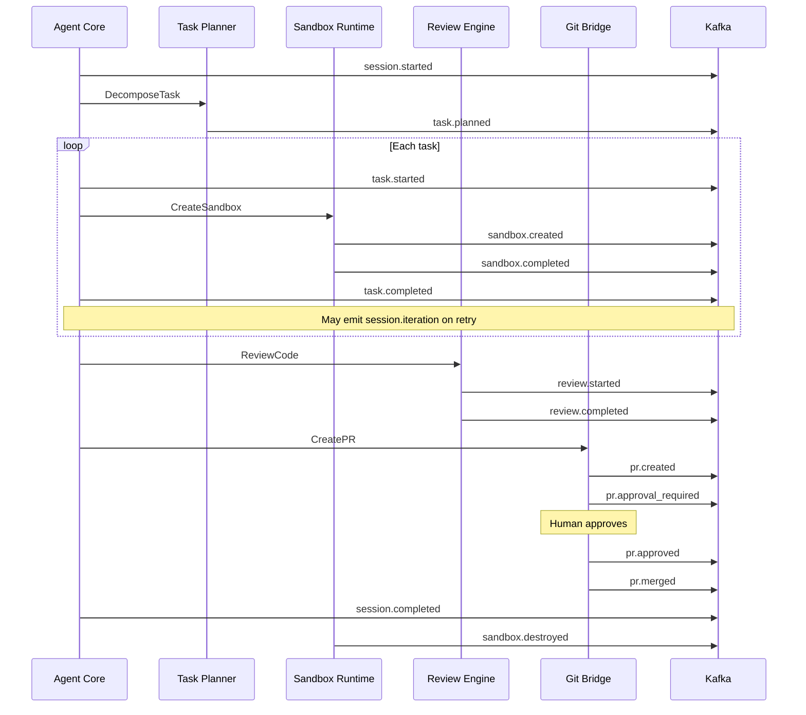

# ERP-Autonomous-Coding -- Event Catalog

## Document Information

| Field | Value |
|-------|-------|
| Module | ERP-Autonomous-Coding |
| Version | 1.0.0 |
| Last Updated | 2026-02-23 |
| Event Bus | Redpanda / Kafka |
| Envelope | CloudEvents v1.0 |

---

## 1. Event Architecture Overview



---

## 2. Event Naming Convention

All events follow the ERP platform naming convention:

```
erp.<module>.<entity>.<action>
```

- **module**: `autonomous_coding`
- **entity**: Domain aggregate name (e.g., `session`, `task`, `sandbox`, `review`, `pr`)
- **action**: Past-tense verb (e.g., `started`, `completed`, `created`, `failed`)

---

## 3. CloudEvents Envelope

Every event is wrapped in a CloudEvents v1.0 envelope:

```json
{
  "specversion": "1.0",
  "id": "evt-uuid-12345",
  "source": "erp-autonomous-coding/agent-core",
  "type": "erp.autonomous_coding.session.started",
  "datacontenttype": "application/json",
  "time": "2026-02-23T10:00:00Z",
  "subject": "session-uuid-456",
  "tenantid": "tenant-uuid-789",
  "data": {
    // Event-specific payload
  }
}
```

---

## 4. Event Catalog

### 4.1 Session Events

| Event | Producer | Topic | Description |
|-------|----------|-------|-------------|
| `erp.autonomous_coding.session.started` | Agent Core | `erp.autonomous_coding.session` | New coding session initiated |
| `erp.autonomous_coding.session.planning` | Agent Core | `erp.autonomous_coding.session` | Task decomposition in progress |
| `erp.autonomous_coding.session.generating` | Agent Core | `erp.autonomous_coding.session` | Code generation in progress |
| `erp.autonomous_coding.session.executing` | Agent Core | `erp.autonomous_coding.session` | Sandbox execution in progress |
| `erp.autonomous_coding.session.reviewing` | Agent Core | `erp.autonomous_coding.session` | Review engine analysis in progress |
| `erp.autonomous_coding.session.completed` | Agent Core | `erp.autonomous_coding.session` | Session finished successfully |
| `erp.autonomous_coding.session.failed` | Agent Core | `erp.autonomous_coding.session` | Session failed with error |
| `erp.autonomous_coding.session.cancelled` | Agent Core | `erp.autonomous_coding.session` | Session cancelled by user |
| `erp.autonomous_coding.session.iteration` | Agent Core | `erp.autonomous_coding.session` | New iteration in generate-test-fix loop |

**session.started payload**:
```json
{
  "session_id": "session-uuid-456",
  "workspace_id": "ws-uuid-123",
  "repository_id": "repo-uuid-789",
  "user_id": "user-uuid-012",
  "prompt": "Add user profile API endpoint",
  "agent_model": "claude-sonnet-4-20250514",
  "config": {
    "max_iterations": 10,
    "sandbox_image": "python:3.12"
  }
}
```

**session.completed payload**:
```json
{
  "session_id": "session-uuid-456",
  "status": "completed",
  "iteration_count": 3,
  "files_changed": ["models/user.py", "handlers/profile.py", "tests/test_profile.py"],
  "pr_url": "https://github.com/org/repo/pull/42",
  "review_score": 92,
  "duration_ms": 332000,
  "token_usage": {
    "input_tokens": 45000,
    "output_tokens": 12000
  }
}
```

### 4.2 Task Events

| Event | Producer | Topic | Description |
|-------|----------|-------|-------------|
| `erp.autonomous_coding.task.planned` | Task Planner | `erp.autonomous_coding.task` | Task plan created |
| `erp.autonomous_coding.task.started` | Agent Core | `erp.autonomous_coding.task` | Individual task execution started |
| `erp.autonomous_coding.task.completed` | Agent Core | `erp.autonomous_coding.task` | Individual task completed |
| `erp.autonomous_coding.task.failed` | Agent Core | `erp.autonomous_coding.task` | Individual task failed |

### 4.3 Sandbox Events

| Event | Producer | Topic | Description |
|-------|----------|-------|-------------|
| `erp.autonomous_coding.sandbox.created` | Sandbox Runtime | `erp.autonomous_coding.sandbox` | Container provisioned |
| `erp.autonomous_coding.sandbox.executing` | Sandbox Runtime | `erp.autonomous_coding.sandbox` | Command executing |
| `erp.autonomous_coding.sandbox.completed` | Sandbox Runtime | `erp.autonomous_coding.sandbox` | Execution finished |
| `erp.autonomous_coding.sandbox.timeout` | Sandbox Runtime | `erp.autonomous_coding.sandbox` | Execution timed out |
| `erp.autonomous_coding.sandbox.destroyed` | Sandbox Runtime | `erp.autonomous_coding.sandbox` | Container terminated |
| `erp.autonomous_coding.sandbox.resource_limit` | Sandbox Runtime | `erp.autonomous_coding.sandbox` | Resource limit breached |

### 4.4 Review Events

| Event | Producer | Topic | Description |
|-------|----------|-------|-------------|
| `erp.autonomous_coding.review.started` | Review Engine | `erp.autonomous_coding.review` | Review analysis started |
| `erp.autonomous_coding.review.completed` | Review Engine | `erp.autonomous_coding.review` | Review analysis completed |
| `erp.autonomous_coding.review.finding` | Review Engine | `erp.autonomous_coding.review` | Individual finding discovered |

### 4.5 Pull Request Events

| Event | Producer | Topic | Description |
|-------|----------|-------|-------------|
| `erp.autonomous_coding.pr.created` | Git Bridge | `erp.autonomous_coding.pr` | PR/MR created |
| `erp.autonomous_coding.pr.updated` | Git Bridge | `erp.autonomous_coding.pr` | PR/MR updated |
| `erp.autonomous_coding.pr.approval_required` | Git Bridge | `erp.autonomous_coding.pr` | AIDD approval requested |
| `erp.autonomous_coding.pr.approved` | Git Bridge | `erp.autonomous_coding.pr` | AIDD approval granted |
| `erp.autonomous_coding.pr.rejected` | Git Bridge | `erp.autonomous_coding.pr` | AIDD approval denied |
| `erp.autonomous_coding.pr.merged` | Git Bridge | `erp.autonomous_coding.pr` | PR/MR merged |
| `erp.autonomous_coding.pr.closed` | Git Bridge | `erp.autonomous_coding.pr` | PR/MR closed without merge |

### 4.6 Webhook Events

| Event | Producer | Topic | Description |
|-------|----------|-------|-------------|
| `erp.autonomous_coding.webhook.received` | Git Bridge | `erp.autonomous_coding.webhook` | Webhook event received from provider |
| `erp.autonomous_coding.webhook.processed` | Git Bridge | `erp.autonomous_coding.webhook` | Webhook event processed |
| `erp.autonomous_coding.webhook.failed` | Git Bridge | `erp.autonomous_coding.webhook` | Webhook processing failed |

### 4.7 Audit Events

| Event | Producer | Topic | Description |
|-------|----------|-------|-------------|
| `erp.autonomous_coding.audit.action` | API Gateway | `erp.autonomous_coding.audit` | User or system action logged |

---

## 5. Topic Configuration

| Topic | Partitions | Replication Factor | Retention | Compaction |
|-------|-----------|-------------------|-----------|------------|
| `erp.autonomous_coding.session` | 12 | 3 | 7 days | None |
| `erp.autonomous_coding.task` | 6 | 3 | 7 days | None |
| `erp.autonomous_coding.sandbox` | 6 | 3 | 3 days | None |
| `erp.autonomous_coding.review` | 6 | 3 | 7 days | None |
| `erp.autonomous_coding.pr` | 6 | 3 | 30 days | None |
| `erp.autonomous_coding.webhook` | 12 | 3 | 3 days | None |
| `erp.autonomous_coding.audit` | 6 | 3 | 90 days | None |

---

## 6. Consumer Groups

| Consumer Group | Topics Consumed | Purpose | Concurrency |
|----------------|----------------|---------|-------------|
| `ac-dashboard-sse` | session, task, sandbox, review, pr | Real-time dashboard updates | 3 |
| `ac-notification` | pr, review | Email/Slack/Teams notifications | 3 |
| `ac-audit-writer` | All | Persist to audit_logs table | 3 |
| `ac-metrics` | session, sandbox | Prometheus metric aggregation | 1 |
| `ac-ipaas-bridge` | pr, session | Forward to ERP-iPaaS | 1 |
| `ac-workspace-notify` | session, pr | Forward to ERP-Workspace | 1 |

---

## 7. Event Flow -- Session Lifecycle



---

## 8. Dead Letter Queue

Failed events are routed to dead letter topics with the naming convention:

```
erp.autonomous_coding.<entity>.dlq
```

| DLQ Topic | Source Topic | Max Retries | Alert Threshold |
|-----------|-------------|-------------|-----------------|
| `erp.autonomous_coding.session.dlq` | session | 3 | 10/hour |
| `erp.autonomous_coding.webhook.dlq` | webhook | 5 | 50/hour |
| `erp.autonomous_coding.pr.dlq` | pr | 3 | 5/hour |
| `erp.autonomous_coding.audit.dlq` | audit | 5 | 1/hour |

Events in DLQs are monitored via Grafana dashboards and PagerDuty alerts.
