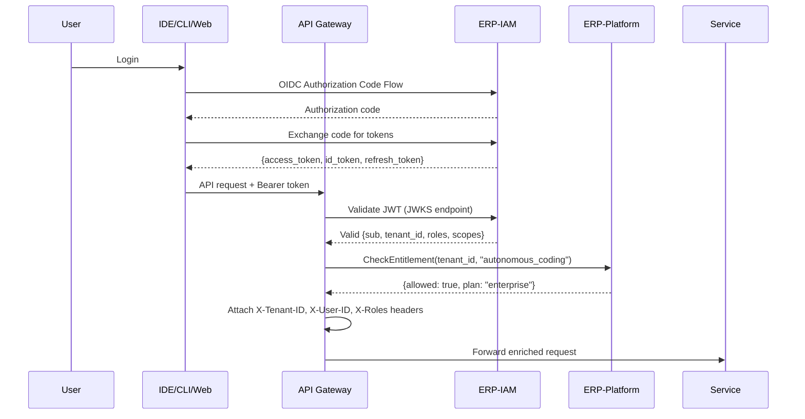
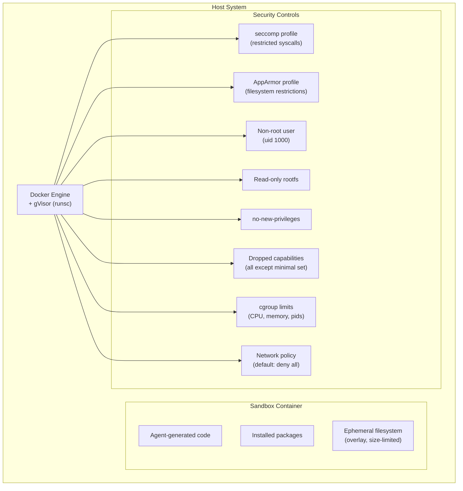
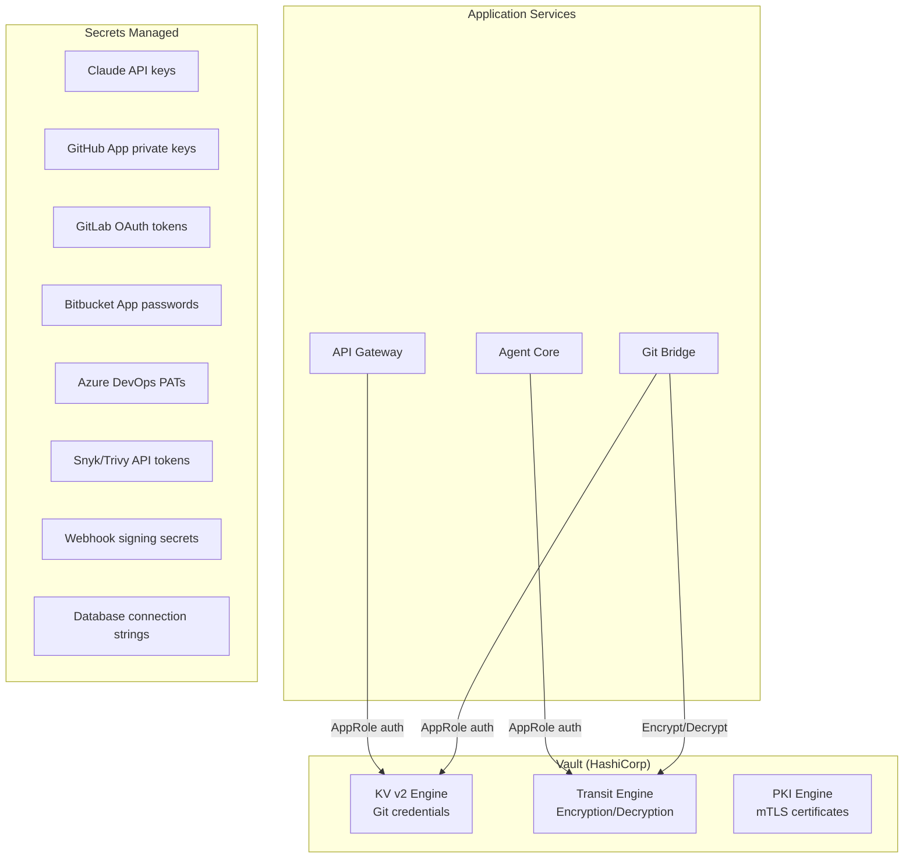
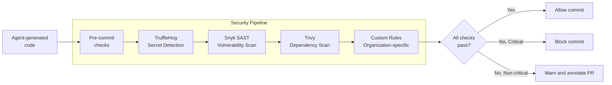

# ERP-Autonomous-Coding -- Security Architecture

## Document Information

| Field | Value |
|-------|-------|
| Module | ERP-Autonomous-Coding |
| Version | 1.0.0 |
| Last Updated | 2026-02-23 |
| Classification | Confidential |

---

## 1. Threat Model

### 1.1 Attack Surface

```mermaid
flowchart TB
    subgraph "External Attack Surface"
        A1["API endpoints<br/>(Internet-facing)"]
        A2["Webhook receivers<br/>(GitHub/GitLab/BB/AzDO)"]
        A3["WebSocket connections<br/>(IDE plugins)"]
        A4["CLI tool<br/>(developer machines)"]
    end

    subgraph "Internal Attack Surface"
        A5["Sandbox containers<br/>(code execution)"]
        A6["Git credentials<br/>(stored tokens)"]
        A7["Claude API keys<br/>(LLM access)"]
        A8["Inter-service communication"]
        A9["Database access"]
    end

    subgraph "Supply Chain"
        A10["Python/Go/Node dependencies"]
        A11["Docker base images"]
        A12["IDE plugin marketplaces"]
    end

    A1 --> T1["Unauthorized access"]
    A2 --> T2["Webhook forgery"]
    A5 --> T3["Container escape"]
    A5 --> T4["Crypto mining"]
    A6 --> T5["Credential theft"]
    A7 --> T6["API key exfiltration"]
    A5 --> T7["Malicious code execution"]
    A10 --> T8["Dependency confusion"]
    A11 --> T9["Supply chain compromise"]
```



### 1.2 STRIDE Analysis

| Threat | Category | Risk | Mitigation |
|--------|----------|------|------------|
| Unauthorized session creation | Spoofing | High | JWT validation, RBAC |
| Webhook payload forgery | Tampering | High | HMAC signature verification |
| Source code exposure | Information Disclosure | Critical | Ephemeral sandboxes, encryption at rest |
| Sandbox container escape | Elevation of Privilege | Critical | gVisor, seccomp, read-only rootfs |
| Git credential theft | Information Disclosure | Critical | Vault storage, short-lived tokens |
| LLM prompt injection | Tampering | High | Input sanitization, output validation |
| Agent generating malicious code | Tampering | High | Sandbox isolation, review engine, AIDD gate |
| Denial of service via sandbox | Denial of Service | Medium | Resource limits, rate limiting |
| Cross-tenant data access | Information Disclosure | Critical | Row-Level Security, tenant isolation |
| Secret committed to repository | Information Disclosure | High | TruffleHog pre-commit scanning |

---

## 2. Authentication and Authorization

### 2.1 Authentication Flow



### 2.2 RBAC Model

| Role | Permissions | Scope |
|------|------------|-------|
| `ac:admin` | Full CRUD on all resources, manage connections, configure sandbox limits | Tenant |
| `ac:developer` | Create sessions, view own sessions, trigger reviews, use IDE/CLI | Workspace |
| `ac:reviewer` | View all sessions, approve/reject PRs (AIDD), manage review rules | Workspace |
| `ac:viewer` | Read-only access to sessions, reviews, dashboard | Workspace |
| `ac:devops` | Manage repositories, sandbox configs, Git connections, CI/CD settings | Tenant |

### 2.3 Permission Matrix

| Resource | ac:admin | ac:developer | ac:reviewer | ac:viewer | ac:devops |
|----------|---------|-------------|-------------|-----------|-----------|
| Sessions (own) | CRUD | CRU | R | R | R |
| Sessions (all) | CRUD | R | R | R | R |
| Repositories | CRUD | R | R | R | CRUD |
| Reviews | CRUD | CR | CRUD | R | R |
| AIDD Approvals | CRUD | R | CRU | R | R |
| Sandbox Config | CRUD | R | R | R | CRUD |
| Review Rules | CRUD | R | CRUD | R | R |
| Audit Logs | R | - | R | - | R |
| Dashboard | Full | Own data | Full | Read | Infra metrics |

---

## 3. Sandbox Security

### 3.1 Container Isolation



### 3.2 Sandbox Security Controls

| Control | Configuration | Purpose |
|---------|-------------|---------|
| **Runtime** | gVisor (runsc) | Kernel syscall interception |
| **seccomp** | Allowlist of ~60 syscalls | Block dangerous syscalls (ptrace, mount, etc.) |
| **Capabilities** | All dropped except CAP_NET_BIND_SERVICE | Minimal privilege |
| **User** | uid 1000 (non-root) | No root access |
| **Filesystem** | Read-only rootfs + tmpfs /tmp (size-limited) | Prevent persistent modifications |
| **Network** | Default deny; allowlist for package registries | Prevent data exfiltration |
| **PID limit** | max_pids: 256 | Prevent fork bombs |
| **CPU** | 2 cores max | Prevent crypto mining |
| **Memory** | 4GB max, no swap | Prevent OOM attacks |
| **Disk** | 10GB overlay, no host mounts | Prevent disk exhaustion |
| **Time limit** | 300s default, 600s max | Prevent runaway processes |

### 3.3 Network Isolation Modes

| Mode | Allowed Destinations | Use Case |
|------|---------------------|----------|
| `isolated` | None | Default. Code execution only |
| `registry_only` | pypi.org, npmjs.com, proxy.golang.org, crates.io, repo.maven.apache.org, nuget.org | Package installation |
| `allowlist` | Custom domain list | Organization-specific APIs |
| `unrestricted` | All (not recommended) | Legacy workloads (admin approval required) |

---

## 4. Secret Management

### 4.1 Secret Storage Architecture



### 4.2 Secret Rotation

| Secret Type | Rotation Period | Mechanism | Alert on Failure |
|------------|----------------|-----------|------------------|
| Claude API key | 90 days | Manual rotation + Vault update | Yes |
| GitHub App key | 1 year | Auto-rotation via Vault | Yes |
| OAuth tokens | On expiry (auto-refresh) | Refresh token flow | Yes |
| Webhook secrets | 180 days | Auto-rotation + webhook re-registration | Yes |
| mTLS certificates | 30 days | Auto-rotation via Vault PKI | Yes |
| Database passwords | 90 days | Vault dynamic secrets | Yes |

---

## 5. Data Protection

### 5.1 Encryption Matrix

| Data State | Method | Key Size | Key Management |
|-----------|--------|----------|---------------|
| In transit (external) | TLS 1.3 | 256-bit | Let's Encrypt / ACM |
| In transit (internal) | mTLS | 256-bit | Vault PKI |
| At rest (PostgreSQL) | AES-256 (TDE) | 256-bit | KMS |
| At rest (S3) | AES-256-GCM (SSE-KMS) | 256-bit | AWS KMS |
| At rest (Redis) | AES-256 (RDB encryption) | 256-bit | KMS |
| Git credentials | AES-256-GCM | 256-bit | Vault Transit |
| Backup encryption | AES-256-GCM | 256-bit | KMS |

### 5.2 Source Code Protection

Source code processed by the platform receives special treatment:

1. **Ephemeral storage**: Cloned repositories exist only in sandbox containers, destroyed after session completion
2. **No persistent cache**: Code is never cached in Redis or other shared storage
3. **Memory-only context**: Agent context windows are held in memory, not persisted
4. **Audit trail**: All file read/write operations are logged in reasoning traces
5. **Network isolation**: Sandboxes cannot exfiltrate code over the network

---

## 6. Security Scanning Pipeline



---

## 7. Incident Response

### 7.1 Security Event Classification

| Event | Severity | Response SLA | Automated Action |
|-------|----------|-------------|-----------------|
| Sandbox escape attempt detected | P1 - Critical | 15 min | Kill container, alert SecOps |
| Secret detected in commit | P1 - Critical | 15 min | Block push, rotate secret |
| Critical vulnerability in generated code | P2 - High | 1 hour | Block PR, notify developer |
| Brute force authentication attempt | P2 - High | 1 hour | Rate limit, block IP |
| Cross-tenant access attempt | P1 - Critical | 15 min | Block request, lock account |
| Unusual resource consumption | P3 - Medium | 4 hours | Throttle, investigate |

### 7.2 Security Monitoring

All security events are forwarded to the SIEM via structured logging:

```json
{
  "event_type": "security.sandbox.escape_attempt",
  "severity": "critical",
  "container_id": "abc123",
  "session_id": "session-uuid-456",
  "tenant_id": "tenant-uuid-789",
  "user_id": "user-uuid-012",
  "details": {
    "syscall": "ptrace",
    "action": "blocked",
    "seccomp_violation": true
  },
  "timestamp": "2026-02-23T10:00:00Z"
}
```
