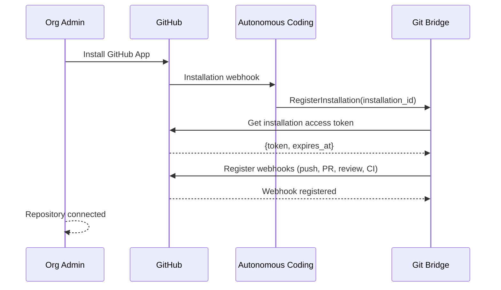
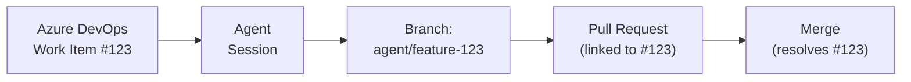
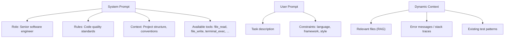
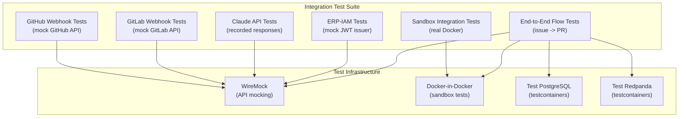

# ERP-Autonomous-Coding -- Integration Guide

## Document Information

| Field | Value |
|-------|-------|
| Module | ERP-Autonomous-Coding |
| Version | 1.0.0 |
| Last Updated | 2026-02-23 |

---

## 1. Integration Architecture

```mermaid
flowchart TB
    subgraph "ERP Platform Integrations"
        IAM["ERP-IAM<br/>OIDC/JWT Auth"]
        PLAT["ERP-Platform<br/>Entitlements"]
        AI["ERP-AI<br/>Model Inference"]
        IPAAS["ERP-iPaaS<br/>Workflow Engine"]
        WS["ERP-Workspace<br/>Notifications"]
        PROJ["ERP-Projects<br/>Task Management"]
    end

    subgraph "Git Provider Integrations"
        GH["GitHub<br/>App + Webhooks + REST + GraphQL"]
        GL["GitLab<br/>OAuth + REST + GraphQL + CI"]
        BB["Bitbucket<br/>App + REST + Pipelines"]
        AZ["Azure DevOps<br/>OAuth + REST + Pipelines"]
    end

    subgraph "Security Tool Integrations"
        SNYK["Snyk<br/>SAST + Dependency"]
        TRIVY["Trivy<br/>Container + Dependency"]
        TH["TruffleHog<br/>Secret Detection"]
    end

    subgraph "LLM Integration"
        CLAUDE["Claude API<br/>Anthropic"]
    end

    AC["ERP-Autonomous-Coding"] --> IAM
    AC --> PLAT
    AC --> AI
    AC --> IPAAS
    AC --> WS
    AC --> PROJ
    AC --> GH
    AC --> GL
    AC --> BB
    AC --> AZ
    AC --> SNYK
    AC --> TRIVY
    AC --> TH
    AC --> CLAUDE
```



---

## 2. ERP-IAM Integration

### 2.1 OIDC Configuration

The module integrates with ERP-IAM for authentication using OpenID Connect:

```json
{
  "issuer": "https://iam.erp.dev/realms/erp",
  "authorization_endpoint": "https://iam.erp.dev/realms/erp/protocol/openid-connect/auth",
  "token_endpoint": "https://iam.erp.dev/realms/erp/protocol/openid-connect/token",
  "jwks_uri": "https://iam.erp.dev/realms/erp/protocol/openid-connect/certs",
  "client_id": "erp-autonomous-coding",
  "scopes": ["openid", "profile", "email", "tenant"],
  "grant_types": ["authorization_code", "client_credentials", "refresh_token"]
}
```

### 2.2 JWT Claims

```json
{
  "sub": "user-uuid-012",
  "tenant_id": "tenant-uuid-789",
  "roles": ["ac:developer", "ac:reviewer"],
  "scopes": ["autonomous_coding:sessions:write", "autonomous_coding:reviews:read"],
  "exp": 1708700400,
  "iss": "https://iam.erp.dev/realms/erp"
}
```

---

## 3. GitHub Integration

### 3.1 GitHub App Setup



### 3.2 GitHub Permissions

| Permission | Access | Purpose |
|-----------|--------|---------|
| Repository contents | Read & Write | Clone repos, commit changes |
| Pull requests | Read & Write | Create/update PRs, post reviews |
| Issues | Read & Write | Triage issues, link to PRs |
| Actions | Read | Monitor CI/CD status |
| Checks | Read & Write | Post check results |
| Webhooks | Read & Write | Receive events |
| Metadata | Read | Repository information |

### 3.3 Supported Webhook Events

| Event | Handler | Action |
|-------|---------|--------|
| `push` | UpdateBranchState | Track branch changes |
| `pull_request.opened` | TriggerAutoReview | Auto-review new PRs |
| `pull_request.synchronize` | TriggerIncrementalReview | Review updated PRs |
| `pull_request_review.submitted` | HandleHumanReview | Process AIDD approval |
| `pull_request_review_comment.created` | HandleReviewComment | Respond to review feedback |
| `check_run.completed` | HandleCIResult | Process CI outcomes |
| `issues.opened` | HandleNewIssue | Triage new issues |
| `issue_comment.created` | HandleIssueComment | Process @mentions |

---

## 4. GitLab Integration

### 4.1 OAuth Setup

```json
{
  "provider": "gitlab",
  "auth_type": "oauth2",
  "authorize_url": "https://gitlab.com/oauth/authorize",
  "token_url": "https://gitlab.com/oauth/token",
  "scopes": ["api", "read_user", "read_repository", "write_repository"],
  "redirect_uri": "https://app.erp.dev/auth/gitlab/callback"
}
```

### 4.2 GitLab API Usage

| API | Version | Operations |
|-----|---------|-----------|
| REST API | v4 | Repository CRUD, MR management, CI/CD triggers |
| GraphQL API | Latest | Complex queries, batch operations |
| CI/CD API | v4 | Pipeline status, job logs |
| Webhook API | v4 | Event registration and processing |

---

## 5. Bitbucket Integration

### 5.1 App Setup

| Configuration | Value |
|--------------|-------|
| Auth Type | Bitbucket App (OAuth 2.0) |
| Scopes | `repository`, `pullrequest`, `pipeline`, `webhook` |
| Webhook Events | `repo:push`, `pullrequest:created`, `pullrequest:updated`, `pullrequest:approved`, `pipeline:completed` |

---

## 6. Azure DevOps Integration

### 6.1 OAuth Setup

| Configuration | Value |
|--------------|-------|
| Auth Type | Azure AD OAuth 2.0 |
| Scopes | `vso.code_write`, `vso.work_write`, `vso.build_execute`, `vso.hooks_write` |
| API Version | 7.1 |

### 6.2 Work Item Linking



---

## 7. Claude API Integration

### 7.1 Client Configuration

```python
# Agent Core Claude API Client
{
    "api_key": "${CLAUDE_API_KEY}",  # From Vault
    "model": "claude-sonnet-4-20250514",
    "max_tokens": 8192,
    "temperature": 0.1,   # Low temperature for code generation
    "timeout_seconds": 120,
    "retry_config": {
        "max_retries": 3,
        "backoff_factor": 2,
        "retry_on": [429, 500, 502, 503]
    },
    "circuit_breaker": {
        "failure_threshold": 5,
        "recovery_timeout_seconds": 60
    }
}
```

### 7.2 System Prompt Structure



---

## 8. Security Tool Integrations

### 8.1 Snyk Integration

```json
{
  "provider": "snyk",
  "api_token": "${SNYK_TOKEN}",
  "org_id": "org-uuid",
  "scan_types": ["sast", "open_source"],
  "severity_threshold": "medium",
  "auto_fix": true
}
```

### 8.2 Trivy Integration

```bash
# Container scanning
trivy image --severity HIGH,CRITICAL --format json erp/sandbox-python:3.12

# Filesystem scanning (dependency vulnerabilities)
trivy fs --security-checks vuln --format json /path/to/project
```

### 8.3 TruffleHog Integration

```bash
# Pre-commit scanning
trufflehog git file:///path/to/repo --since-commit HEAD~1 --json
```

---

## 9. ERP-iPaaS Integration

### 9.1 Workflow Triggers

The module publishes events that ERP-iPaaS can use to trigger external workflows:

| Event | iPaaS Trigger | Example Workflow |
|-------|--------------|-----------------|
| `pr.created` | New PR webhook | Notify Slack channel |
| `pr.approval_required` | Approval request | Send Teams notification to approvers |
| `session.completed` | Task completion | Update Jira ticket |
| `review.completed` | Review results | Create security dashboard entry |
| `session.failed` | Agent failure | Create PagerDuty incident |

### 9.2 iPaaS Webhook Format

```json
{
  "event": "erp.autonomous_coding.pr.created",
  "timestamp": "2026-02-23T10:00:00Z",
  "tenant_id": "tenant-uuid-789",
  "data": {
    "pr_url": "https://github.com/org/repo/pull/42",
    "title": "Add user profile API endpoint",
    "files_changed": 4,
    "review_score": 92
  }
}
```

---

## 10. Integration Testing


