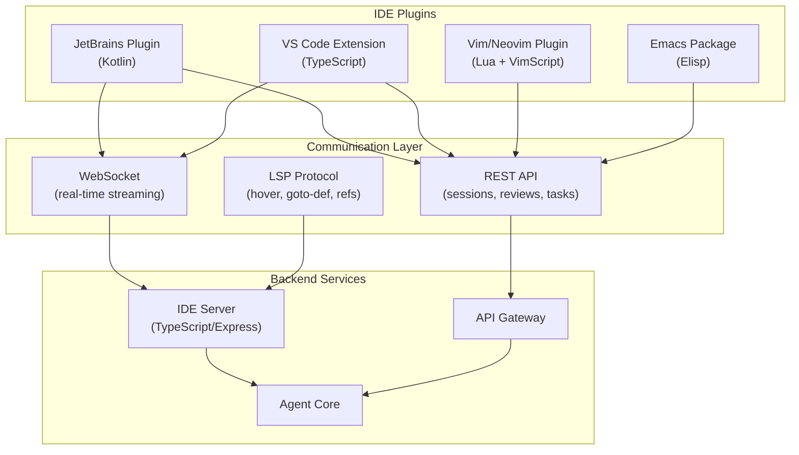
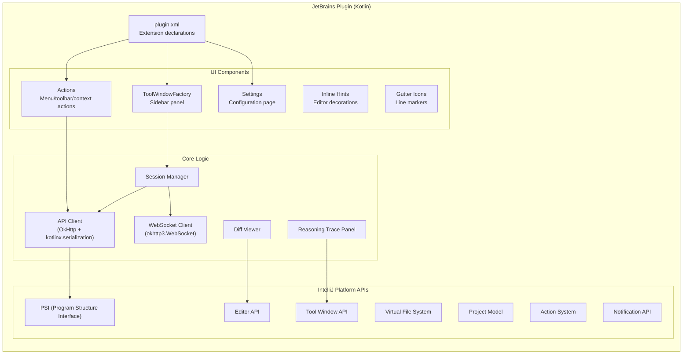
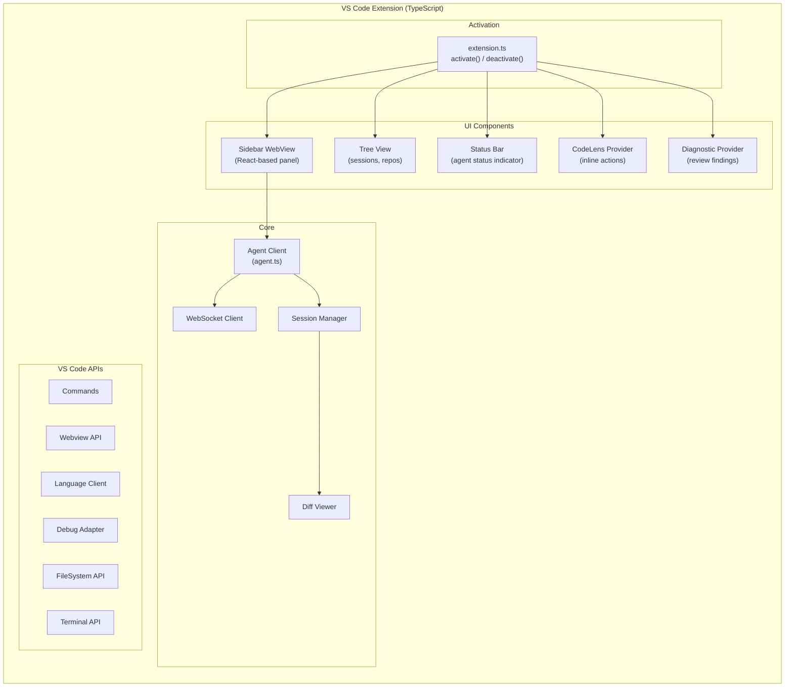
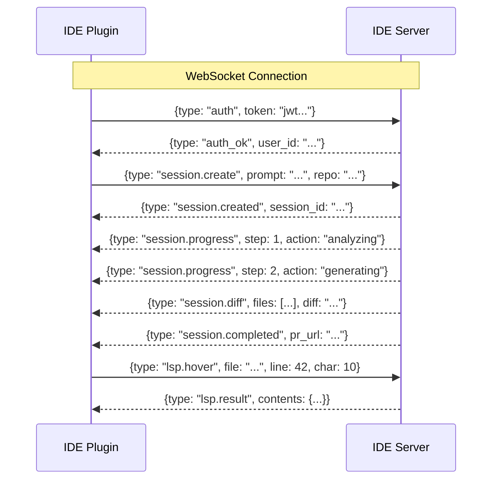

# ERP-Autonomous-Coding -- IDE Plugin Architecture

## Document Information

| Field | Value |
|-------|-------|
| Module | ERP-Autonomous-Coding |
| Version | 1.0.0 |
| Last Updated | 2026-02-23 |

---

## 1. Plugin Architecture Overview



---

## 2. JetBrains Plugin (Kotlin)

### 2.1 Supported IDEs

| IDE | Min Version | Language Focus |
|-----|-------------|---------------|
| IntelliJ IDEA | 2024.1 | Java, Kotlin, Scala |
| WebStorm | 2024.1 | TypeScript, JavaScript |
| PyCharm | 2024.1 | Python |
| GoLand | 2024.1 | Go |
| Rider | 2024.1 | C#, .NET |
| CLion | 2024.1 | C, C++, Rust |
| PHPStorm | 2024.1 | PHP |

### 2.2 Plugin Architecture



### 2.3 Plugin Actions

| Action | Shortcut | Context | Description |
|--------|----------|---------|-------------|
| Generate Code | `Ctrl+Shift+G` | Editor | Generate code from prompt |
| Generate Tests | `Ctrl+Shift+T` | Editor (on selection) | Generate tests for selected code |
| Review File | `Ctrl+Shift+R` | Editor | Review current file |
| Fix Bug | `Ctrl+Shift+F` | Editor (on error) | Fix error at cursor |
| Explain Code | `Ctrl+Shift+E` | Editor (on selection) | Explain selected code |
| Refactor | `Ctrl+Shift+Alt+R` | Editor (on selection) | Refactor selected code |
| Open Agent Panel | `Alt+A` | Global | Open sidebar tool window |
| View Reasoning | `Ctrl+Shift+L` | Agent Panel | Show reasoning trace |

### 2.4 build.gradle.kts

```kotlin
plugins {
    id("org.jetbrains.intellij") version "1.17.0"
    kotlin("jvm") version "1.9.22"
    kotlin("plugin.serialization") version "1.9.22"
}

intellij {
    version.set("2024.1")
    type.set("IC")
    plugins.set(listOf("com.intellij.java", "org.jetbrains.kotlin"))
}

dependencies {
    implementation("com.squareup.okhttp3:okhttp:4.12.0")
    implementation("org.jetbrains.kotlinx:kotlinx-serialization-json:1.6.3")
    implementation("org.jetbrains.kotlinx:kotlinx-coroutines-core:1.8.0")
}
```

---

## 3. VS Code Extension (TypeScript)

### 3.1 Extension Architecture



### 3.2 Commands

| Command | ID | Keybinding | Description |
|---------|-----|-----------|-------------|
| Generate Code | `autonomousCoding.generate` | `Ctrl+Shift+G` | Create from prompt |
| Generate Tests | `autonomousCoding.generateTests` | `Ctrl+Shift+T` | Tests for selection |
| Review | `autonomousCoding.review` | `Ctrl+Shift+R` | Review current file |
| Fix | `autonomousCoding.fix` | `Ctrl+Shift+F` | Fix error |
| Explain | `autonomousCoding.explain` | `Ctrl+Shift+E` | Explain selection |
| Open Panel | `autonomousCoding.openPanel` | `Alt+A` | Open sidebar |
| View Trace | `autonomousCoding.viewTrace` | `Ctrl+Shift+L` | Reasoning trace |

### 3.3 package.json (Extension Manifest)

```json
{
  "name": "erp-autonomous-coding",
  "displayName": "ERP Autonomous Coding",
  "publisher": "erp",
  "version": "1.0.0",
  "engines": {
    "vscode": "^1.85.0"
  },
  "categories": ["Programming Languages", "Machine Learning", "Other"],
  "activationEvents": ["onStartupFinished"],
  "main": "./out/extension.js",
  "contributes": {
    "viewsContainers": {
      "activitybar": [{
        "id": "autonomous-coding",
        "title": "Autonomous Coding",
        "icon": "media/icon.svg"
      }]
    },
    "views": {
      "autonomous-coding": [
        {"id": "ac-sessions", "name": "Sessions"},
        {"id": "ac-repositories", "name": "Repositories"},
        {"id": "ac-reviews", "name": "Reviews"}
      ]
    },
    "commands": [
      {"command": "autonomousCoding.generate", "title": "Generate Code"},
      {"command": "autonomousCoding.generateTests", "title": "Generate Tests"},
      {"command": "autonomousCoding.review", "title": "Review Code"},
      {"command": "autonomousCoding.fix", "title": "Fix Bug"},
      {"command": "autonomousCoding.explain", "title": "Explain Code"}
    ],
    "configuration": {
      "title": "Autonomous Coding",
      "properties": {
        "autonomousCoding.serverUrl": {
          "type": "string",
          "default": "https://api.erp.dev/autonomous-coding",
          "description": "Server URL"
        },
        "autonomousCoding.maxIterations": {
          "type": "number",
          "default": 10,
          "description": "Maximum agent iterations"
        },
        "autonomousCoding.autoReview": {
          "type": "boolean",
          "default": true,
          "description": "Auto-review on save"
        }
      }
    }
  }
}
```

---

## 4. Vim/Neovim Plugin (Lua + VimScript)

### 4.1 Plugin Structure

```
ide-plugins/vim-neovim/
  plugin/
    autonomous-coding.vim       # VimScript entry point
  lua/
    openhands/
      init.lua                  # Lua module entry
      config.lua                # Configuration
      client.lua                # HTTP client (curl-based)
      session.lua               # Session management
      ui.lua                    # Floating windows, splits
      commands.lua              # :AC* commands
```

### 4.2 Commands

| Command | Description |
|---------|-------------|
| `:ACGenerate <prompt>` | Generate code from prompt |
| `:ACGenerateTests` | Generate tests for current buffer |
| `:ACReview` | Review current file |
| `:ACFix` | Fix error at cursor |
| `:ACExplain` | Explain visual selection |
| `:ACStatus` | Show agent status |
| `:ACTrace` | Show reasoning trace in split |
| `:ACConnect <repo>` | Connect repository |

### 4.3 Neovim Lua API

```lua
-- lua/openhands/init.lua
local M = {}

M.setup = function(opts)
  opts = opts or {}
  M.config = vim.tbl_deep_extend("force", {
    server_url = "https://api.erp.dev/autonomous-coding",
    api_key = nil, -- Set via environment or config
    max_iterations = 10,
    auto_review = true,
    keymaps = {
      generate = "<leader>ag",
      test = "<leader>at",
      review = "<leader>ar",
      fix = "<leader>af",
      explain = "<leader>ae",
    },
  }, opts)

  -- Register commands and keymaps
  require("openhands.commands").setup()
end

return M
```

---

## 5. Emacs Package (Elisp)

### 5.1 Package Structure

```
ide-plugins/emacs/
  autonomous-coding.el           # Main package file
```

### 5.2 Interactive Functions

| Function | Keybinding | Description |
|----------|-----------|-------------|
| `autonomous-coding-generate` | `C-c a g` | Generate code from prompt |
| `autonomous-coding-test` | `C-c a t` | Generate tests |
| `autonomous-coding-review` | `C-c a r` | Review buffer |
| `autonomous-coding-fix` | `C-c a f` | Fix error at point |
| `autonomous-coding-explain` | `C-c a e` | Explain region |
| `autonomous-coding-status` | `C-c a s` | Show status |

### 5.3 Elisp Configuration

```elisp
(use-package autonomous-coding
  :config
  (setq autonomous-coding-server-url "https://api.erp.dev/autonomous-coding"
        autonomous-coding-max-iterations 10
        autonomous-coding-auto-review t)
  :bind (:map autonomous-coding-mode-map
         ("C-c a g" . autonomous-coding-generate)
         ("C-c a t" . autonomous-coding-test)
         ("C-c a r" . autonomous-coding-review)
         ("C-c a f" . autonomous-coding-fix)
         ("C-c a e" . autonomous-coding-explain)))
```

---

## 6. IDE Communication Protocol

### 6.1 Message Types



### 6.2 Diff Application Protocol

When the agent generates code changes, the IDE plugin receives a structured diff:

```json
{
  "type": "session.diff",
  "session_id": "session-uuid-456",
  "changes": [
    {
      "file": "models/user.py",
      "action": "create",
      "content": "class User:\n    ..."
    },
    {
      "file": "handlers/profile.py",
      "action": "modify",
      "hunks": [
        {
          "start_line": 10,
          "end_line": 10,
          "new_content": "from models.user import User\n"
        }
      ]
    }
  ]
}
```

The plugin presents these changes in the IDE's native diff viewer, allowing the developer to accept, reject, or modify individual changes before committing.
