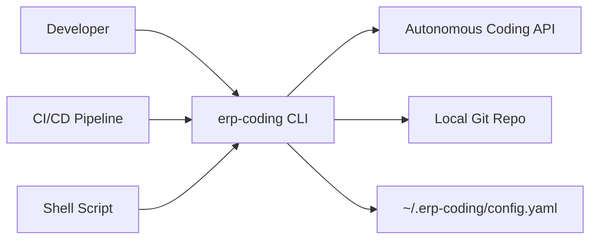
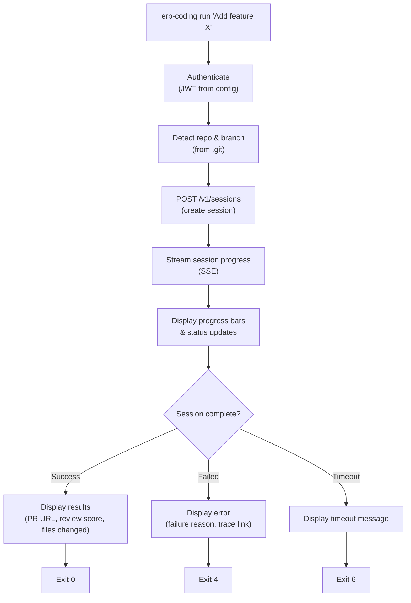

# ERP-Autonomous-Coding -- CLI Reference

## Document Information

| Field | Value |
|-------|-------|
| Module | ERP-Autonomous-Coding |
| Version | 1.0.0 |
| Last Updated | 2026-02-23 |
| Binary | `erp-coding` |
| Language | Go 1.22 |

---

## 1. Overview

The `erp-coding` CLI is a Go-based command-line tool that provides full access to the ERP-Autonomous-Coding platform from the terminal. It supports interactive and non-interactive workflows, making it suitable for both direct developer use and CI/CD pipeline integration.



---

## 2. Installation

```bash
# macOS (Homebrew)
brew install erp/tap/erp-coding

# Linux (curl)
curl -sSL https://releases.erp.dev/erp-coding/install.sh | sh

# Go install
go install erp/erp_autonomous_coding/cli@latest

# Docker
docker run --rm -it erp/erp-coding:latest

# Verify installation
erp-coding version
# erp-coding v1.0.0 (go1.22, linux/amd64)
```

---

## 3. Commands

### 3.1 Command Tree

```
erp-coding
  init          Initialize agent connection for a repository
  run           Run an autonomous coding task
  review        Review code (file, branch, or PR)
  fix           Fix bugs or CI failures
  test          Generate or run tests
  deploy        Trigger deployment pipeline
  status        Show session status
  logs          Stream session or sandbox logs
  trace         View agent reasoning trace
  config        Manage CLI configuration
  repo          Manage repository connections
  auth          Authentication management
  version       Show version information
  help          Show help for any command
```

### 3.2 erp-coding init

Initialize the agent connection for the current repository.

```bash
erp-coding init [flags]

Flags:
  --provider string      Git provider: github, gitlab, bitbucket, azure-devops
  --repo string          Repository (owner/name format)
  --branch string        Default branch (default: auto-detect)
  --server string        Server URL (default: from config)
  --interactive          Interactive setup mode (default: true)

# Examples
erp-coding init --provider github --repo my-org/my-app
erp-coding init --provider gitlab --repo group/subgroup/project
```

### 3.3 erp-coding run

Run an autonomous coding task from a natural language prompt.

```bash
erp-coding run <prompt> [flags]

Flags:
  --repo string          Target repository (default: current directory)
  --branch string        Base branch (default: repo default)
  --max-iterations int   Maximum agent iterations (default: 10)
  --sandbox-image string Sandbox image (default: auto-detect from project)
  --create-pr            Auto-create PR on success (default: true)
  --wait                 Wait for session to complete (default: true)
  --json                 Output results as JSON
  --timeout duration     Session timeout (default: 30m)

# Examples
erp-coding run "Add pagination to the /users endpoint"
erp-coding run "Implement OAuth2 login flow" --max-iterations 15
erp-coding run "Add rate limiting middleware" --sandbox-image golang:1.22 --json
```

### 3.4 erp-coding review

Review code for quality, security, and style issues.

```bash
erp-coding review [flags]

Flags:
  --file string          Review specific file
  --branch string        Review branch diff against base
  --pr string            Review pull request by ID or URL
  --checks strings       Checks to run (default: all)
                         Options: sast, secrets, dependencies, style, complexity, coverage, performance, aidd
  --format string        Output format: text, json, sarif (default: text)
  --fail-on string       Exit with error on severity: critical, high, medium, low (default: critical)

# Examples
erp-coding review --file src/handlers/users.go
erp-coding review --branch feature/oauth
erp-coding review --pr 42 --checks sast,secrets
erp-coding review --pr https://github.com/org/repo/pull/42 --format sarif
```

### 3.5 erp-coding fix

Fix bugs, errors, or CI failures.

```bash
erp-coding fix [flags]

Flags:
  --from-ci              Fix from latest CI failure
  --from-error string    Fix from error message or stack trace
  --from-issue string    Fix from issue ID or URL
  --file string          Fix specific file
  --create-pr            Auto-create PR (default: true)

# Examples
erp-coding fix --from-ci
erp-coding fix --from-error "TypeError: cannot read property 'id' of undefined"
erp-coding fix --from-issue 123
```

### 3.6 erp-coding test

Generate tests or run existing tests in sandbox.

```bash
erp-coding test [flags]

Flags:
  --file string          Generate tests for file
  --module string        Generate tests for module/package
  --coverage-target int  Target coverage percentage (default: 80)
  --type string          Test type: unit, integration, e2e (default: unit)
  --run                  Run tests in sandbox instead of generating
  --create-pr            Auto-create PR with generated tests (default: true)

# Examples
erp-coding test --file src/services/billing.py
erp-coding test --module handlers --coverage-target 90
erp-coding test --run --file tests/
```

### 3.7 erp-coding deploy

Trigger deployment pipeline.

```bash
erp-coding deploy [flags]

Flags:
  --env string           Target environment: staging, production
  --branch string        Branch to deploy (default: current)
  --dry-run              Show what would be deployed without executing
  --wait                 Wait for deployment to complete

# Examples
erp-coding deploy --env staging
erp-coding deploy --env production --branch release/1.0.0
```

---

## 4. Configuration

### 4.1 Config File Location

```
~/.erp-coding/config.yaml
```

### 4.2 Config File Format

```yaml
server:
  url: https://api.erp.dev/autonomous-coding
  timeout: 30s

auth:
  method: oauth    # oauth, token, api-key
  token_file: ~/.erp-coding/token.json

defaults:
  max_iterations: 10
  sandbox_image: auto
  auto_create_pr: true
  review_checks:
    - sast
    - secrets
    - dependencies
    - style
    - complexity
    - coverage
  review_fail_on: critical

output:
  format: text     # text, json
  color: true
  verbose: false

repositories:
  my-org/my-app:
    provider: github
    default_branch: main
    sandbox_image: python:3.12
```

---

## 5. Exit Codes

| Code | Meaning |
|------|---------|
| 0 | Success |
| 1 | General error |
| 2 | Authentication error |
| 3 | Configuration error |
| 4 | Session failed (agent could not complete task) |
| 5 | Review found critical issues (when --fail-on is set) |
| 6 | Timeout |
| 7 | Server unreachable |

---

## 6. CI/CD Integration

### 6.1 GitHub Actions

```yaml
name: AI Code Review
on:
  pull_request:
    types: [opened, synchronize]

jobs:
  review:
    runs-on: ubuntu-latest
    steps:
      - uses: actions/checkout@v4
      - name: Install erp-coding
        run: curl -sSL https://releases.erp.dev/erp-coding/install.sh | sh
      - name: Run AI review
        run: erp-coding review --pr ${{ github.event.pull_request.number }} --format sarif --fail-on high
        env:
          ERP_CODING_TOKEN: ${{ secrets.ERP_CODING_TOKEN }}
      - name: Upload SARIF
        uses: github/codeql-action/upload-sarif@v3
        with:
          sarif_file: review-results.sarif
```

### 6.2 GitLab CI

```yaml
ai-review:
  stage: review
  image: erp/erp-coding:latest
  script:
    - erp-coding review --branch $CI_MERGE_REQUEST_SOURCE_BRANCH_NAME --format json
  rules:
    - if: $CI_MERGE_REQUEST_IID
```

---

## 7. Shell Completions

```bash
# Bash
erp-coding completion bash > /etc/bash_completion.d/erp-coding

# Zsh
erp-coding completion zsh > "${fpath[1]}/_erp-coding"

# Fish
erp-coding completion fish > ~/.config/fish/completions/erp-coding.fish
```

---

## 8. CLI Workflow Diagram


