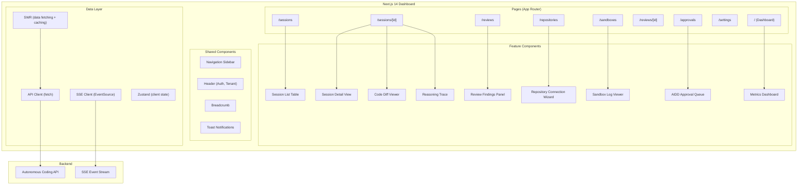
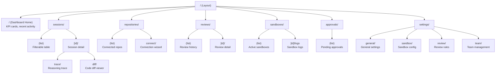
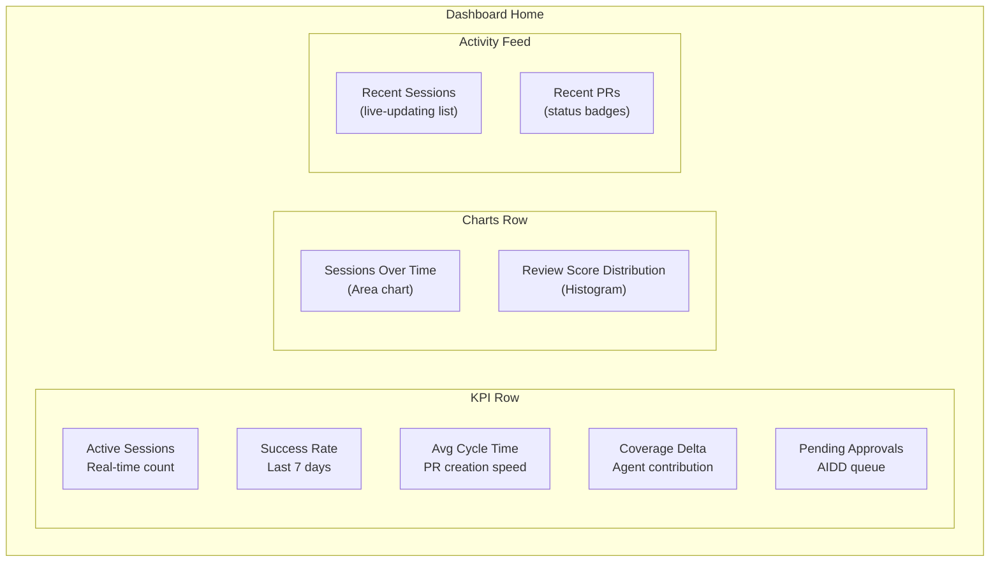
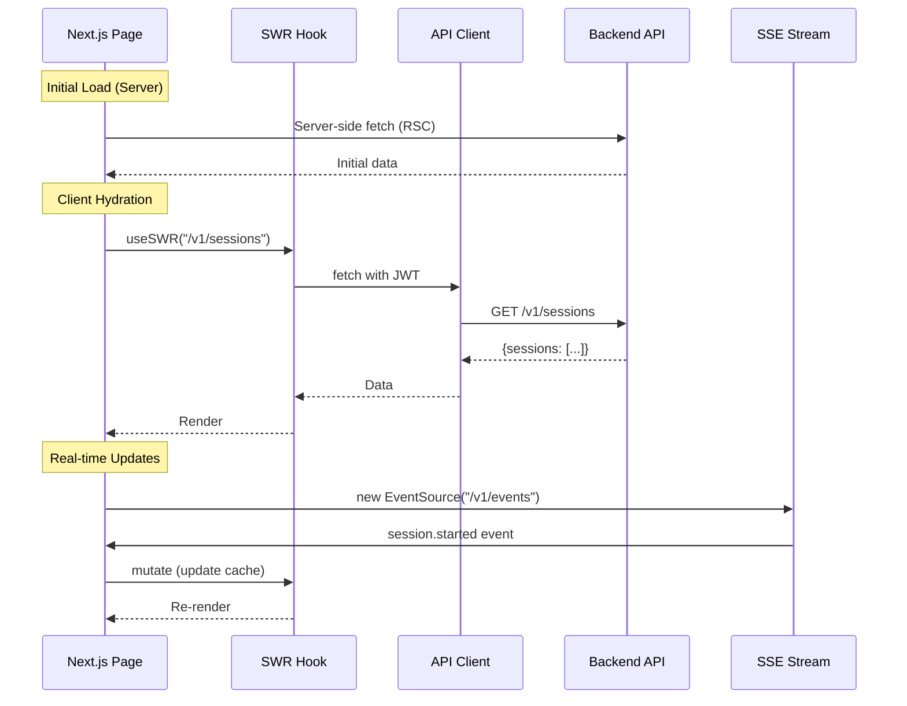
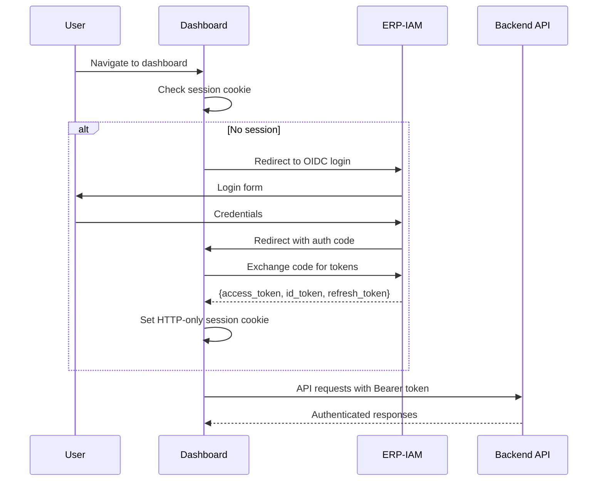

# ERP-Autonomous-Coding -- Frontend Architecture (Dashboard)

## Document Information

| Field | Value |
|-------|-------|
| Module | ERP-Autonomous-Coding |
| Version | 1.0.0 |
| Last Updated | 2026-02-23 |
| Framework | Next.js 14 |

---

## 1. Dashboard Architecture

---

## 2. Page Hierarchy

---

## 3. Key UI Components

### 3.1 Dashboard Home (KPI Cards)

### 3.2 Code Diff Viewer

The diff viewer renders agent-generated code changes with syntax highlighting, inline annotations, and approval controls:

- Split or unified diff view toggle
- Syntax-highlighted code (via Shiki or Prism)
- Inline review comments from the Review Engine
- Accept/reject controls per file or per hunk
- Link to full reasoning trace for each change

### 3.3 Reasoning Trace Viewer

The trace viewer presents the agent's step-by-step reasoning as a timeline:

- Expandable step cards showing reasoning text
- Tool invocation details (file reads, writes, terminal commands)
- Token usage per step
- Duration per step
- Error states highlighted in red

---

## 4. Technology Stack

| Layer | Technology | Purpose |
|-------|-----------|---------|
| Framework | Next.js 14 (App Router) | Server/client rendering, routing |
| Language | TypeScript | Type safety |
| Styling | Tailwind CSS + shadcn/ui | Component library |
| State (server) | SWR | Data fetching, caching, revalidation |
| State (client) | Zustand | Client-side global state |
| Real-time | EventSource (SSE) | Live session updates |
| Charts | Recharts | Data visualization |
| Diff Viewer | react-diff-viewer-continued | Code diff rendering |
| Syntax Highlighting | Shiki | Code syntax colors |
| Forms | React Hook Form + Zod | Form validation |
| Tables | TanStack Table | Sortable, filterable tables |
| Icons | Lucide React | Iconography |
| Testing | Vitest + Testing Library | Unit + component tests |
| E2E Testing | Playwright | End-to-end tests |

---

## 5. Data Fetching Pattern

---

## 6. Authentication Flow

---

## 7. Responsive Design

| Breakpoint | Layout | Sidebar | Details |
|-----------|--------|---------|---------|
| Desktop (>= 1280px) | Full | Expanded sidebar | Split panels |
| Tablet (768-1279px) | Compact | Collapsed sidebar (icons) | Stacked panels |
| Mobile (< 768px) | Single column | Hidden (hamburger menu) | Single panel |

---

## 8. Accessibility

| Standard | Implementation |
|----------|---------------|
| WCAG 2.1 AA | Color contrast, keyboard navigation, screen reader support |
| Keyboard Navigation | All interactive elements focusable, logical tab order |
| Screen Reader | ARIA labels, roles, live regions for real-time updates |
| Motion | Reduced motion media query respected |
| Color Blindness | Icons + text labels (not color alone) for status indicators |
