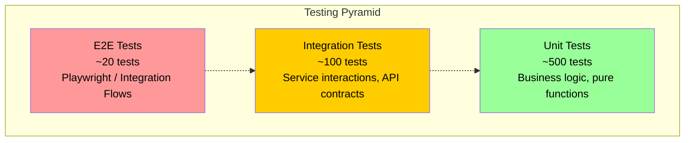
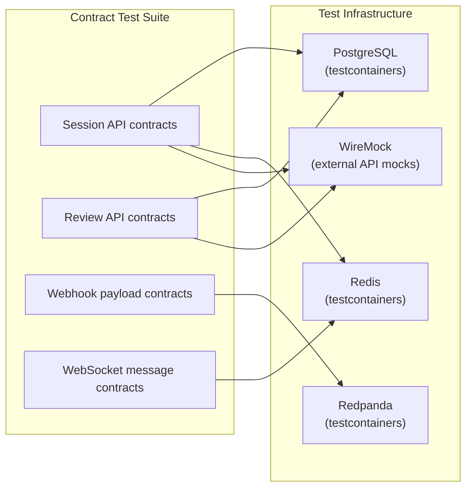
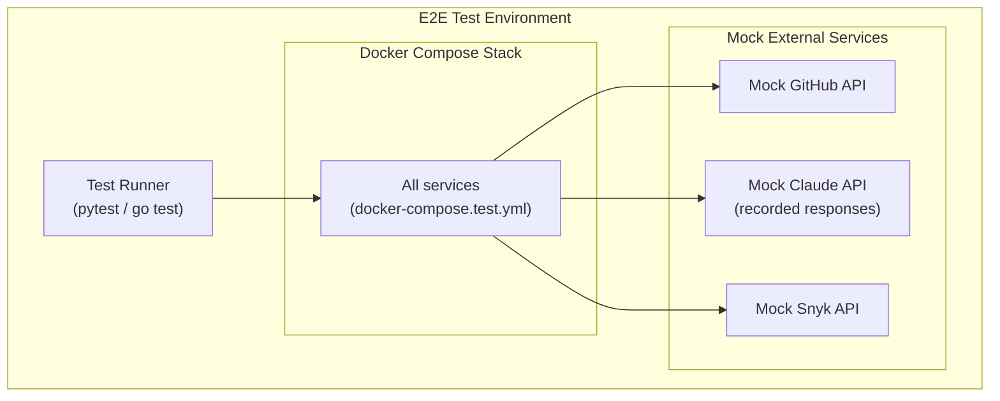
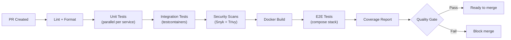

# ERP-Autonomous-Coding -- Testing Strategy

## Document Information

| Field | Value |
|-------|-------|
| Module | ERP-Autonomous-Coding |
| Version | 1.0.0 |
| Last Updated | 2026-02-23 |

---

## 1. Testing Pyramid



---

## 2. Testing by Service

### 2.1 Test Coverage Targets

| Service | Language | Framework | Unit Target | Integration Target | E2E Target |
|---------|----------|-----------|-------------|-------------------|------------|
| Agent Core | Python | pytest | 85% | 70% | Via E2E |
| Sandbox Runtime | Go | go test | 80% | 75% | Via E2E |
| Git Bridge | Go | go test | 85% | 80% | Via E2E |
| IDE Server | TypeScript | Jest/Vitest | 80% | 70% | Via E2E |
| Review Engine | Python | pytest | 85% | 75% | Via E2E |
| Task Planner | Python | pytest | 85% | 70% | Via E2E |
| Dashboard | TypeScript | Vitest + RTL | 80% | N/A | Playwright |
| CLI | Go | go test | 80% | 70% | Shell integration |
| JetBrains Plugin | Kotlin | JUnit 5 | 75% | N/A | IntelliJ test framework |
| VS Code Extension | TypeScript | Jest | 75% | N/A | VS Code E2E |

---

## 3. Unit Testing

### 3.1 Agent Core (Python)

```python
# tests/test_agent_orchestrator.py
import pytest
from unittest.mock import AsyncMock, MagicMock
from agent_core.orchestrator import AgentOrchestrator

@pytest.fixture
def orchestrator():
    claude_client = AsyncMock()
    sandbox_client = AsyncMock()
    git_client = AsyncMock()
    return AgentOrchestrator(claude_client, sandbox_client, git_client)

@pytest.mark.asyncio
async def test_generate_code_success(orchestrator):
    orchestrator.claude_client.complete.return_value = MockResponse(
        content="def hello(): return 'world'"
    )
    result = await orchestrator.generate_code("Write a hello function")
    assert result.code is not None
    assert "def hello" in result.code

@pytest.mark.asyncio
async def test_iteration_loop_retries_on_test_failure(orchestrator):
    orchestrator.sandbox_client.execute.side_effect = [
        MockExecution(exit_code=1, stderr="AssertionError"),
        MockExecution(exit_code=0, stdout="1 passed"),
    ]
    result = await orchestrator.iterate(prompt="Fix test", max_iterations=3)
    assert result.iteration_count == 2
    assert result.status == "success"
```

### 3.2 Git Bridge (Go)

```go
// services/git-bridge/adapter_test.go
func TestGitHubAdapter_CreatePullRequest(t *testing.T) {
    mock := &MockGitHubAPI{}
    adapter := NewGitHubAdapter(mock)

    pr, err := adapter.CreatePullRequest(context.Background(), CreatePRRequest{
        Owner:  "org",
        Repo:   "app",
        Title:  "Add feature",
        Branch: "agent/feature",
        Base:   "main",
    })

    require.NoError(t, err)
    assert.Equal(t, "open", pr.Status)
    assert.NotEmpty(t, pr.URL)
}

func TestUnifiedGitInterface_ProviderRouting(t *testing.T) {
    tests := []struct{
        provider string
        expected string
    }{
        {"github", "GitHubAdapter"},
        {"gitlab", "GitLabAdapter"},
        {"bitbucket", "BitbucketAdapter"},
        {"azure-devops", "AzureDevOpsAdapter"},
    }
    for _, tt := range tests {
        t.Run(tt.provider, func(t *testing.T) {
            adapter := GetAdapter(tt.provider)
            assert.Equal(t, tt.expected, adapter.Name())
        })
    }
}
```

---

## 4. Integration Testing

### 4.1 API Contract Tests



### 4.2 Sandbox Integration Tests

```go
// tests/integration/sandbox_test.go
func TestSandbox_PythonExecution(t *testing.T) {
    if testing.Short() {
        t.Skip("skipping sandbox integration test")
    }

    ctx, cancel := context.WithTimeout(context.Background(), 30*time.Second)
    defer cancel()

    sandbox, err := runtime.CreateSandbox(ctx, SandboxConfig{
        Image:  "erp/sandbox-python:3.12",
        CPU:    1,
        Memory: "512m",
    })
    require.NoError(t, err)
    defer sandbox.Destroy(ctx)

    result, err := sandbox.Execute(ctx, "python -c 'print(1+1)'")
    require.NoError(t, err)
    assert.Equal(t, 0, result.ExitCode)
    assert.Contains(t, result.Stdout, "2")
}
```

---

## 5. End-to-End Testing

### 5.1 E2E Test Scenarios

| Scenario | Flow | Assertions |
|----------|------|-----------|
| Full coding session | Prompt -> Plan -> Generate -> Test -> Review -> PR | PR created, tests pass, review score > threshold |
| PR review on webhook | GitHub webhook -> Review Engine -> Post comments | Comments posted on PR |
| CI failure fix | CI webhook -> Agent diagnoses -> Fix -> Push | Branch updated, CI re-runs |
| IDE session | WebSocket connect -> Request -> Stream -> Complete | Diff received, session completes |
| CLI workflow | `erp-coding run` -> Complete -> Output | Exit code 0, PR URL in output |
| AIDD approval | PR created -> Approval request -> Human approves -> Merge | PR merged, audit logged |

### 5.2 E2E Test Infrastructure



---

## 6. Performance Testing

### 6.1 Load Test Scenarios

| Scenario | Target | Tool |
|----------|--------|------|
| Concurrent session creation | 100 sessions/min | k6 |
| WebSocket connections | 1,000 concurrent | k6 WebSocket |
| Webhook processing throughput | 500 webhooks/min | k6 |
| Sandbox startup time | P95 < 1s (warm), P95 < 5s (cold) | Custom Go benchmark |
| API latency under load | P95 < 200ms at 100 RPS | k6 |

### 6.2 k6 Load Test Example

```javascript
import http from 'k6/http';
import { check, sleep } from 'k6';

export const options = {
  stages: [
    { duration: '1m', target: 50 },
    { duration: '3m', target: 100 },
    { duration: '1m', target: 0 },
  ],
  thresholds: {
    http_req_duration: ['p(95)<200'],
    http_req_failed: ['rate<0.01'],
  },
};

export default function () {
  const res = http.get('http://localhost:8095/v1/sessions', {
    headers: { Authorization: `Bearer ${__ENV.JWT}`, 'X-Tenant-ID': 'test-tenant' },
  });
  check(res, {
    'status is 200': (r) => r.status === 200,
    'response time < 200ms': (r) => r.timings.duration < 200,
  });
  sleep(1);
}
```

---

## 7. Security Testing

| Test Type | Tool | Frequency | Target |
|-----------|------|-----------|--------|
| SAST | Snyk Code | Every PR | All source code |
| Dependency scanning | Trivy | Daily | All dependencies |
| Container scanning | Trivy | Weekly | All Docker images |
| Secret scanning | TruffleHog | Every commit | All repos |
| Penetration testing | Manual + Burp Suite | Quarterly | API surface |
| Fuzz testing | go-fuzz / Atheris | Monthly | Input parsers |

---

## 8. Test Automation Pipeline



### 8.1 Quality Gates

| Gate | Threshold | Action on Failure |
|------|-----------|-------------------|
| Unit test coverage | >= 80% | Block merge |
| All tests pass | 100% | Block merge |
| No critical vulnerabilities | 0 critical | Block merge |
| No secrets detected | 0 secrets | Block merge |
| Performance regression | < 10% degradation | Warning |
| Code complexity | < 20 cyclomatic | Warning |
