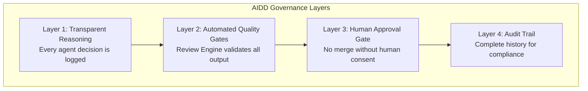
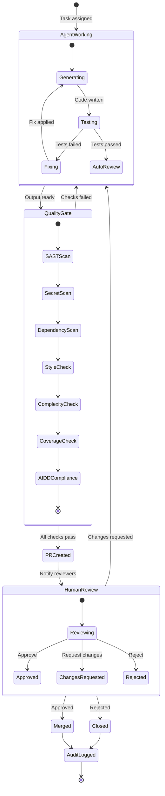
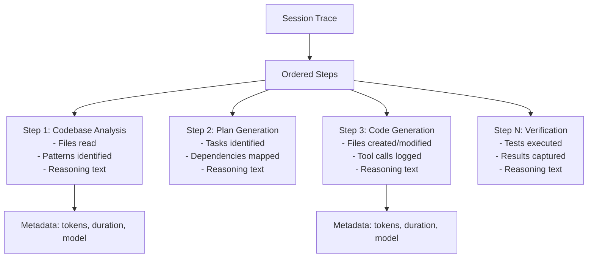
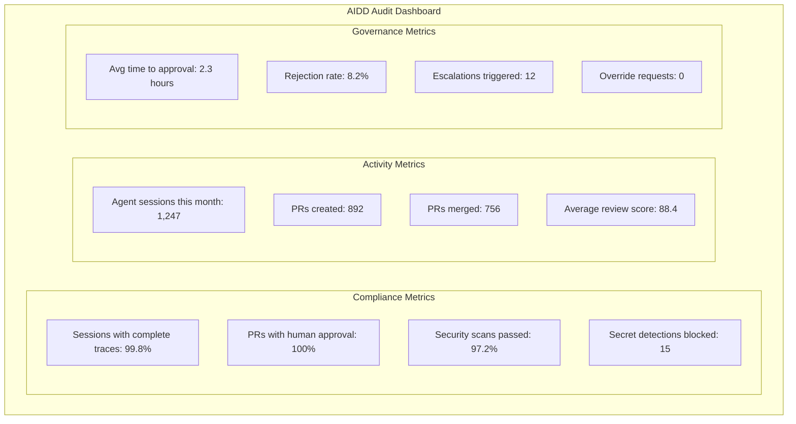
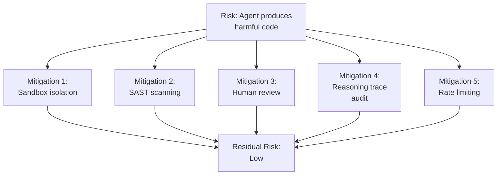

# ERP-Autonomous-Coding -- AIDD Governance Framework

## Document Information

| Field | Value |
|-------|-------|
| Module | ERP-Autonomous-Coding |
| Version | 1.0.0 |
| Last Updated | 2026-02-23 |

---

## 1. AIDD Overview

AI-Driven Development (AIDD) is the governance framework that ensures all autonomous AI actions within the ERP-Autonomous-Coding platform are transparent, auditable, and subject to human oversight. The framework enforces the principle that **no AI-generated code reaches production without explicit human approval**.

---

## 2. Governance Workflow

### 2.1 End-to-End AIDD Flow

### 2.2 Approval Policies

| Policy | Description | Configuration |
|--------|------------|---------------|
| **Required Reviewers** | Minimum number of human approvals | Default: 1, configurable per repo |
| **Review Scope** | Who can approve | Team leads, designated reviewers, CODEOWNERS |
| **Auto-merge on Approval** | Merge automatically when approved + CI passes | Default: disabled |
| **Timeout** | Maximum time before approval request expires | Default: 72 hours |
| **Escalation** | Escalate if no review within N hours | Default: 24 hours |
| **Branch Protection** | Which branches require AIDD approval | Default: main, release/* |
| **Override Policy** | Allow admin override of AI governance | Default: disabled |

---

## 3. Reasoning Trace Requirements

Every agent session must produce a complete reasoning trace that satisfies the following requirements:

### 3.1 Trace Structure

### 3.2 Trace Completeness Checklist

| Requirement | Description | Enforced |
|-------------|------------|----------|
| Every step has reasoning text | Natural language explanation of why the action was taken | Yes |
| All tool calls logged | Input arguments and output results for every tool invocation | Yes |
| File operations tracked | Every file read, write, and delete recorded | Yes |
| Terminal commands logged | Every sandbox command with stdout/stderr | Yes |
| Token usage recorded | Input/output tokens per Claude API call | Yes |
| Duration per step | Wall-clock time for each step | Yes |
| Error states captured | Failures and recovery actions | Yes |

---

## 4. Compliance Controls

### 4.1 Control Mapping

| Control ID | Control | Implementation | Evidence |
|-----------|---------|----------------|----------|
| AIDD-001 | All agent actions logged | Reasoning trace persisted to PostgreSQL | Trace query API |
| AIDD-002 | Human approval before merge | Git Bridge approval gate | Approval records in DB |
| AIDD-003 | Security scan on all output | Review Engine mandatory pipeline | Review records |
| AIDD-004 | No credential exposure | TruffleHog pre-commit scan | Scan results |
| AIDD-005 | Tenant data isolation | RLS + namespace isolation | Audit log queries |
| AIDD-006 | Agent model versioning | Model ID recorded per session | Session records |
| AIDD-007 | Reproducibility | Config + prompt + trace enable replay | Trace records |
| AIDD-008 | Rate limiting | Per-user, per-tenant limits enforced | Rate limit logs |
| AIDD-009 | Escalation on anomaly | Alert on unusual patterns | Alert records |
| AIDD-010 | Retention compliance | Data retained per policy, archived/purged on schedule | Archive records |

---

## 5. Audit Reporting

### 5.1 Audit Dashboard Metrics

### 5.2 Audit Report Generation

The platform generates periodic compliance reports containing:

1. **Session Summary**: Total sessions, success/failure breakdown, model usage
2. **Approval Summary**: All AIDD approvals with approver, decision, and timing
3. **Security Summary**: Vulnerability findings, secret detections, remediation actions
4. **Anomaly Report**: Unusual patterns (excessive retries, unusual prompts, resource spikes)
5. **Data Access Report**: Who accessed what data, when, from where

---

## 6. Risk Mitigation

The defense-in-depth approach ensures that even if one control fails, multiple additional layers prevent harmful code from reaching production. The combination of automated quality gates and mandatory human approval creates a robust governance posture suitable for regulated industries.
