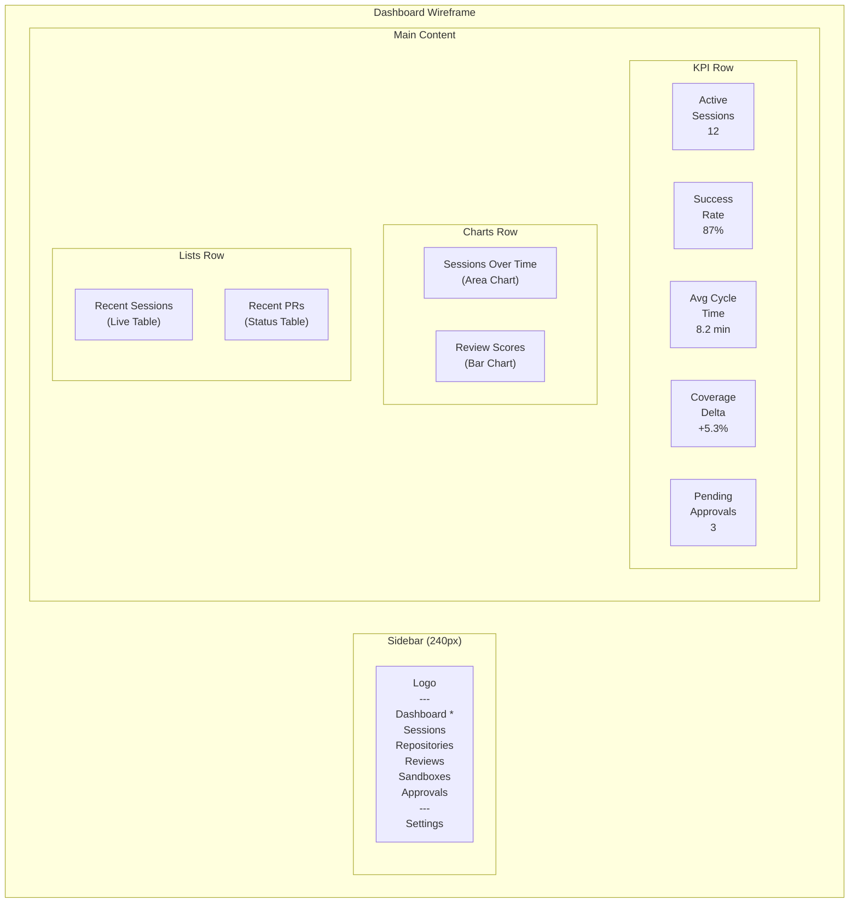

# ERP-Autonomous-Coding -- Figma Design Prompts

## Document Information

| Field | Value |
|-------|-------|
| Module | ERP-Autonomous-Coding |
| Version | 1.0.0 |
| Last Updated | 2026-02-23 |

---

## 1. Design System Foundation

All screens follow the ERP Platform design system: dark theme primary with light theme option, Inter font family, 8px grid, consistent color tokens for status (green=success, amber=warning, red=error, blue=info, purple=AI-generated).

---

## 2. Screen 1: Agent Dashboard (Home)

**Figma Prompt**:

> Design a full-width dashboard home screen for an AI autonomous coding platform. The layout uses a dark theme with a left sidebar navigation (240px wide) containing: Dashboard (active), Sessions, Repositories, Reviews, Sandboxes, Approvals, Settings icons with labels. The main content area has:
>
> **Top row**: 5 KPI metric cards in a horizontal row: "Active Sessions" (real-time count with pulsing green dot), "Success Rate" (percentage with sparkline), "Avg Cycle Time" (duration with trend arrow), "Coverage Delta" (percentage with trend), "Pending Approvals" (count with orange badge).
>
> **Middle row**: Two charts side by side. Left: area chart "Sessions Over Time" (7-day view, x-axis dates, y-axis count, fill gradient purple-to-transparent). Right: horizontal bar chart "Review Score Distribution" showing score ranges 0-60, 60-70, 70-80, 80-90, 90-100 with counts.
>
> **Bottom section**: Two columns. Left: "Recent Sessions" live-updating list with columns: Status icon (green check, yellow spinner, red X), Prompt (truncated), Repository, Duration, Review Score. Right: "Recent PRs" with columns: Status badge (Open/Merged/Closed), Title, Repository, Created time.
>
> Color palette: background #0f1117, card backgrounds #1a1d27, accent purple #7c3aed, text white #f8fafc, muted text #94a3b8. Use rounded corners (8px), subtle card shadows, and status-appropriate color coding.

---

## 3. Screen 2: Code Diff Viewer

**Figma Prompt**:

> Design a code diff viewer screen for an AI coding agent's output. Header shows session info: "Session #456 -- Add user profile API endpoint" with status badge "Completed", duration "5m 32s", review score "92/100" (green). Below the header, a tab bar: "Diff" (active), "Reasoning Trace", "Review Findings", "Sandbox Logs".
>
> The diff viewer has a file tree sidebar (200px) listing changed files with status icons (A=added green, M=modified amber, D=deleted red): models/user.py (A), handlers/profile.py (M), validators/email.py (A), tests/test_profile.py (A).
>
> The main area shows a split diff view with syntax-highlighted Python code. Left panel "main" (before), right panel "agent/user-profile-api" (after). Line numbers on both sides. Added lines have green background tint, removed lines have red background tint. Inline review comments appear as collapsible annotations between code lines -- purple left border, showing Review Engine finding with severity badge.
>
> Bottom action bar: "Accept All Changes" (primary purple button), "Accept File" (secondary), "Reject File" (ghost), "Request Changes" (outline).
>
> Use monospace font (JetBrains Mono or Fira Code) for code, same dark theme as dashboard.

---

## 4. Screen 3: PR Review Interface

**Figma Prompt**:

> Design a pull request review interface for AIDD human approval. Left panel (60% width) shows the PR details: title "Add user profile API endpoint with validation", description (markdown rendered), linked issue "#123", branch "agent/user-profile-api -> main", CI status (green check "All checks passed"), review score card (overall 92, security 95, quality 90, coverage +12.3%).
>
> Right panel (40% width) is the AIDD Approval panel: header "AIDD Approval Required", agent reasoning summary (collapsible), files changed list (4 files, +156/-12 lines), reviewer avatars, approval controls: "Approve and Merge" (green button), "Request Changes" (amber button, opens comment box), "Reject" (red button). Required approval count "1 of 1 required". Comment text area for optional approval notes.
>
> Below both panels: the diff viewer (collapsed by default, expandable per file). Each file shows inline review findings with severity badges (critical=red, high=orange, medium=yellow, low=blue, info=gray).
>
> Dark theme consistent with dashboard.

---

## 5. Screen 4: Repository Connections Panel

**Figma Prompt**:

> Design a repository connections management screen. Header: "Connected Repositories" with "Connect Repository" primary button (purple, with + icon).
>
> Main content: Card grid (3 columns) of connected repositories. Each card shows: provider icon (GitHub/GitLab/Bitbucket/Azure DevOps), repository name "org/repo-name", default branch "main", connection status (green dot "Connected" or red dot "Error"), last synced time, stats row (sessions count, PRs created, avg review score). Card actions: Settings gear icon, Disconnect (trash icon with confirmation).
>
> When "Connect Repository" is clicked, show a wizard modal: Step 1 -- Select provider (4 large icon cards: GitHub, GitLab, Bitbucket, Azure DevOps). Step 2 -- Authenticate (provider-specific OAuth flow). Step 3 -- Select repository (searchable list with checkboxes). Step 4 -- Configure (webhook events toggles, auto-review toggle, AIDD required toggle, default sandbox image dropdown). Step 5 -- Confirm and connect.
>
> Dark theme. Provider brand colors for icons: GitHub #f0f6fc, GitLab #fc6d26, Bitbucket #0052cc, Azure DevOps #0078d4.

---

## 6. Screen 5: CI/CD Status Monitor

**Figma Prompt**:

> Design a CI/CD pipeline status monitoring screen. Header: "CI/CD Status" with filters: repository dropdown, branch dropdown, time range selector (1h, 6h, 24h, 7d).
>
> Main content: Pipeline timeline view. Each pipeline is a horizontal row showing: trigger (push/PR/manual), commit info (hash, message truncated), branch, status badge (running=blue spinner, passed=green check, failed=red X, cancelled=gray slash), duration, timestamp.
>
> For failed pipelines: expandable detail panel showing build log excerpt (monospace, dark background), failure summary, and "Auto-fix with Agent" button (purple, AI icon). When agent is fixing, show progress indicator with current step ("Analyzing logs...", "Generating fix...", "Testing fix...").
>
> Right sidebar: Pipeline health summary card (pass rate %, avg duration, flaky test count), Active agents card (agents currently fixing CI issues), Recent fixes card (last 5 agent-fixed pipelines).
>
> Dark theme, status colors consistent with dashboard.

---

## 7. Screen 6: IDE Plugin Sidebar (JetBrains)

**Figma Prompt**:

> Design a JetBrains IDE tool window sidebar panel (320px wide) for the Autonomous Coding plugin. The panel has three tabs at the top: "Agent", "Sessions", "Settings".
>
> **Agent tab** (active): Prompt input area at top (multi-line text field with placeholder "Describe what you want to build..."). Below: action buttons row: "Generate Code", "Generate Tests", "Review", "Fix Bug" (icon + text buttons, compact). Below: current session status card (if running): session ID, current step (animated), progress bar, elapsed time. Below: recent actions list (last 5 actions with timestamps).
>
> **Sessions tab**: Scrollable list of recent sessions. Each entry: status icon, prompt (truncated to 2 lines), repository, time ago, review score badge. Click to expand inline with: files changed, PR link, reasoning trace link.
>
> **Settings tab**: Server URL text field, Authentication status (green "Connected" or red "Not connected" with "Sign in" button), Max iterations slider (1-20), Auto-review toggle, Default sandbox image dropdown, Theme selector (sync with IDE / dark / light).
>
> Use JetBrains Darcula theme colors: background #2b2b2b, text #a9b7c6, accent #589df6, selection #214283. Consistent with IntelliJ platform UI patterns.

---

## 8. Screen 7: VS Code Extension Panel

**Figma Prompt**:

> Design a VS Code sidebar panel for the Autonomous Coding extension. Activity bar icon on the left (brain/code icon). The sidebar has three sections in an accordion:
>
> **Sessions** (expanded): Tree view listing sessions grouped by "Active" (animated spinner) and "Recent" (last 10). Each node shows: status icon, prompt text (truncated), duration, expand to show files changed.
>
> **Repositories** (collapsed): List of connected repositories with provider icons, connection status dots.
>
> **Reviews** (collapsed): List of recent reviews with score badges.
>
> At the top of the sidebar: compact prompt input with "Ask Agent" button. Status bar item at bottom of VS Code: "Autonomous Coding: Connected" with green dot, click to open sessions.
>
> Use VS Code dark theme colors: background #1e1e1e, sidebar background #252526, text #cccccc, accent #007acc, borders #3c3c3c.

---

## 9. Screen 8: Task Breakdown View

**Figma Prompt**:

> Design a task decomposition view showing how the agent breaks down a large task. Header: "Task Plan: Add multi-currency support to billing" with overall status badge and estimated total time.
>
> Main content: Horizontal timeline / dependency graph. Each task is a card node: title, status (pending/running/completed/failed), estimated time, files affected count. Cards are connected with dependency arrows. Independent tasks are shown at the same vertical position (parallelizable). Sequential tasks flow left to right.
>
> Cards use status colors: pending=gray border, running=blue border with pulse animation, completed=green border with checkmark, failed=red border with X.
>
> Below the graph: detailed task list table with columns: Order, Title, Status, Dependencies, Files, Estimated Time, Actual Time. Expandable rows show file list and mini-diff preview.
>
> Right sidebar: Plan summary (total tasks, parallelism factor, critical path duration, estimated savings vs sequential).
>
> Dark theme consistent with dashboard.

---

## 10. Screen 9: Sandbox Logs Viewer

**Figma Prompt**:

> Design a real-time sandbox log viewer. Header: "Sandbox #012 -- python:3.12" with status badge (Running/Completed/Terminated), container ID, session link, resource usage mini-gauges (CPU %, Memory MB, Disk MB).
>
> Main content: Full-width terminal-style log output with monospace font on black background (#0d1117). Logs stream in real-time with auto-scroll (toggleable). Each log line has: timestamp (gray), stream indicator (stdout=white, stderr=red), content. Command executions are highlighted with a blue left border. Test results are color-coded (PASSED=green, FAILED=red, SKIPPED=yellow).
>
> Top toolbar: Search box (filter logs), stream filter toggles (stdout/stderr), auto-scroll toggle, clear button, download logs button, full-screen toggle.
>
> Right panel (collapsible): Resource usage charts (CPU over time, memory over time), filesystem diff summary (files created/modified/deleted with sizes).
>
> Terminal aesthetic with dark background, green-on-black option available.

---

## 11. Screen 10: Agent Reasoning Trace

**Figma Prompt**:

> Design a reasoning trace viewer showing the AI agent's step-by-step thought process. Header: "Reasoning Trace -- Session #456" with total steps count, total duration, total tokens used.
>
> Main content: Vertical timeline with expandable step cards. Each card has: step number (circle badge), action type icon (search=magnifying glass, generate=code icon, execute=terminal icon, review=shield icon), action name, duration badge, token count badge.
>
> Expanded card shows: "Reasoning" section (prose text in a quote-styled block with left purple border), "Tool Calls" section (collapsible code blocks showing tool name, input args as JSON, output/result), "Duration" (breakdown of Claude API time vs tool execution time).
>
> Error steps have red border and show error details. Iteration boundaries are marked with a horizontal divider showing "Iteration 2 of 3 -- Tests failed, retrying".
>
> Left sidebar: Step quick-nav list (clickable step numbers with action icons). Filter by action type (analyze, generate, execute, review).
>
> Dark theme with purple accent for AI reasoning content.

---

## 12. Screen 11: Settings & Preferences

**Figma Prompt**:

> Design a comprehensive settings page with a left tab navigation: General, Sandbox, Review Rules, Team, Integrations, Billing.
>
> **General tab** (active): Workspace name (editable), Default agent model dropdown (Claude models), Max iterations per session (slider 1-20), Auto-create PR toggle, AIDD enforcement toggle (with warning if disabled), Notification preferences (email toggles for: session completed, PR created, approval required, CI failure).
>
> **Sandbox tab**: Default resource limits (CPU cores slider 1-4, Memory slider 256MB-8GB, Disk slider 1GB-20GB), Network policy dropdown (Isolated/Registry Only/Allowlist/Unrestricted), Custom allowlist domains (tag input), Warm pool size (slider 5-100), Default sandbox image (dropdown with Go/Python/Node/Rust/Java/.NET/Multi options).
>
> **Review Rules tab**: Table of custom review rules with columns: Name, Category (dropdown: security, style, performance, custom), Severity (dropdown), Pattern (code/regex input), Enabled toggle. Add new rule button. Import/Export rules buttons.
>
> Each section has "Save Changes" and "Reset to Defaults" buttons at the bottom.
>
> Dark theme consistent with dashboard.

---

## 13. Design Token Reference

| Token | Value | Usage |
|-------|-------|-------|
| `--bg-primary` | #0f1117 | Page background |
| `--bg-card` | #1a1d27 | Card backgrounds |
| `--bg-input` | #252830 | Input field backgrounds |
| `--text-primary` | #f8fafc | Primary text |
| `--text-secondary` | #94a3b8 | Muted/secondary text |
| `--accent-purple` | #7c3aed | AI/Agent accent color |
| `--accent-blue` | #3b82f6 | Links, info |
| `--status-success` | #22c55e | Success, passed, connected |
| `--status-warning` | #f59e0b | Warning, pending |
| `--status-error` | #ef4444 | Error, failed, critical |
| `--status-info` | #3b82f6 | Info, running |
| `--border` | #2d3748 | Card borders, dividers |
| `--radius` | 8px | Border radius |
| `--font-body` | Inter | Body text |
| `--font-mono` | JetBrains Mono | Code, logs, terminal |
