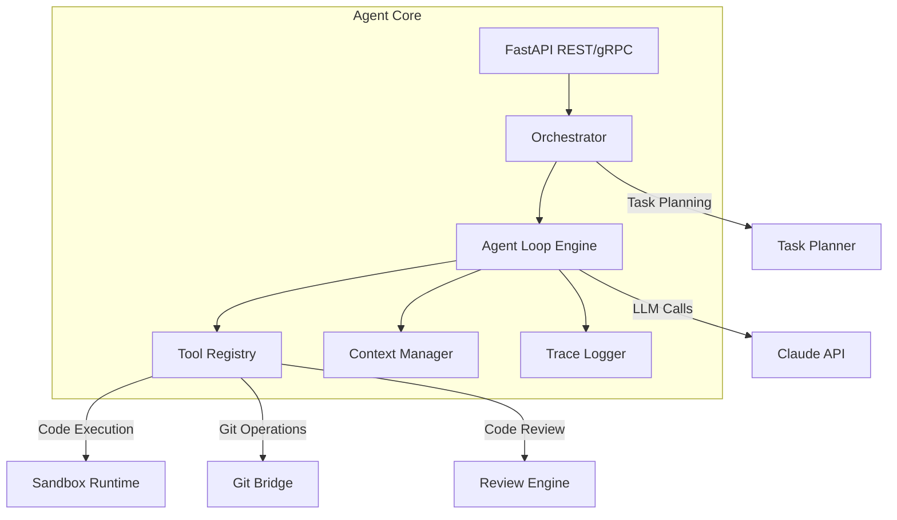
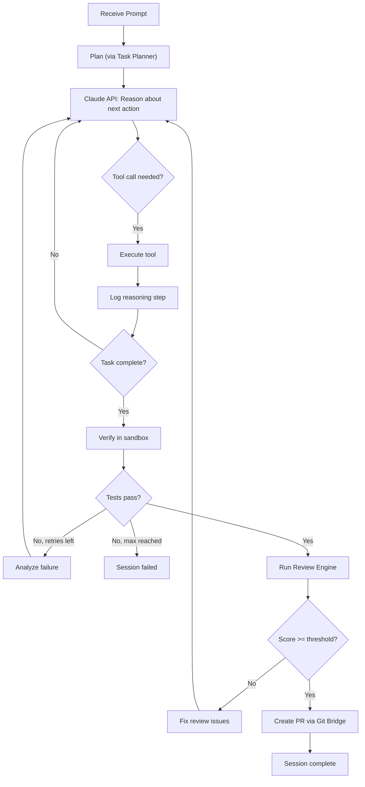
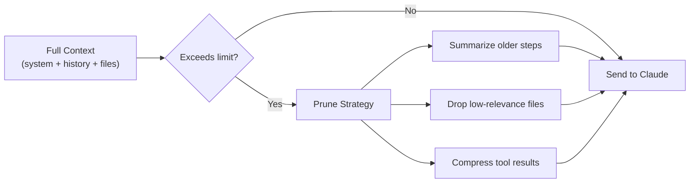
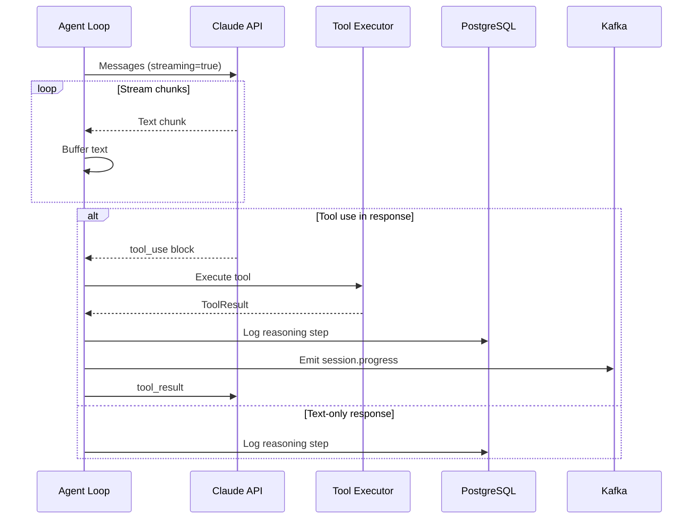
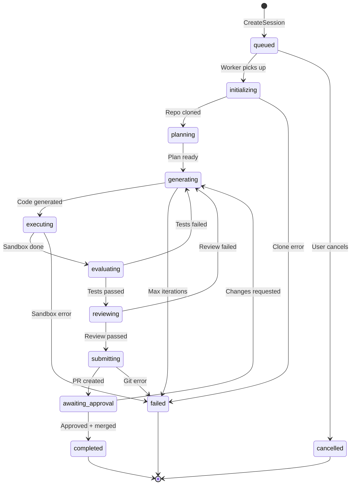

# ERP-Autonomous-Coding -- Agent Core Service Specification

## Document Information

| Field | Value |
|-------|-------|
| Service | agent-core |
| Language | Python 3.12 |
| Framework | FastAPI |
| Port | 8080 (internal), 8205 (external) |
| Source | `/services/agent-core/` |

---

## 1. Service Overview

Agent Core is the central orchestration service of the ERP-Autonomous-Coding platform. It manages the autonomous coding agent's lifecycle -- from receiving a natural language prompt to delivering a reviewed pull request. The service integrates with the Claude API for LLM reasoning, coordinates with Sandbox Runtime for code execution, with Git Bridge for repository operations, with Review Engine for quality validation, and with Task Planner for work decomposition.



---

## 2. Agent Loop Architecture

### 2.1 Iteration Cycle



### 2.2 Context Window Management

The Context Manager maintains the agent's working memory within Claude's context window limits:

| Strategy | Description |
|----------|------------|
| **Sliding window** | Keep last N tool calls and results |
| **Summarization** | Summarize older context when approaching limit |
| **File content caching** | Cache file contents, include on demand |
| **Diff-only mode** | Show only changed portions of large files |
| **Priority ranking** | Rank context items by relevance to current task |



---

## 3. Tool Implementation

### 3.1 Tool Interface

```python
from abc import ABC, abstractmethod
from dataclasses import dataclass

@dataclass
class ToolResult:
    success: bool
    output: str
    error: str | None = None
    metadata: dict | None = None

class Tool(ABC):
    @property
    @abstractmethod
    def name(self) -> str: ...

    @property
    @abstractmethod
    def description(self) -> str: ...

    @property
    @abstractmethod
    def parameters_schema(self) -> dict: ...

    @abstractmethod
    async def execute(self, params: dict) -> ToolResult: ...
```

### 3.2 Tool Implementations

| Tool | Class | Dependencies | Sandbox |
|------|-------|-------------|---------|
| `file_read` | FileReadTool | Git clone path | No |
| `file_write` | FileWriteTool | Sandbox filesystem | Yes |
| `file_delete` | FileDeleteTool | Sandbox filesystem | Yes |
| `file_search` | FileSearchTool | ripgrep binary | No |
| `terminal_exec` | TerminalExecTool | Sandbox Runtime gRPC | Yes |
| `test_run` | TestRunTool | Sandbox Runtime gRPC | Yes |
| `git_status` | GitStatusTool | Local clone | No |
| `git_commit` | GitCommitTool | Git Bridge gRPC | Via bridge |
| `git_push` | GitPushTool | Git Bridge gRPC | Via bridge |
| `git_create_pr` | GitCreatePRTool | Git Bridge gRPC | Via bridge |
| `lsp_hover` | LSPHoverTool | IDE Server WebSocket | No |
| `lsp_goto_def` | LSPGotoDefTool | IDE Server WebSocket | No |
| `lsp_find_refs` | LSPFindRefsTool | IDE Server WebSocket | No |
| `web_search` | WebSearchTool | HTTP client | No |
| `codebase_analyze` | CodebaseAnalyzeTool | Task Planner gRPC | No |

---

## 4. Claude API Integration

### 4.1 System Prompt Template

```
You are an expert software engineer working on the {project_name} project.
Your task is to: {user_prompt}

Repository: {repo_url} (branch: {branch})
Language(s): {detected_languages}
Framework(s): {detected_frameworks}
Test framework: {detected_test_framework}

You have access to the following tools:
{tool_descriptions}

Rules:
1. Always read existing code before making changes to understand patterns
2. Write tests for all new functionality
3. Follow the project's existing code style and conventions
4. Explain your reasoning before making changes
5. Verify changes compile and tests pass before submitting
```

### 4.2 Streaming Response Handler



---

## 5. Session Management

### 5.1 Session State Machine



### 5.2 Session Configuration

| Parameter | Type | Default | Description |
|-----------|------|---------|-------------|
| `max_iterations` | int | 10 | Maximum generate-test-fix iterations |
| `sandbox_image` | string | auto | Container image for sandbox |
| `review_threshold` | float | 80.0 | Minimum review score to pass |
| `timeout_minutes` | int | 30 | Session timeout |
| `auto_create_pr` | bool | true | Auto-create PR on success |
| `claude_model` | string | claude-sonnet-4-20250514 | Claude model to use |
| `temperature` | float | 0.1 | LLM temperature |

---

## 6. Error Recovery

| Error Type | Recovery Strategy | Max Retries |
|-----------|-------------------|-------------|
| Claude API timeout | Retry with exponential backoff | 3 |
| Claude API rate limit | Queue and retry after delay | 5 |
| Sandbox creation failure | Retry on different host node | 2 |
| Sandbox execution timeout | Kill and retry with simpler approach | 2 |
| Git clone failure | Retry with fresh credentials | 2 |
| Git push failure | Retry, check for conflicts | 3 |
| Review Engine unavailable | Continue without review (warn) | 1 |

---

## 7. Dependencies

```
# requirements.txt
fastapi==0.110.0
uvicorn==0.27.0
anthropic==0.18.0
grpcio==1.62.0
grpcio-tools==1.62.0
asyncpg==0.29.0
redis==5.0.1
aiokafka==0.10.0
pydantic==2.6.0
httpx==0.27.0
structlog==24.1.0
opentelemetry-api==1.23.0
opentelemetry-sdk==1.23.0
opentelemetry-instrumentation-fastapi==0.44b0
```
