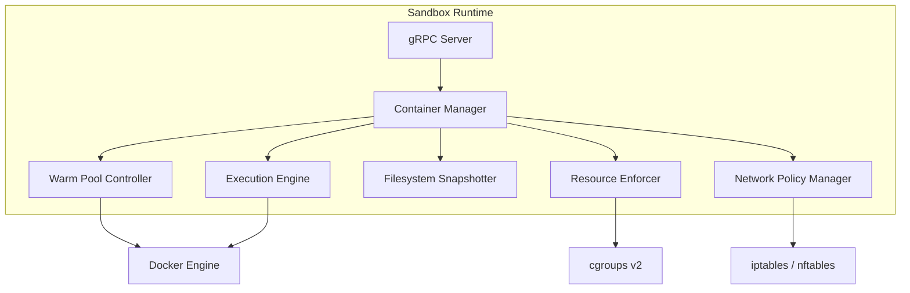
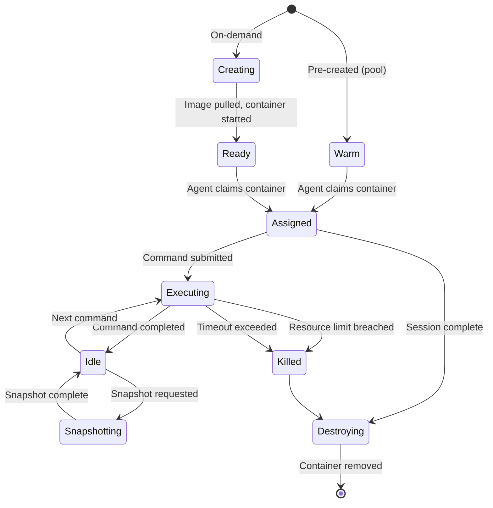
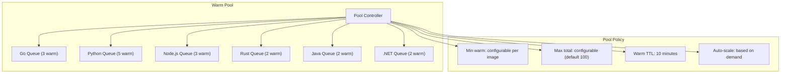
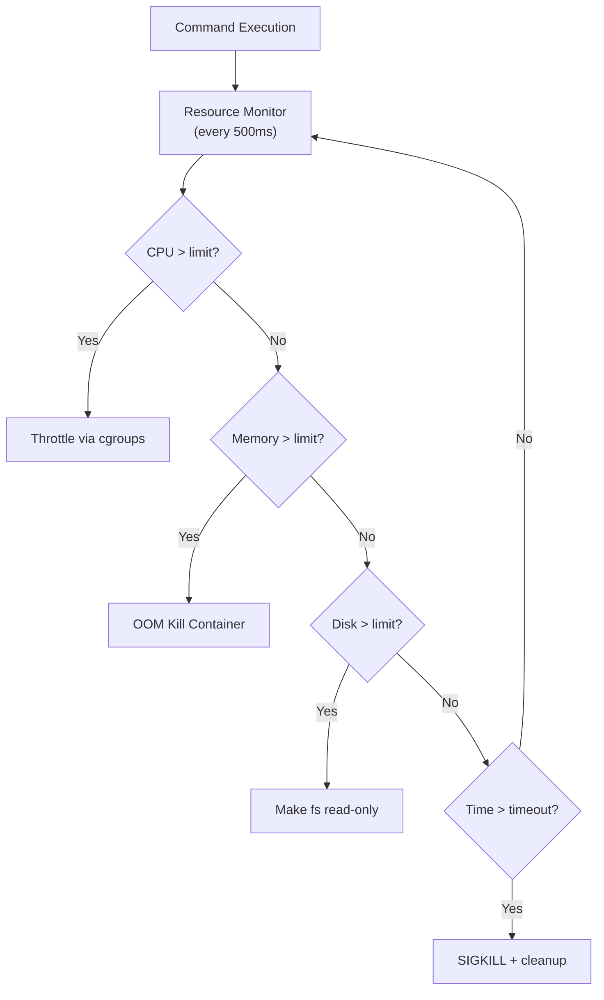
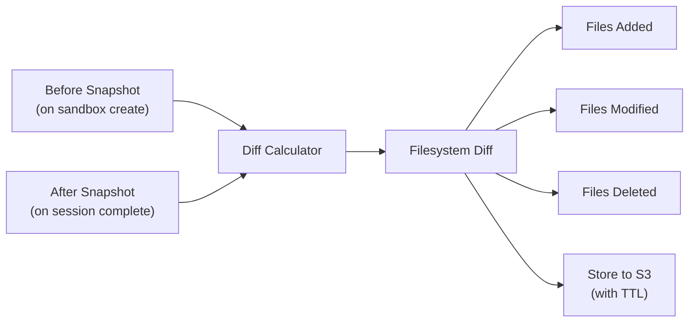

# ERP-Autonomous-Coding -- Sandbox Runtime Service Specification

## Document Information

| Field | Value |
|-------|-------|
| Service | sandbox-runtime |
| Language | Go 1.22 |
| Port | Internal only |
| Source | `/services/sandbox-runtime/` |

---

## 1. Service Overview

Sandbox Runtime manages the lifecycle of ephemeral Docker containers that provide isolated execution environments for agent-generated code. It handles container creation, resource limit enforcement, code execution, filesystem snapshotting, and container cleanup.



---

## 2. Container Lifecycle



---

## 3. Warm Pool Architecture



The warm pool maintains pre-started containers for each language image. When an agent session requests a sandbox, a warm container is assigned instantly (< 1s) rather than starting cold (< 5s). The pool controller monitors demand patterns and pre-scales during peak usage hours.

---

## 4. gRPC API

```protobuf
service SandboxService {
  // Create a new sandbox container
  rpc CreateSandbox(CreateSandboxRequest) returns (CreateSandboxResponse);

  // Execute a command in a sandbox
  rpc Execute(ExecuteRequest) returns (ExecuteResponse);

  // Stream execution output in real-time
  rpc StreamExecute(ExecuteRequest) returns (stream ExecuteOutput);

  // Take a filesystem snapshot
  rpc Snapshot(SnapshotRequest) returns (SnapshotResponse);

  // Get sandbox status
  rpc GetStatus(GetStatusRequest) returns (SandboxStatus);

  // Destroy a sandbox
  rpc Destroy(DestroyRequest) returns (DestroyResponse);

  // Get pool statistics
  rpc GetPoolStats(Empty) returns (PoolStats);
}

message CreateSandboxRequest {
  string session_id = 1;
  string image = 2;          // e.g., "erp/sandbox-python:3.12"
  ResourceLimits limits = 3;
  string network_policy = 4;  // isolated, registry_only, allowlist
  repeated string allowlist_domains = 5;
}

message ResourceLimits {
  int32 cpu_cores = 1;        // max CPU cores
  int64 memory_mb = 2;        // max memory in MB
  int64 disk_mb = 3;          // max disk in MB
  int32 max_pids = 4;         // max processes
  int32 timeout_seconds = 5;  // execution timeout
}

message ExecuteRequest {
  string sandbox_id = 1;
  string command = 2;
  string working_dir = 3;
  map<string, string> env = 4;
  int32 timeout_seconds = 5;
}

message ExecuteResponse {
  int32 exit_code = 1;
  string stdout = 2;
  string stderr = 3;
  int64 duration_ms = 4;
  ResourceUsage resource_usage = 5;
}
```

---

## 5. Resource Enforcement

| Resource | Mechanism | Default Limit | Hard Maximum |
|----------|-----------|---------------|-------------|
| CPU | cgroups v2 cpu.max | 2 cores | 4 cores |
| Memory | cgroups v2 memory.max | 4 GB | 8 GB |
| Disk | overlay quota / tmpfs size | 10 GB | 20 GB |
| PIDs | cgroups v2 pids.max | 256 | 512 |
| Network | iptables rules + nftables | Deny all | Allowlist |
| Time | Process timeout + SIGKILL | 300s | 600s |



---

## 6. Filesystem Snapshotter

The snapshotter captures before/after filesystem state for audit purposes:



---

## 7. Security Configuration

```yaml
# Sandbox container security settings
security:
  runtime: "runsc"  # gVisor
  seccomp_profile: "restricted"
  apparmor_profile: "sandbox-restricted"
  readonly_rootfs: true
  no_new_privileges: true
  user: "1000:1000"  # Non-root
  capabilities:
    drop: ["ALL"]
    add: ["NET_BIND_SERVICE"]
  tmpfs:
    - path: "/tmp"
      size: "1g"
    - path: "/workspace"
      size: "10g"
  volumes:
    # No host mounts allowed
    host_mounts: false
```

---

## 8. Metrics

| Metric | Type | Description |
|--------|------|-------------|
| `sandbox_pool_warm_total` | Gauge | Warm containers per image |
| `sandbox_pool_active_total` | Gauge | Active containers |
| `sandbox_creation_duration_seconds` | Histogram | Container creation time |
| `sandbox_execution_duration_seconds` | Histogram | Command execution time |
| `sandbox_resource_cpu_usage` | Gauge | CPU usage per container |
| `sandbox_resource_memory_bytes` | Gauge | Memory usage per container |
| `sandbox_resource_limit_breaches_total` | Counter | Resource limit violations |
| `sandbox_oom_kills_total` | Counter | OOM kills |
| `sandbox_timeouts_total` | Counter | Execution timeouts |
