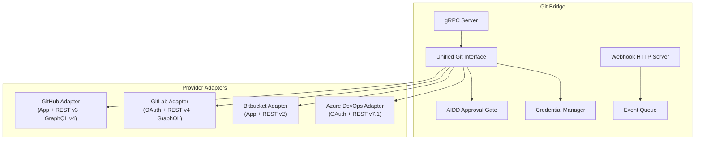
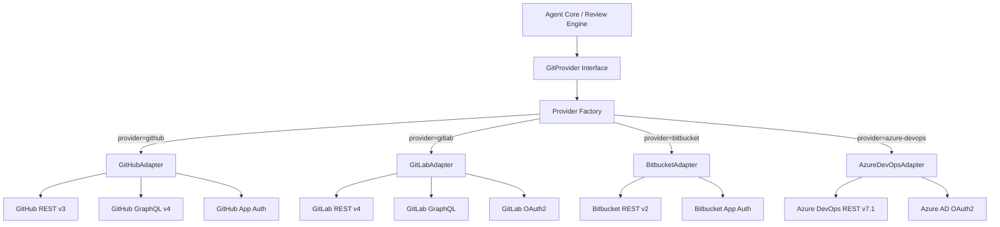
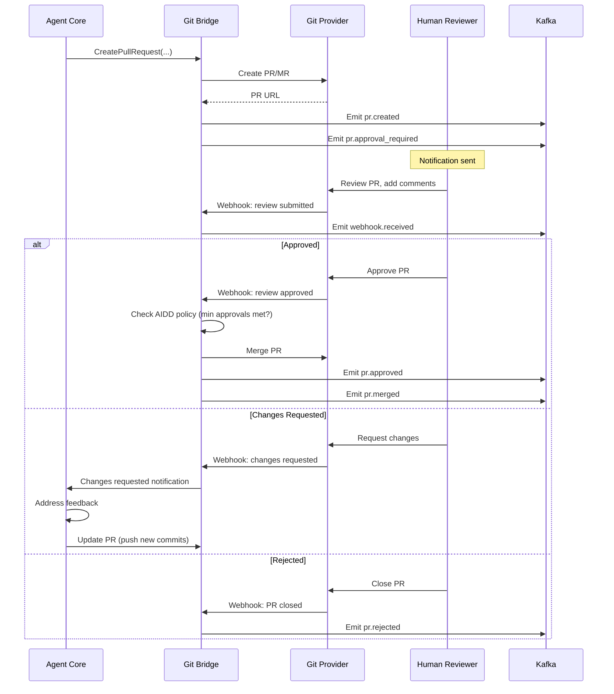
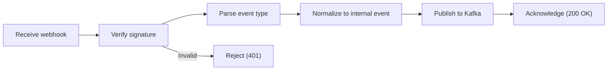
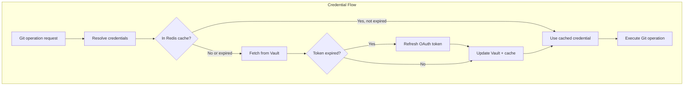

# ERP-Autonomous-Coding -- Git Bridge Service Specification

## Document Information

| Field | Value |
|-------|-------|
| Service | git-bridge |
| Language | Go 1.22 |
| Port | Internal only |
| Source | `/services/git-bridge/` |

---

## 1. Service Overview

Git Bridge provides a unified abstraction layer over four Git hosting providers: GitHub, GitLab, Bitbucket, and Azure DevOps. It handles the complete PR lifecycle, webhook event processing, and the AIDD human approval gate.



---

## 2. Unified Git Interface

### 2.1 Interface Definition

```go
type GitProvider interface {
    // Repository operations
    CloneRepository(ctx context.Context, req CloneRequest) (*CloneResult, error)
    GetRepository(ctx context.Context, owner, name string) (*Repository, error)

    // Branch operations
    CreateBranch(ctx context.Context, req CreateBranchRequest) (*Branch, error)
    DeleteBranch(ctx context.Context, req DeleteBranchRequest) error

    // Commit operations
    Commit(ctx context.Context, req CommitRequest) (*Commit, error)
    Push(ctx context.Context, req PushRequest) error

    // Pull Request operations
    CreatePullRequest(ctx context.Context, req CreatePRRequest) (*PullRequest, error)
    UpdatePullRequest(ctx context.Context, req UpdatePRRequest) (*PullRequest, error)
    GetPullRequest(ctx context.Context, id string) (*PullRequest, error)
    ListPullRequests(ctx context.Context, req ListPRRequest) ([]*PullRequest, error)
    MergePullRequest(ctx context.Context, req MergePRRequest) error
    PostReviewComment(ctx context.Context, req ReviewCommentRequest) error
    RespondToReview(ctx context.Context, req RespondRequest) error

    // Webhook operations
    RegisterWebhook(ctx context.Context, req WebhookRequest) (*Webhook, error)
    VerifyWebhook(ctx context.Context, req VerifyRequest) (bool, error)

    // CI/CD operations
    GetPipelineStatus(ctx context.Context, req PipelineRequest) (*PipelineStatus, error)
    TriggerPipeline(ctx context.Context, req TriggerRequest) (*Pipeline, error)
}
```

### 2.2 Provider Adapter Pattern



---

## 3. Provider Feature Matrix

| Feature | GitHub | GitLab | Bitbucket | Azure DevOps |
|---------|--------|--------|-----------|-------------|
| Clone via HTTPS | Yes | Yes | Yes | Yes |
| Clone via SSH | Yes | Yes | Yes | Yes |
| REST API | v3 | v4 | v2 | v7.1 |
| GraphQL API | v4 | Yes | No | No |
| App-based Auth | GitHub App | OAuth2 | App Password | OAuth2 |
| Webhooks | Yes | Yes | Yes | Service Hooks |
| PR/MR Management | Yes (PRs) | Yes (MRs) | Yes (PRs) | Yes (PRs) |
| CI/CD Integration | Actions | GitLab CI | Pipelines | Azure Pipelines |
| Issue Tracking | Issues | Issues | Jira integration | Work Items |
| Review Comments | Yes | Yes | Yes | Yes (Threads) |
| Status Checks | Check Runs | Pipeline status | Build status | Policy checks |
| Copilot Bridge | Yes | N/A | N/A | N/A |

---

## 4. AIDD Approval Gate



---

## 5. Webhook Processing

### 5.1 Webhook Verification

| Provider | Verification Method | Header |
|----------|-------------------|--------|
| GitHub | HMAC-SHA256 of payload | `X-Hub-Signature-256` |
| GitLab | Secret token comparison | `X-Gitlab-Token` |
| Bitbucket | IP allowlist + secret | N/A (IP-based) |
| Azure DevOps | Basic auth or OAuth | `Authorization` |

### 5.2 Webhook Processing Pipeline



---

## 6. Credential Management



Credentials are never stored in the database. They are managed exclusively through HashiCorp Vault with short-lived tokens cached in Redis.

---

## 7. GitHub Copilot Bridge

For organizations using GitHub Copilot alongside ERP-Autonomous-Coding, the Copilot Bridge provides:

- Shared context between Copilot suggestions and agent sessions
- Agent can reference and extend Copilot-generated code
- Unified telemetry for both Copilot and autonomous agent usage
- Policy coordination (e.g., content filters apply to both)

---

## 8. Error Handling

| Error | Retry | Fallback |
|-------|-------|----------|
| API rate limit (429) | Backoff per Retry-After header | Queue operations |
| Auth token expired | Auto-refresh, retry once | Re-authenticate |
| Webhook delivery failure | GitHub auto-retries (3x) | Dead letter queue |
| Clone timeout | Retry with shallow clone | Fail session |
| Merge conflict | Notify agent for rebase | Manual resolution |
| Provider API outage | Retry with exponential backoff | Queue and retry later |
