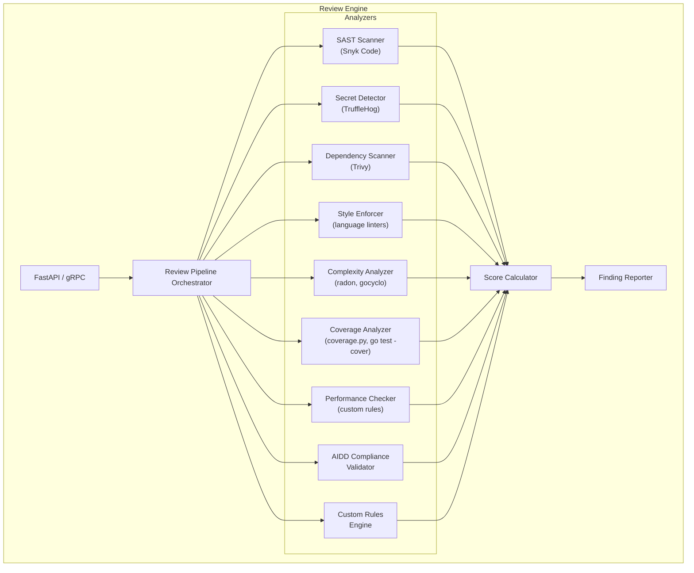
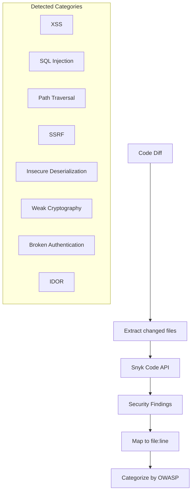
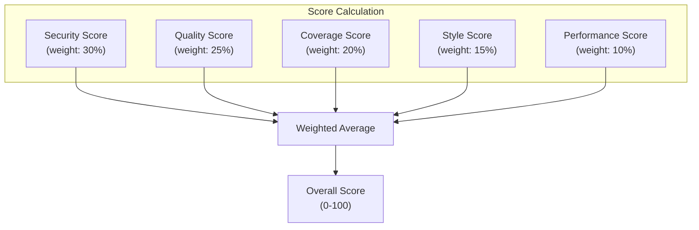
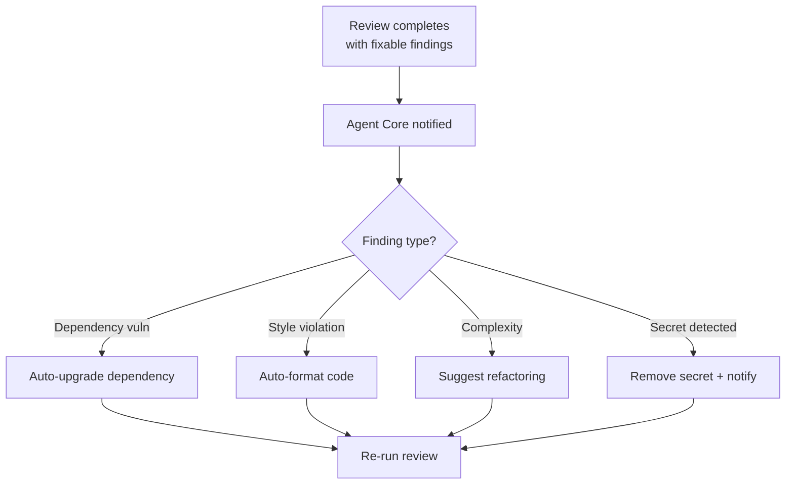

# ERP-Autonomous-Coding -- Review Engine Service Specification

## Document Information

| Field | Value |
|-------|-------|
| Service | review-engine |
| Language | Python 3.12 |
| Framework | FastAPI |
| Port | 8080 (internal), 8206 (external) |
| Source | `/services/review-engine/` |

---

## 1. Service Overview

The Review Engine performs automated, multi-dimensional code review on every piece of code produced by the autonomous agent. It orchestrates a pipeline of security, quality, and compliance checks using both built-in analyzers and third-party tools.



---

## 2. Review Pipeline

### 2.1 Pipeline Stages

```mermaid
flowchart LR
    INPUT["Code Diff"] --> S1["Stage 1:<br/>Secret Detection<br/>(blocking)"]
    S1 --> S2["Stage 2:<br/>SAST Security<br/>(blocking on critical)"]
    S2 --> S3["Stage 3:<br/>Dependency Scan<br/>(blocking on critical)"]
    S3 --> S4["Stage 4:<br/>Style Check<br/>(non-blocking)"]
    S4 --> S5["Stage 5:<br/>Complexity<br/>(non-blocking)"]
    S5 --> S6["Stage 6:<br/>Coverage<br/>(non-blocking)"]
    S6 --> S7["Stage 7:<br/>Performance<br/>(non-blocking)"]
    S7 --> S8["Stage 8:<br/>AIDD Compliance<br/>(blocking)"]
    S8 --> S9["Stage 9:<br/>Custom Rules<br/>(configurable)"]
    S9 --> SCORE["Calculate Score"]

    style S1 fill:#ff6666,color:#000
    style S2 fill:#ff6666,color:#000
    style S3 fill:#ff6666,color:#000
    style S8 fill:#ffcc00,color:#000
```



### 2.2 Blocking vs Non-Blocking

| Stage | Blocking | Criteria |
|-------|----------|---------|
| Secret Detection | Always | Any secret found = block |
| SAST Security | On critical/high | Critical or high severity = block |
| Dependency Scan | On critical | Known exploited CVE = block |
| Style Check | Never | Findings are advisory |
| Complexity | Never | Findings are advisory |
| Coverage | Configurable | Below threshold = configurable block |
| Performance | Never | Findings are advisory |
| AIDD Compliance | Always | Missing trace or approval = block |
| Custom Rules | Configurable | Per-rule severity |

---

## 3. Analyzer Details

### 3.1 SAST Scanner (Snyk Code)



### 3.2 Style Enforcer

| Language | Linter | Configuration |
|----------|--------|--------------|
| Python | ruff | `.ruff.toml` or `pyproject.toml` |
| Go | golangci-lint | `.golangci.yml` |
| TypeScript | ESLint + Prettier | `.eslintrc.json` + `.prettierrc` |
| Java | Checkstyle + SpotBugs | `checkstyle.xml` |
| Rust | clippy | `clippy.toml` |
| C# | dotnet-format | `.editorconfig` |
| Kotlin | ktlint | `.editorconfig` |

### 3.3 Complexity Analyzer

| Language | Tool | Metrics |
|----------|------|---------|
| Python | radon | Cyclomatic complexity, maintainability index |
| Go | gocyclo | Cyclomatic complexity |
| TypeScript | eslint-plugin-complexity | Cyclomatic complexity |
| Java | PMD | Cyclomatic complexity, cognitive complexity |

### 3.4 Performance Anti-Pattern Detection

| Anti-Pattern | Languages | Detection Method |
|-------------|-----------|-----------------|
| N+1 queries | Python, Go, Java | AST analysis for loop-enclosed DB calls |
| Unbounded loops | All | Loop without termination condition |
| Missing pagination | All | List queries without LIMIT/OFFSET |
| Synchronous blocking in async | Python, TypeScript | Sync calls in async functions |
| Large payload responses | All | Unbounded collection serialization |
| Missing index hints | SQL | JOIN/WHERE on non-indexed columns |

---

## 4. Scoring Algorithm



**Score deductions**:
- Critical finding: -20 points from category
- High finding: -10 points from category
- Medium finding: -5 points from category
- Low finding: -2 points from category
- Info finding: -0 points (advisory only)

---

## 5. Custom Rules Engine

Organizations can define custom review rules using a YAML-based DSL:

```yaml
rules:
  - name: "no-console-log"
    category: style
    severity: medium
    description: "Console.log statements should not be in production code"
    languages: [typescript, javascript]
    pattern: "console\\.log\\("
    exclude_paths: ["**/test/**", "**/*.spec.*"]
    message: "Remove console.log before merging"

  - name: "require-error-handling"
    category: quality
    severity: high
    description: "All API handlers must have error handling"
    languages: [go]
    ast_rule:
      type: "function"
      name_pattern: "Handle.*"
      must_contain: "error"
    message: "API handler must handle errors explicitly"

  - name: "no-hardcoded-urls"
    category: security
    severity: high
    description: "URLs should come from configuration, not hardcoded"
    languages: [all]
    pattern: "https?://[a-zA-Z0-9.-]+\\.[a-zA-Z]{2,}"
    exclude_patterns: ["localhost", "127.0.0.1", "example.com"]
    message: "Use configuration for external URLs"
```

---

## 6. Review Output Format

```json
{
  "review_id": "review-uuid-345",
  "status": "completed",
  "overall_score": 88,
  "scores": {
    "security": 95,
    "quality": 85,
    "coverage": 82,
    "style": 90,
    "performance": 88
  },
  "blocking": false,
  "findings": [
    {
      "id": "finding-001",
      "stage": "sast",
      "severity": "high",
      "category": "dependency_vulnerability",
      "title": "CVE-2024-1234 in lodash@4.17.20",
      "description": "Prototype pollution vulnerability allows...",
      "file": "package.json",
      "line": 15,
      "column": 5,
      "recommendation": "Upgrade lodash to >= 4.17.21",
      "references": ["https://nvd.nist.gov/vuln/detail/CVE-2024-1234"],
      "tool": "trivy",
      "auto_fixable": true
    }
  ],
  "summary": "Code quality is good. One high-severity dependency vulnerability found.",
  "duration_ms": 12500
}
```

---

## 7. Integration with Agent Core

When the Review Engine finds issues that the agent can fix automatically:


