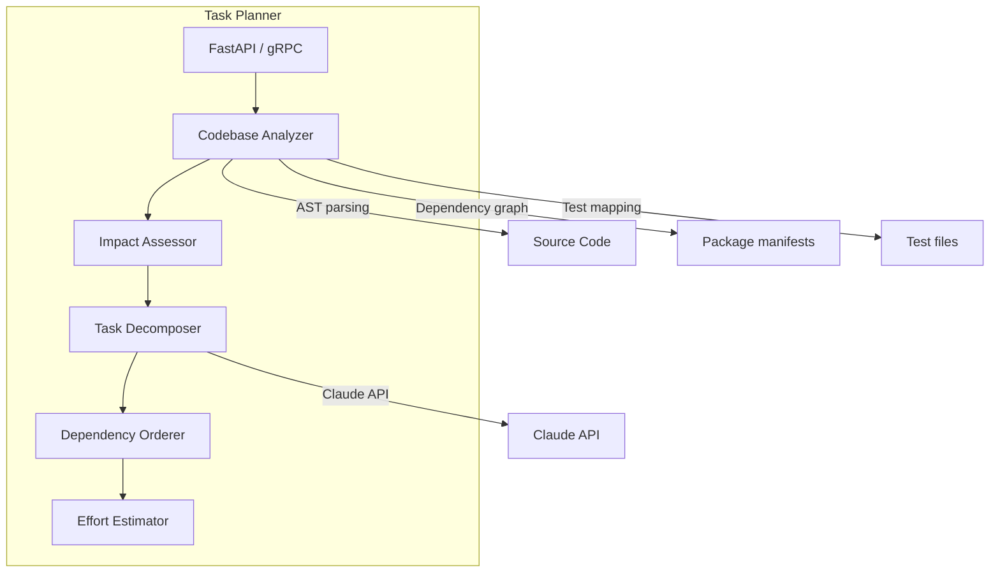
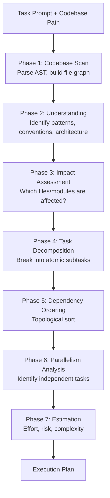
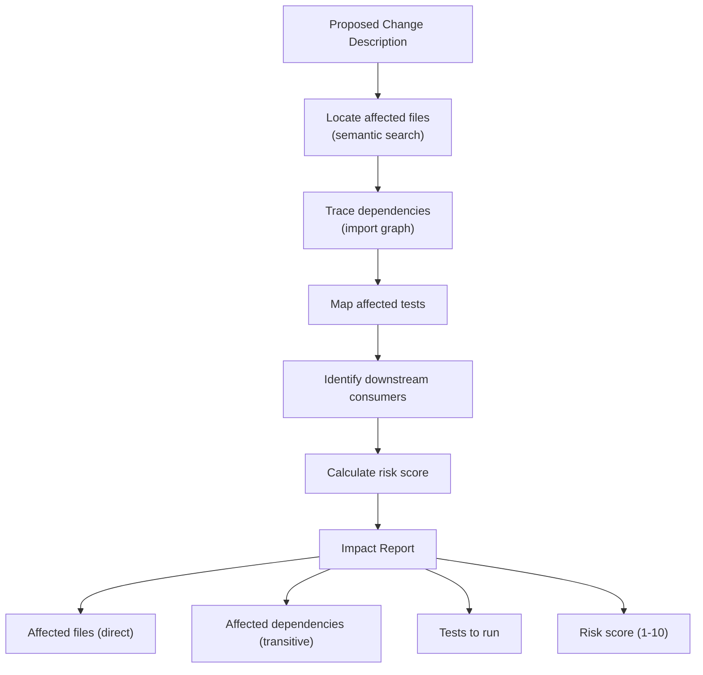
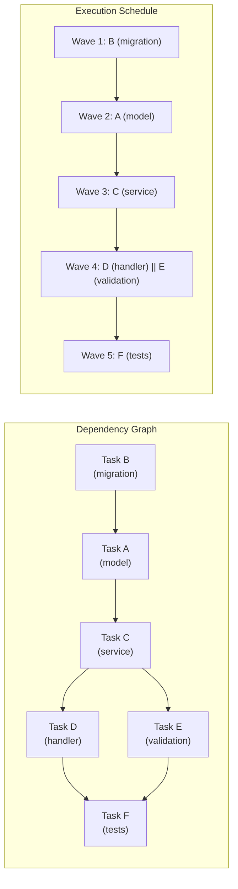

# ERP-Autonomous-Coding -- Task Planner Service Specification

## Document Information

| Field | Value |
|-------|-------|
| Service | task-planner |
| Language | Python 3.12 |
| Framework | FastAPI |
| Port | 8080 (internal), 8209 (external) |
| Source | `/services/task-planner/` |

---

## 1. Service Overview

The Task Planner decomposes large coding tasks into ordered, parallelizable subtasks. It analyzes the target codebase to understand structure, dependencies, and patterns, then generates an execution plan with impact assessment, dependency ordering, and effort estimates.



---

## 2. Planning Pipeline



---

## 3. Codebase Analyzer

### 3.1 Analysis Outputs

| Analysis | Description | Method |
|----------|------------|--------|
| File tree | Complete project structure | Filesystem scan |
| Language detection | Primary and secondary languages | File extension + content analysis |
| Framework detection | Web frameworks, test frameworks, build tools | Pattern matching on config files |
| Dependency graph | Module-level import relationships | AST parsing per language |
| Test mapping | Which tests cover which source files | Import analysis + naming conventions |
| API surface | Endpoints, routes, handlers | Framework-specific parsing |
| Database schema | Tables, columns, relationships | Migration file parsing |
| Configuration | Environment variables, config files | Pattern matching |

### 3.2 Supported Language Parsers

| Language | AST Parser | Dependency Detection |
|----------|-----------|---------------------|
| Python | ast (stdlib) | import analysis |
| Go | go/parser | import analysis |
| TypeScript | @typescript-eslint/parser | import/require analysis |
| Java | JavaParser | import analysis |
| Kotlin | KotlinParser | import analysis |
| Rust | syn (via tree-sitter) | use/mod analysis |
| C# | Roslyn (via tree-sitter) | using analysis |

---

## 4. Impact Assessment



### 4.1 Risk Scoring

| Factor | Weight | Score Range |
|--------|--------|-------------|
| Number of files affected | 20% | 1-10 based on count |
| Critical path involvement | 25% | Higher if core modules affected |
| Test coverage of affected area | 20% | Lower coverage = higher risk |
| Number of downstream consumers | 15% | More consumers = higher risk |
| Database schema changes | 10% | Schema changes = higher risk |
| API contract changes | 10% | Breaking changes = higher risk |

---

## 5. Task Decomposition Strategy

### 5.1 Decomposition Rules

1. **Atomic tasks**: Each task should modify a small, coherent set of files
2. **Testable**: Each task should have a verifiable success criterion
3. **Ordered**: Tasks respect dependencies (e.g., model before handler)
4. **Parallel where possible**: Independent tasks can execute concurrently
5. **Rollback-safe**: Each task can be reverted independently

### 5.2 Common Decomposition Patterns

```mermaid
flowchart TB
    subgraph "Pattern: New API Endpoint"
        T1_A["1. Database migration"]
        T2_A["2. Domain model"]
        T3_A["3. Repository/DAO"]
        T4_A["4. Service/business logic"]
        T5_A["5. API handler"]
        T6_A["6. Validation"]
        T7_A["7. Tests"]
        T8_A["8. Documentation"]

        T1_A --> T2_A --> T3_A --> T4_A --> T5_A
        T4_A --> T6_A
        T5_A --> T7_A
        T6_A --> T7_A
        T7_A --> T8_A
    end

    subgraph "Pattern: Bug Fix"
        T1_B["1. Reproduce (write failing test)"]
        T2_B["2. Identify root cause"]
        T3_B["3. Apply fix"]
        T4_B["4. Verify fix (test passes)"]
        T5_B["5. Add regression tests"]

        T1_B --> T2_B --> T3_B --> T4_B --> T5_B
    end

    subgraph "Pattern: Refactoring"
        T1_C["1. Ensure test coverage"]
        T2_C["2. Extract/restructure"]
        T3_C["3. Update consumers"]
        T4_C["4. Verify tests still pass"]
        T5_C["5. Clean up"]

        T1_C --> T2_C --> T3_C --> T4_C --> T5_C
    end
```



---

## 6. Dependency Ordering

The orderer uses topological sort to determine task execution order:



Tasks D and E are independent of each other and can execute in parallel (Wave 4).

---

## 7. API Endpoints

```
GET  /healthz                    # Health check
GET  /v1/task-planner            # List plans (paginated)
POST /v1/planner/analyze         # Analyze codebase
POST /v1/planner/impact          # Assess impact of change
POST /v1/planner/decompose       # Decompose task into subtasks
GET  /v1/planner/{id}/plan       # Get execution plan
GET  /v1/planner/{id}/graph      # Get dependency graph (DOT format)
```

---

## 8. Plan Output Format

```json
{
  "plan_id": "plan-uuid-567",
  "prompt": "Add multi-currency support to billing",
  "analysis": {
    "languages": ["python"],
    "frameworks": ["fastapi", "sqlalchemy", "pytest"],
    "files_analyzed": 47,
    "lines_of_code": 12500,
    "modules_affected": ["billing", "invoicing", "payments"]
  },
  "impact": {
    "direct_files": 8,
    "transitive_dependencies": 15,
    "tests_affected": 12,
    "risk_score": 6.5
  },
  "tasks": [
    {
      "id": "task-1",
      "title": "Add Currency model and migration",
      "description": "Create SQLAlchemy Currency model with code, name, symbol, exchange_rate fields and Alembic migration",
      "order": 1,
      "wave": 1,
      "parallelizable": false,
      "dependencies": [],
      "affected_files": ["models/currency.py", "migrations/versions/0045_add_currency.py"],
      "estimated_minutes": 5,
      "risk": "low",
      "verification": "Migration runs successfully, model instantiable"
    }
  ],
  "schedule": {
    "waves": 5,
    "critical_path_minutes": 35,
    "parallel_execution_minutes": 22,
    "parallelism_factor": 1.6
  }
}
```
