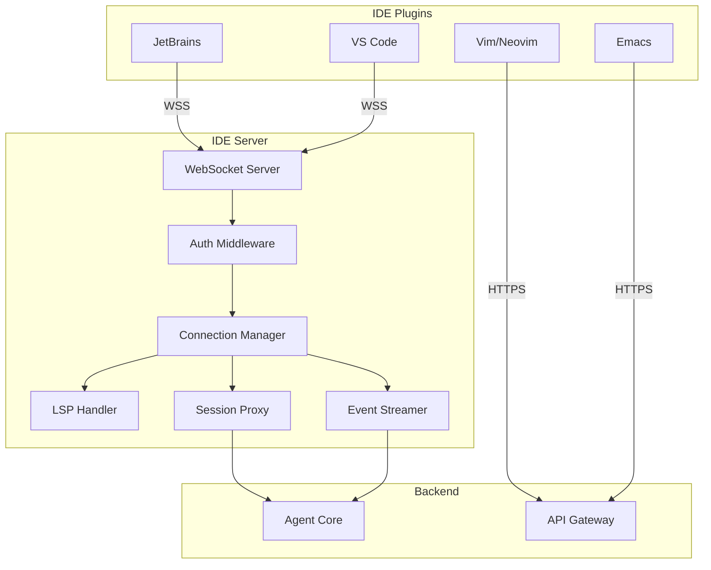
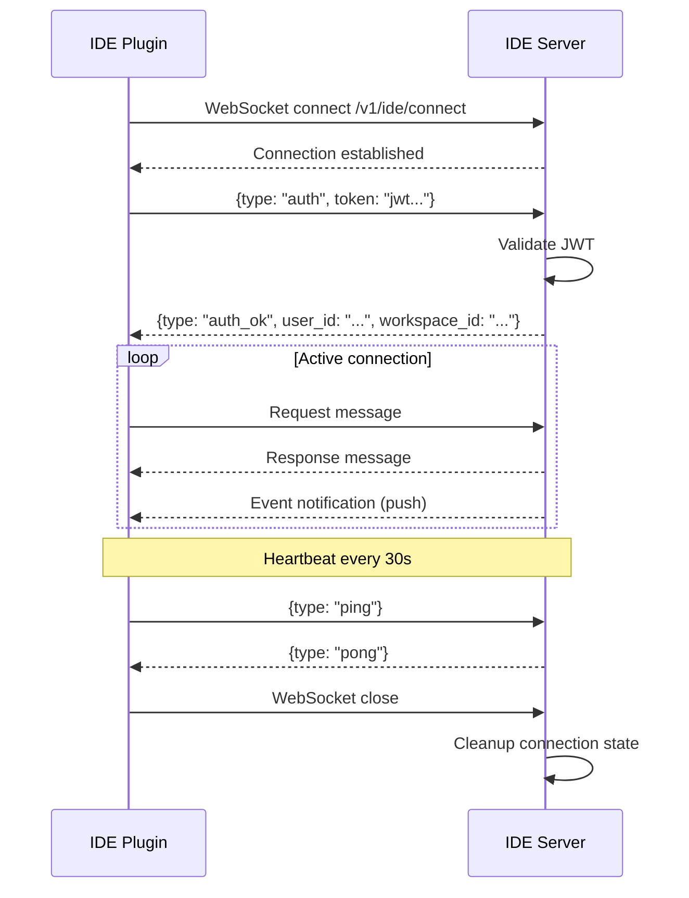
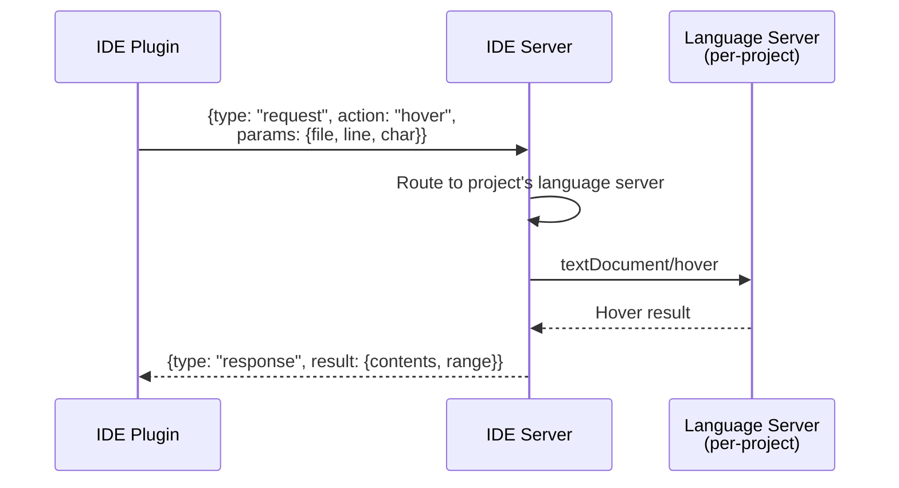
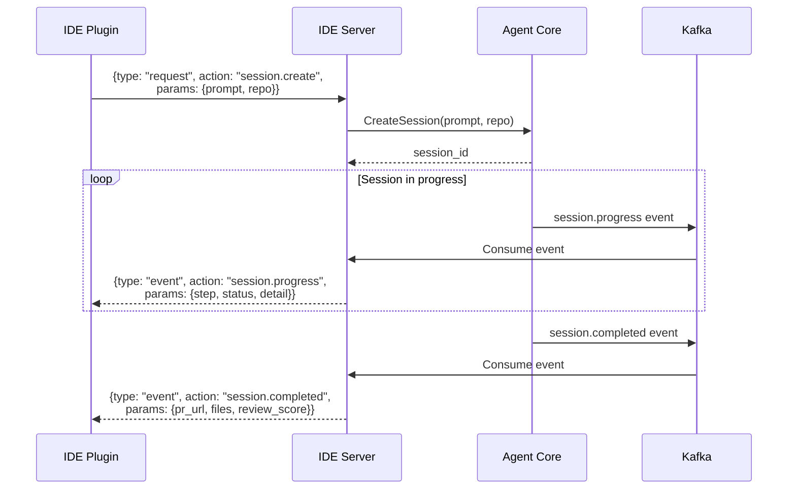
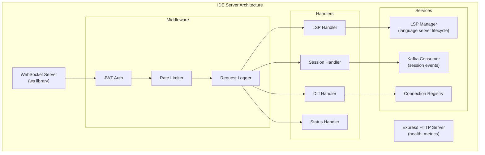

# ERP-Autonomous-Coding -- IDE Server Service Specification

## Document Information

| Field | Value |
|-------|-------|
| Service | ide-server |
| Language | TypeScript |
| Framework | Express |
| Port | 8080 (internal), 8207 (external) |
| Source | `/services/ide-server/` |

---

## 1. Service Overview

The IDE Server bridges IDE plugins with the Agent Core, providing LSP (Language Server Protocol) capabilities over WebSocket and serving as the real-time communication hub for IDE-based agent interactions.



---

## 2. WebSocket Protocol

### 2.1 Connection Lifecycle



### 2.2 Message Format

```typescript
interface Message {
  type: "request" | "response" | "event" | "error" | "auth" | "ping" | "pong";
  id?: string;         // Correlation ID for request/response pairs
  action?: string;     // Action name for requests
  params?: Record<string, unknown>;  // Request parameters
  result?: unknown;    // Response result
  error?: {
    code: string;
    message: string;
  };
}
```

---

## 3. LSP Capabilities

### 3.1 Supported LSP Methods

| LSP Method | Action Name | Description |
|-----------|-------------|-------------|
| `textDocument/hover` | `hover` | Type information and documentation |
| `textDocument/definition` | `definition` | Navigate to definition |
| `textDocument/references` | `references` | Find all references |
| `textDocument/completion` | `completions` | Code completions |
| `textDocument/publishDiagnostics` | `diagnostics` | Error/warning reporting |
| `textDocument/codeAction` | `codeActions` | Quick fixes, refactoring |
| `textDocument/formatting` | `formatting` | Code formatting |
| `textDocument/rename` | `rename` | Symbol rename |

### 3.2 LSP Request/Response Flow



### 3.3 Language Server Management

The IDE Server manages one language server process per active project:

| Language | Server | Protocol |
|----------|--------|----------|
| Python | pylsp (python-lsp-server) | JSON-RPC over stdio |
| Go | gopls | JSON-RPC over stdio |
| TypeScript | typescript-language-server | JSON-RPC over stdio |
| Java | Eclipse JDT LS | JSON-RPC over stdio |
| Rust | rust-analyzer | JSON-RPC over stdio |
| C# | OmniSharp | JSON-RPC over stdio |
| Kotlin | kotlin-language-server | JSON-RPC over stdio |

---

## 4. Session Streaming

### 4.1 Real-time Session Updates

When an agent session is active, the IDE Server streams updates to connected IDE plugins:



---

## 5. Connection Management

### 5.1 Connection Registry

| Property | Description |
|----------|------------|
| Connection ID | Unique per WebSocket connection |
| User ID | Authenticated user (from JWT) |
| Workspace ID | Active workspace |
| IDE Type | JetBrains, VS Code, Vim/Neovim, Emacs |
| IDE Version | Plugin version |
| Active Sessions | Sessions being monitored |
| Last Heartbeat | Timestamp of last ping |

### 5.2 Connection Limits

| Limit | Value | Enforcement |
|-------|-------|-------------|
| Max connections per user | 5 | Reject new connections |
| Max connections per workspace | 50 | Reject new connections |
| Heartbeat interval | 30s | Disconnect on 3 missed heartbeats |
| Message rate limit | 100 msg/min | Throttle |
| Max message size | 1 MB | Reject oversized messages |

---

## 6. Diff Application

When the agent generates code changes, the IDE Server formats them for the IDE's native diff viewer:

```typescript
interface DiffPayload {
  session_id: string;
  changes: FileChange[];
}

interface FileChange {
  file: string;
  action: "create" | "modify" | "delete" | "rename";
  content?: string;        // Full content for create
  hunks?: DiffHunk[];      // Hunks for modify
  old_path?: string;       // For rename
}

interface DiffHunk {
  old_start: number;
  old_count: number;
  new_start: number;
  new_count: number;
  content: string;         // Unified diff format
}
```

---

## 7. Architecture Patterns



---

## 8. Metrics

| Metric | Type | Description |
|--------|------|-------------|
| `ide_server_connections_active` | Gauge | Current WebSocket connections |
| `ide_server_connections_total` | Counter | Total connections established |
| `ide_server_messages_received_total` | Counter | Messages from IDE plugins |
| `ide_server_messages_sent_total` | Counter | Messages to IDE plugins |
| `ide_server_lsp_request_duration_ms` | Histogram | LSP request latency |
| `ide_server_session_events_streamed` | Counter | Session events forwarded |
| `ide_server_auth_failures_total` | Counter | Authentication failures |
