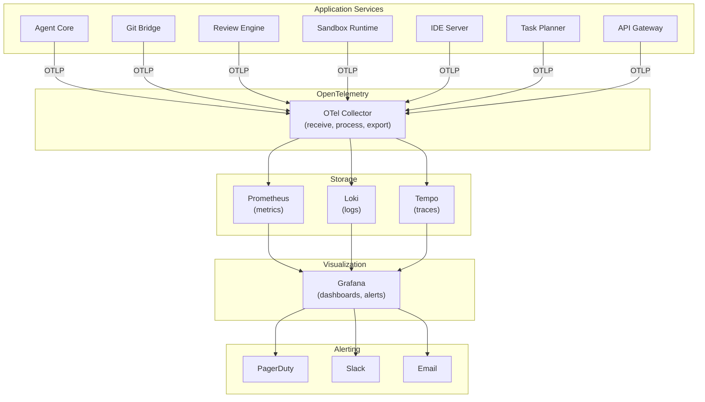
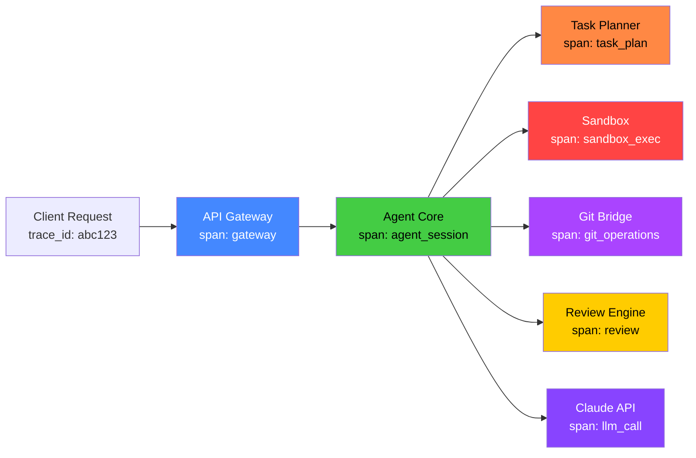
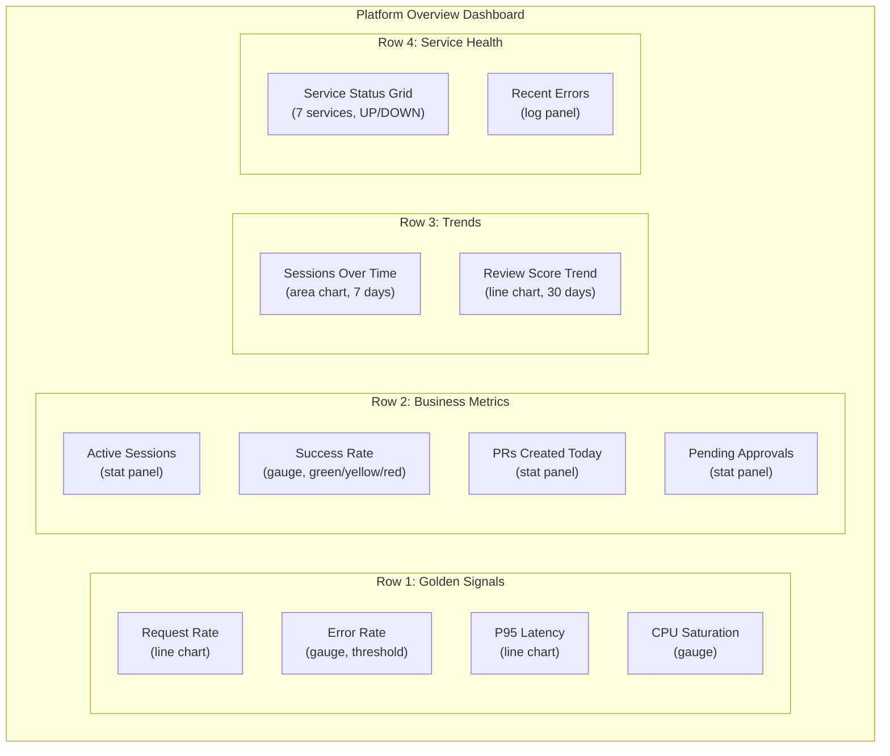

# ERP-Autonomous-Coding -- Observability Guide

## Document Information

| Field | Value |
|-------|-------|
| Module | ERP-Autonomous-Coding |
| Version | 1.0.0 |
| Last Updated | 2026-02-23 |

---

## 1. Observability Architecture



---

## 2. Metrics

### 2.1 Golden Signals

| Signal | Metric | Service | Alert Threshold |
|--------|--------|---------|-----------------|
| **Latency** | `http_request_duration_seconds` | All | P95 > 2s |
| **Traffic** | `http_requests_total` | All | Spike > 3x normal |
| **Errors** | `http_requests_total{status=5xx}` | All | Error rate > 1% |
| **Saturation** | `container_cpu_usage_seconds_total` | All | CPU > 80% |

### 2.2 Business Metrics

| Metric | Type | Description |
|--------|------|-------------|
| `ac_sessions_total` | Counter | Total sessions created (by status, repo) |
| `ac_sessions_active` | Gauge | Currently running sessions |
| `ac_session_duration_seconds` | Histogram | Session completion time |
| `ac_session_iterations` | Histogram | Iterations per session |
| `ac_review_score` | Histogram | Review scores distribution |
| `ac_pr_created_total` | Counter | PRs created by agent |
| `ac_pr_merged_total` | Counter | PRs merged |
| `ac_pr_rejected_total` | Counter | PRs rejected |
| `ac_approval_wait_seconds` | Histogram | Time to AIDD approval |
| `ac_claude_api_duration_seconds` | Histogram | Claude API call latency |
| `ac_claude_api_tokens_total` | Counter | Tokens consumed (input/output) |
| `ac_sandbox_startup_seconds` | Histogram | Sandbox startup time |
| `ac_sandbox_pool_size` | Gauge | Warm pool size per image |
| `ac_webhook_processing_seconds` | Histogram | Webhook processing latency |
| `ac_ide_connections_active` | Gauge | Active IDE connections |

---

## 3. Distributed Tracing

### 3.1 Trace Propagation



### 3.2 Key Spans

| Span Name | Service | Attributes |
|-----------|---------|-----------|
| `gateway.request` | API Gateway | method, path, status, tenant_id |
| `agent.session` | Agent Core | session_id, prompt (truncated), repo |
| `agent.iteration` | Agent Core | iteration_number, action |
| `agent.claude_call` | Agent Core | model, tokens_in, tokens_out |
| `agent.tool_call` | Agent Core | tool_name, duration |
| `sandbox.create` | Sandbox Runtime | image, pool_hit |
| `sandbox.execute` | Sandbox Runtime | command (truncated), exit_code |
| `git.clone` | Git Bridge | provider, repo, duration |
| `git.push` | Git Bridge | provider, branch |
| `git.create_pr` | Git Bridge | provider, pr_id |
| `review.pipeline` | Review Engine | checks_run, overall_score |
| `planner.decompose` | Task Planner | task_count, waves |

---

## 4. Logging

### 4.1 Log Format

All services use structured JSON logging:

```json
{
  "timestamp": "2026-02-23T10:00:00.123Z",
  "level": "info",
  "service": "agent-core",
  "trace_id": "abc123def456",
  "span_id": "789ghi",
  "tenant_id": "tenant-uuid",
  "user_id": "user-uuid",
  "session_id": "session-uuid",
  "message": "Session started",
  "attributes": {
    "prompt_length": 45,
    "repository": "org/repo",
    "model": "claude-sonnet-4-20250514"
  }
}
```

### 4.2 Log Levels

| Level | Usage | Example |
|-------|-------|---------|
| ERROR | Unexpected failures requiring attention | Database connection failure, Claude API error |
| WARN | Degraded behavior, potential issues | Rate limit approached, high memory usage |
| INFO | Normal operational events | Session started, PR created, review completed |
| DEBUG | Detailed debugging information | Tool call details, context window management |

---

## 5. Grafana Dashboards

### 5.1 Dashboard Catalog

| Dashboard | Audience | Key Panels |
|-----------|----------|-----------|
| **Platform Overview** | Engineering leads | Active sessions, success rate, error rate, latency P95 |
| **Agent Performance** | Engineering team | Session duration distribution, iteration counts, Claude API latency |
| **Sandbox Health** | DevOps | Pool utilization, startup times, resource limit breaches, OOM kills |
| **Git Bridge** | DevOps | Webhook throughput, provider API latency, PR lifecycle times |
| **Review Engine** | Security team | Scan results, vulnerability trends, secret detections |
| **IDE Server** | Engineering team | Active connections, LSP latency, message rates |
| **Cost Analysis** | Management | Claude API token usage, sandbox compute hours, cost per session |

### 5.2 Platform Overview Dashboard Layout



---

## 6. Alerting Rules

### 6.1 Critical Alerts

| Alert | Condition | Action | Notification |
|-------|-----------|--------|-------------|
| Service Down | Health check fails 3x | Auto-restart pod | PagerDuty |
| Error Rate Spike | > 5% error rate for 5 min | Investigate | PagerDuty + Slack |
| Database Connection Pool Exhausted | Available connections = 0 | Scale pool | PagerDuty |
| Claude API Unavailable | Circuit breaker open | Queue sessions | Slack |
| Sandbox Pool Depleted | 0 warm containers for 2 min | Scale pool | Slack |
| Secret Detected | TruffleHog finding | Block commit | PagerDuty + Email |

### 6.2 Warning Alerts

| Alert | Condition | Notification |
|-------|-----------|-------------|
| High Latency | P95 > 5s for 10 min | Slack |
| Sandbox OOM Kills | > 5/hour | Slack |
| Claude API Rate Limiting | > 10 429 responses/min | Slack |
| Disk Usage High | > 80% on any node | Slack |
| Webhook Processing Delay | > 30s average | Slack |
| Low Review Scores | Average < 70 for 1 hour | Slack |

---

## 7. SLI/SLO Definition

| SLI | SLO | Measurement Window | Error Budget |
|-----|-----|--------------------|-------------|
| API availability | 99.9% | 30 days | 43.2 minutes/month |
| Webhook processing success | 99.95% | 30 days | 21.6 minutes/month |
| Session completion success | > 85% | 7 days | N/A (quality metric) |
| P95 API latency | < 500ms | 30 days | N/A (quality metric) |
| P95 sandbox startup (warm) | < 1s | 30 days | N/A (quality metric) |
| IDE WebSocket availability | 99.9% | 30 days | 43.2 minutes/month |
