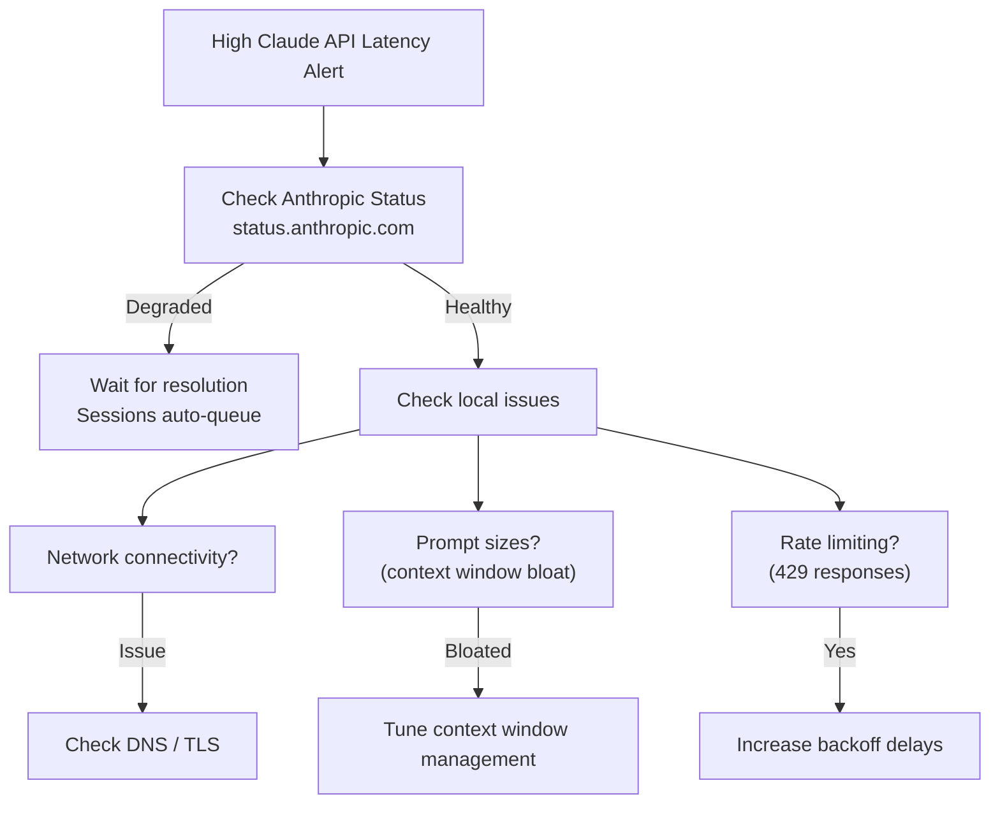

# ERP-Autonomous-Coding -- Operations Runbook

## Document Information

| Field | Value |
|-------|-------|
| Module | ERP-Autonomous-Coding |
| Version | 1.0.0 |
| Last Updated | 2026-02-23 |
| Audience | DevOps / SRE |

---

## 1. Service Health Checks

### 1.1 Health Endpoints

| Service | URL | Expected Response |
|---------|-----|-------------------|
| API Gateway | `GET :8095/healthz` | `{"status": "healthy"}` |
| Agent Core | `GET :8205/healthz` | `{"status": "healthy", "service": "agent-core"}` |
| Review Engine | `GET :8206/healthz` | `{"status": "healthy", "service": "review-engine"}` |
| IDE Server | `GET :8207/healthz` | `{"status": "healthy", "service": "ide-server"}` |
| Task Planner | `GET :8209/healthz` | `{"status": "healthy", "service": "task-planner"}` |

### 1.2 Quick Health Check Script

```bash
#!/bin/bash
services=("8095:api-gateway" "8205:agent-core" "8206:review-engine" "8207:ide-server" "8209:task-planner")
for svc in "${services[@]}"; do
  port="${svc%%:*}"
  name="${svc##*:}"
  status=$(curl -s -o /dev/null -w "%{http_code}" "http://localhost:${port}/healthz" 2>/dev/null)
  if [ "$status" = "200" ]; then
    echo "[OK] ${name} (port ${port})"
  else
    echo "[FAIL] ${name} (port ${port}) - HTTP ${status}"
  fi
done
```

---

## 2. Common Issues and Remediation

### 2.1 Agent Sessions Stuck in "Generating"

**Symptoms**: Sessions remain in `generating` status beyond `max_iterations` timeout.

**Diagnosis**:
```bash
# Check agent-core logs
kubectl logs -l app=agent-core --tail=100 -n erp-autonomous-coding | grep "session-uuid"

# Check Claude API connectivity
kubectl exec -it deployment/agent-core -n erp-autonomous-coding -- curl https://api.anthropic.com/v1/messages -H "x-api-key: $CLAUDE_API_KEY" -H "anthropic-version: 2023-06-01"

# Check session state in database
kubectl exec -it statefulset/postgresql-0 -n erp-autonomous-coding -- psql -U user -d ac -c \
  "SELECT id, status, iteration_count, started_at FROM agent_sessions WHERE status = 'generating' AND started_at < now() - interval '30 minutes';"
```

**Remediation**:
1. Check if Claude API is responding (circuit breaker state)
2. If Claude API is down, sessions will automatically queue
3. For stuck sessions, cancel via API: `POST /v1/sessions/{id}/cancel`
4. If widespread, restart agent-core deployment

---

### 2.2 Sandbox Pool Exhausted

**Symptoms**: New sessions fail with "No sandbox available", `sandbox_pool_warm_total` gauge = 0.

**Diagnosis**:
```bash
# Check sandbox pool stats
kubectl exec -it daemonset/sandbox-runtime -n erp-autonomous-coding -- curl localhost:8080/metrics | grep sandbox_pool

# Check Docker on nodes
kubectl get nodes -o wide
ssh <node> "docker ps | wc -l"
ssh <node> "docker stats --no-stream"
```

**Remediation**:
1. Check if containers are leaking (not being destroyed after session completion)
2. Manually kill orphaned containers: `docker rm -f $(docker ps -q --filter label=sandbox=true)`
3. Increase pool size: update `SANDBOX_MAX_CONTAINERS` environment variable
4. Scale out nodes if compute-constrained

---

### 2.3 Webhook Processing Failures

**Symptoms**: Git provider events not being processed, `webhook.failed` events in Kafka DLQ.

**Diagnosis**:
```bash
# Check webhook DLQ
kubectl exec -it statefulset/redpanda-0 -n erp-autonomous-coding -- rpk topic consume erp.autonomous_coding.webhook.dlq --num 5

# Check git-bridge logs
kubectl logs -l app=git-bridge --tail=100 -n erp-autonomous-coding

# Verify webhook signature validation
kubectl logs -l app=git-bridge -n erp-autonomous-coding | grep "signature verification"
```

**Remediation**:
1. Verify webhook secret matches provider configuration
2. Check if provider changed their IP ranges (Bitbucket IP allowlist)
3. Rotate webhook secret if compromised
4. Replay DLQ events after fixing root cause

---

### 2.4 High Claude API Latency

**Symptoms**: Session durations increasing, `ac_claude_api_duration_seconds` P95 > 10s.



---

### 2.5 Database Connection Exhaustion

**Symptoms**: 500 errors with "connection pool exhausted", high `pg_stat_activity` count.

**Diagnosis**:
```sql
-- Check active connections
SELECT count(*), state FROM pg_stat_activity GROUP BY state;

-- Find long-running queries
SELECT pid, query, state, now() - query_start AS duration
FROM pg_stat_activity
WHERE state != 'idle' AND query_start < now() - interval '1 minute'
ORDER BY duration DESC;
```

**Remediation**:
1. Kill long-running queries: `SELECT pg_terminate_backend(pid);`
2. Increase pool size in connection pool config
3. Check for connection leaks in application code
4. Scale PostgreSQL if persistent

---

## 3. Scaling Procedures

### 3.1 Scaling Agent Core

```bash
# Manual scale
kubectl scale deployment agent-core --replicas=15 -n erp-autonomous-coding

# Verify HPA
kubectl get hpa agent-core-hpa -n erp-autonomous-coding

# Adjust HPA thresholds
kubectl edit hpa agent-core-hpa -n erp-autonomous-coding
```

### 3.2 Scaling Sandbox Pool

```bash
# Update pool configuration
kubectl set env daemonset/sandbox-runtime SANDBOX_POOL_SIZE=100 SANDBOX_MAX_CONTAINERS=500 -n erp-autonomous-coding

# Pre-pull images on all nodes
kubectl create job --from=cronjob/sandbox-image-pull image-pull-now -n erp-autonomous-coding
```

---

## 4. Backup and Restore

### 4.1 Database Backup

```bash
# Manual backup
kubectl exec -it statefulset/postgresql-0 -n erp-autonomous-coding -- \
  pg_dump -U user -d ac --format=custom --file=/tmp/ac_backup.dump

# Copy backup
kubectl cp erp-autonomous-coding/postgresql-0:/tmp/ac_backup.dump ./ac_backup.dump
```

### 4.2 Database Restore

```bash
# Restore from backup
kubectl cp ./ac_backup.dump erp-autonomous-coding/postgresql-0:/tmp/ac_backup.dump
kubectl exec -it statefulset/postgresql-0 -n erp-autonomous-coding -- \
  pg_restore -U user -d ac --clean --if-exists /tmp/ac_backup.dump
```

---

## 5. Emergency Procedures

### 5.1 Kill All Active Sandboxes

```bash
# Emergency sandbox cleanup
kubectl exec -it daemonset/sandbox-runtime -n erp-autonomous-coding -- \
  curl -X POST localhost:8080/admin/kill-all-sandboxes

# Verify
kubectl exec -it daemonset/sandbox-runtime -n erp-autonomous-coding -- \
  curl localhost:8080/metrics | grep sandbox_pool_active
```

### 5.2 Disable Agent (Maintenance Mode)

```bash
# Enable maintenance mode (stops accepting new sessions)
kubectl set env deployment/api-gateway MAINTENANCE_MODE=true -n erp-autonomous-coding

# Verify
curl -s http://localhost:8095/healthz | jq .maintenance
# {"maintenance": true}

# Disable maintenance mode
kubectl set env deployment/api-gateway MAINTENANCE_MODE=false -n erp-autonomous-coding
```

---

## 6. Log Analysis Queries

### 6.1 Loki Queries

```logql
# All errors in the last hour
{namespace="erp-autonomous-coding"} |= "error" | json | level="error"

# Agent Core session failures
{app="agent-core"} |= "session.failed" | json | session_id != ""

# Sandbox resource limit breaches
{app="sandbox-runtime"} |= "resource_limit" | json

# Webhook processing errors
{app="git-bridge"} |= "webhook" |= "error" | json
```
