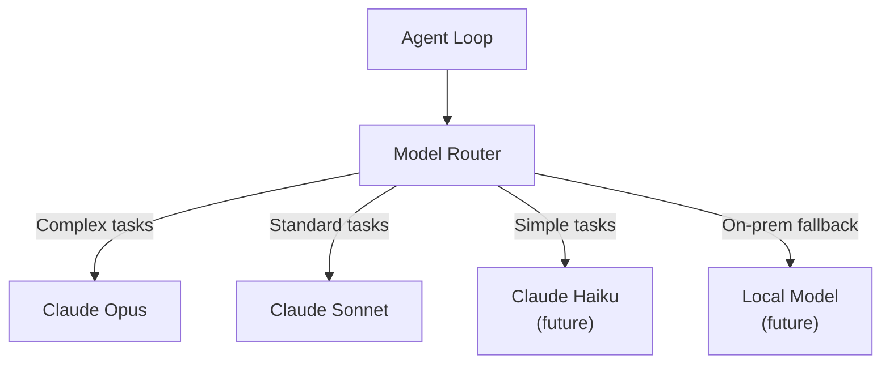

# ADR-001: Selection of Claude API as Primary LLM Engine

## Status

**Accepted** -- 2026-02-23

---

## Context

ERP-Autonomous-Coding requires a large language model (LLM) to power the autonomous coding agent. The agent must reason about code, generate multi-file implementations, write tests, diagnose bugs, and produce review comments. The LLM choice affects code quality, latency, cost, and security.

Candidates evaluated:
- **Anthropic Claude** (Sonnet, Opus)
- **OpenAI GPT-4o / o1**
- **Google Gemini 2.0**
- **Meta Llama 3.1 (self-hosted)**
- **Mistral Large (self-hosted or API)**

---

## Decision

We selected **Anthropic Claude** (specifically Claude Sonnet as default, with Claude Opus for complex tasks) as the primary LLM engine for the following reasons:

### Decision Drivers

1. **Code quality**: Claude consistently produces more accurate, idiomatic code across multiple languages in our evaluation benchmarks
2. **Long context**: 200K token context window supports analyzing large codebases without aggressive truncation
3. **Tool use**: Native tool use (function calling) is robust and well-suited for the agent's tool registry pattern
4. **Streaming**: Reliable streaming API for real-time IDE feedback
5. **Safety**: Built-in safety features align with AIDD governance requirements
6. **Enterprise support**: Anthropic offers enterprise contracts with SLA guarantees

### Trade-offs

| Factor | Claude | GPT-4o | Gemini | Llama (self-hosted) |
|--------|--------|--------|--------|-------------------|
| Code quality | Excellent | Very good | Good | Good |
| Context window | 200K | 128K | 1M+ | 128K |
| Tool use reliability | Excellent | Excellent | Good | Fair |
| Latency (P95) | 5.5s | 3.8s | 4.2s | 2.0s (GPU-dependent) |
| Cost per 1M tokens (output) | $15 (Sonnet) | $15 (GPT-4o) | $10 | Infrastructure cost |
| Self-hosted option | No (API only) | No (API only) | No (API only) | Yes |
| Enterprise SLA | Yes | Yes | Yes | N/A |

---

## Consequences

### Positive
- High-quality code generation reduces iteration count, lowering total cost per session
- 200K context enables analyzing medium-to-large codebases in a single pass
- Tool use reliability reduces agent loop errors
- Enterprise SLA provides uptime guarantees

### Negative
- Vendor lock-in to Anthropic API (mitigated by abstraction layer)
- No self-hosting option (mitigated by exploring on-premises Anthropic deployments)
- Slightly higher latency than some alternatives

### Mitigations
- Abstract the LLM client behind an interface to allow future provider switching
- Cache repeated queries (e.g., codebase analysis) to reduce API calls
- Implement circuit breaker for API failures with graceful degradation

---

## Alternatives Considered

### Self-hosted Llama 3.1
Rejected because: infrastructure overhead, lower code quality requiring more iterations, no enterprise SLA, higher total cost at scale (GPU fleet management).

### Multi-model approach
Deferred to Phase 4: using Claude for complex reasoning and a smaller model (e.g., Claude Haiku or local model) for simple tasks. Architecture supports this via the LLM client abstraction.

