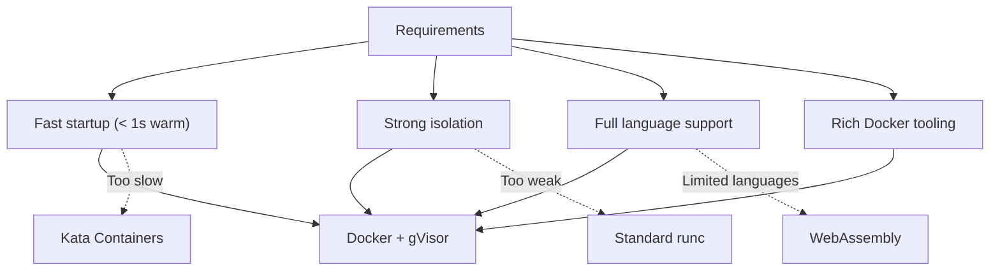
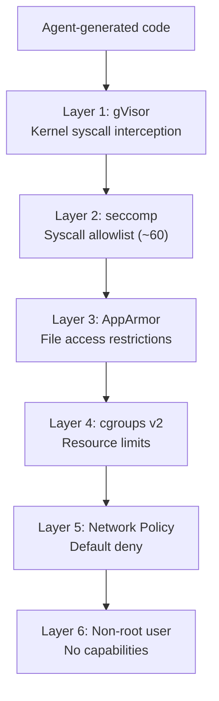

# ADR-002: Docker + gVisor for Sandbox Isolation

## Status

**Accepted** -- 2026-02-23

---

## Context

The autonomous coding agent generates and executes arbitrary code. This code must run in a secure, isolated environment to prevent:
- Host system compromise
- Data exfiltration
- Resource exhaustion (crypto mining, fork bombs)
- Cross-tenant interference

We evaluated several isolation technologies.

---

## Decision

We selected **Docker containers with gVisor (runsc) runtime** as the sandbox isolation technology.

### Candidates Evaluated

| Technology | Isolation Level | Startup Time | Compatibility | Complexity |
|-----------|----------------|-------------|---------------|-----------|
| Docker + gVisor | High (kernel intercept) | 0.3s (warm) | High | Medium |
| Firecracker microVMs | Very High (hardware) | 0.8s | Medium | High |
| Kata Containers | Very High (hardware) | 1.2s | High | High |
| Docker (standard runc) | Medium (namespace) | 0.2s | Very High | Low |
| Nsjail | High (namespace + seccomp) | 0.1s | Medium | Medium |
| WebAssembly (WASI) | High (sandbox) | < 0.1s | Low (limited languages) | Medium |

### Decision Rationale

---

## Consequences

### Positive
- Sub-second startup from warm pool
- gVisor intercepts syscalls at the kernel level, providing defense against container escape
- Full Docker ecosystem compatibility (images, volumes, networking)
- Existing tooling for monitoring, logging, resource limits

### Negative
- gVisor has ~10-15% performance overhead on I/O-heavy workloads
- Some syscalls not supported by gVisor (rare in coding workloads)
- Requires privileged DaemonSet for sandbox-runtime service

### Mitigations
- Performance overhead is acceptable for code generation workloads (not latency-critical compute)
- Maintain fallback to standard runc for specific compatibility cases
- Limit privileged access to sandbox-runtime DaemonSet only, with strict RBAC

---

## Security Layers

The defense-in-depth approach ensures that even if one layer is bypassed, multiple additional layers prevent system compromise.
