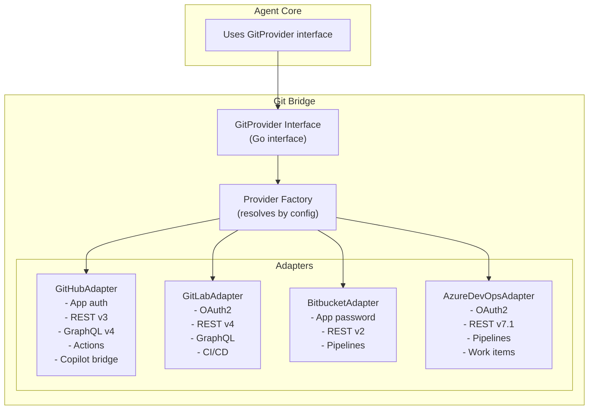

# ADR-003: Unified Git Provider Abstraction Layer

## Status

**Accepted** -- 2026-02-23

---

## Context

Enterprise customers use diverse Git hosting solutions. The platform must support GitHub, GitLab, Bitbucket, and Azure DevOps without duplicating business logic for each provider. We need a unified interface that abstracts provider-specific APIs while preserving provider-unique capabilities.

---

## Decision

Implement a **Unified Git Interface** using the **Adapter Pattern** in the Git Bridge service. A single Go interface (`GitProvider`) defines all operations. Each provider has a dedicated adapter implementing this interface.

### Interface Design Principles

1. **Least common denominator for core operations**: Clone, branch, commit, push, create PR, merge -- all providers support these
2. **Extension points for provider-specific features**: GitHub Actions, Azure Work Items, GitLab CI -- available through optional interfaces
3. **Normalized data models**: Internal `PullRequest`, `Repository`, `Branch` models mapped from provider-specific responses
4. **Webhook normalization**: All provider webhooks normalized to internal event types before publishing to Kafka

---

## Consequences

### Positive
- Business logic written once, works across all providers
- Easy to add new providers (implement the interface)
- Consistent behavior and testing across providers
- Webhook events normalized for downstream consumers

### Negative
- Some provider-specific features may not fit the common interface
- Maintaining four adapter implementations requires ongoing effort
- Provider API breaking changes affect individual adapters

### Mitigations
- Optional interfaces for provider-specific features: `type GitHubExtended interface { ... }`
- Comprehensive integration test suite with recorded responses (WireMock)
- Version-pinned API clients to isolate from breaking changes

---

## Alternatives Considered

### Direct provider clients in Agent Core
Rejected: Would require Agent Core to know about every provider, violating separation of concerns.

### Third-party Git abstraction library
Rejected: No library supports all four providers with the depth needed (webhooks, CI/CD, reviews).

### Separate services per provider
Rejected: Excessive operational overhead for a common interface pattern.
