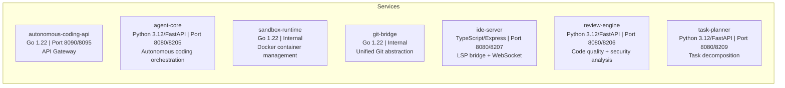

# ERP-Autonomous-Coding -- Glossary and Reference

## Document Information

| Field | Value |
|-------|-------|
| Module | ERP-Autonomous-Coding |
| Version | 1.0.0 |
| Last Updated | 2026-02-23 |

---

## 1. Glossary

| Term | Definition |
|------|------------|
| **AIDD** | AI-Driven Development -- governance framework requiring human approval for all AI-generated code changes before they reach production |
| **Agent Core** | The central Python/FastAPI service that orchestrates the autonomous coding agent's lifecycle |
| **Agent Loop** | The iterative reasoning cycle where the agent generates code, tests it, analyzes results, and either succeeds or retries |
| **Agent Session** | A single end-to-end execution of the autonomous agent from prompt to PR |
| **Approval Gate** | The AIDD governance checkpoint where a human reviewer must approve AI-generated changes before merge |
| **Claude API** | Anthropic's large language model API used for AI reasoning in the agent |
| **Context Window** | The bounded memory of text the AI model can process in a single request, managed by the Context Manager |
| **Dead Letter Queue (DLQ)** | Kafka topic where events that failed processing are stored for retry or investigation |
| **Ephemeral Container** | A Docker container created for a single session and destroyed afterward, leaving no persistent state |
| **Git Bridge** | The Go service providing a unified abstraction over GitHub, GitLab, Bitbucket, and Azure DevOps |
| **gVisor** | Google's application kernel that intercepts and sandboxes syscalls, used as the Docker runtime for sandbox security |
| **IDE Server** | The TypeScript/Express service bridging IDE plugins with the agent via WebSocket and LSP |
| **Iteration** | One cycle of the generate-test-fix loop within an agent session |
| **LSP** | Language Server Protocol -- standard protocol for IDE features like hover, go-to-definition, and completions |
| **Merge Request (MR)** | GitLab's term for a pull request |
| **Pull Request (PR)** | A request to merge code changes into a target branch, used by GitHub, Bitbucket, and Azure DevOps |
| **Reasoning Trace** | The complete logged chain of the agent's decisions, tool invocations, and results during a session |
| **Review Engine** | The Python/FastAPI service performing automated code review including SAST, secret detection, and quality analysis |
| **Sandbox** | An isolated Docker container where agent-generated code is executed and tested |
| **Sandbox Runtime** | The Go service managing the lifecycle of sandbox containers |
| **SAST** | Static Application Security Testing -- analyzing source code for security vulnerabilities without executing it |
| **Task Planner** | The Python/FastAPI service that decomposes large tasks into ordered, parallelizable subtasks |
| **Tenant** | An organization or company using the platform, isolated at the data level |
| **Tool** | A function the AI agent can invoke during its reasoning loop (e.g., file_read, terminal_exec) |
| **Warm Pool** | Pre-started Docker containers kept ready for instant assignment to new sessions |
| **Webhook** | An HTTP callback from a Git provider notifying the platform of events (pushes, PRs, reviews, CI results) |
| **Workspace** | A logical grouping of repositories and settings within a tenant |

---

## 2. Acronym Reference

| Acronym | Full Form |
|---------|-----------|
| ADR | Architecture Decision Record |
| API | Application Programming Interface |
| AST | Abstract Syntax Tree |
| AZ | Availability Zone |
| BB | Bitbucket |
| CI/CD | Continuous Integration / Continuous Deployment |
| CQRS | Command Query Responsibility Segregation |
| CVE | Common Vulnerabilities and Exposures |
| DDD | Domain-Driven Design |
| DLQ | Dead Letter Queue |
| ERP | Enterprise Resource Planning |
| GH | GitHub |
| GL | GitLab |
| gRPC | gRPC Remote Procedure Call |
| HA | High Availability |
| HMAC | Hash-based Message Authentication Code |
| HPA | Horizontal Pod Autoscaler |
| IAM | Identity and Access Management |
| JWT | JSON Web Token |
| KMS | Key Management Service |
| LSP | Language Server Protocol |
| LLM | Large Language Model |
| MR | Merge Request |
| mTLS | Mutual TLS |
| OIDC | OpenID Connect |
| OOM | Out of Memory |
| OTEL | OpenTelemetry |
| OWASP | Open Worldwide Application Security Project |
| PAT | Personal Access Token |
| PDB | Pod Disruption Budget |
| PITR | Point-In-Time Recovery |
| PR | Pull Request |
| RBAC | Role-Based Access Control |
| RLS | Row-Level Security |
| RPO | Recovery Point Objective |
| RPS | Requests Per Second |
| RSC | React Server Component |
| RTO | Recovery Time Objective |
| SARIF | Static Analysis Results Interchange Format |
| SAST | Static Application Security Testing |
| SLA | Service Level Agreement |
| SLI | Service Level Indicator |
| SLO | Service Level Objective |
| SOC | System and Organization Controls |
| SSE | Server-Sent Events |
| TDE | Transparent Data Encryption |
| TLS | Transport Layer Security |
| WAL | Write-Ahead Log |
| WS | WebSocket |
| WSS | WebSocket Secure |

---

## 3. Service Inventory Quick Reference

---

## 4. Port Mapping Reference

| Service | Internal Port | External Port | Protocol |
|---------|:------------:|:------------:|----------|
| autonomous-coding-api | 8090 | 8095 | HTTP/gRPC |
| agent-core | 8080 | 8205 | HTTP/gRPC |
| review-engine | 8080 | 8206 | HTTP/gRPC |
| ide-server | 8080 | 8207 | HTTP/WebSocket |
| task-planner | 8080 | 8209 | HTTP/gRPC |
| sandbox-runtime | 8080 | N/A | gRPC (internal) |
| git-bridge | 8080 | N/A | gRPC (internal) |
| redis | 6379 | N/A | Redis protocol |
| postgresql | 5432 | N/A | PostgreSQL |
| redpanda | 9092 | N/A | Kafka protocol |

---

## 5. Event Topic Reference

| Topic | Partitions | Retention | Key Events |
|-------|:----------:|-----------|-----------|
| `erp.autonomous_coding.session` | 12 | 7d | started, completed, failed, cancelled, iteration |
| `erp.autonomous_coding.task` | 6 | 7d | planned, started, completed, failed |
| `erp.autonomous_coding.sandbox` | 6 | 3d | created, executing, completed, timeout, destroyed, resource_limit |
| `erp.autonomous_coding.review` | 6 | 7d | started, completed, finding |
| `erp.autonomous_coding.pr` | 6 | 30d | created, updated, approval_required, approved, rejected, merged, closed |
| `erp.autonomous_coding.webhook` | 12 | 3d | received, processed, failed |
| `erp.autonomous_coding.audit` | 6 | 90d | action |

---

## 6. API Endpoint Quick Reference

| Method | Path | Service | Description |
|--------|------|---------|-------------|
| GET | `/healthz` | Gateway | Health check |
| GET | `/v1/capabilities` | Gateway | Module capabilities |
| POST | `/v1/sessions` | Agent Core | Create session |
| GET | `/v1/sessions` | Agent Core | List sessions |
| GET | `/v1/sessions/{id}` | Agent Core | Get session detail |
| GET | `/v1/sessions/{id}/trace` | Agent Core | Get reasoning trace |
| POST | `/v1/sessions/{id}/cancel` | Agent Core | Cancel session |
| POST | `/v1/reviews` | Review Engine | Trigger review |
| GET | `/v1/reviews/{id}` | Review Engine | Get review results |
| GET | `/v1/reviews/{id}/findings` | Review Engine | Get findings |
| POST | `/v1/repositories` | Git Bridge | Connect repository |
| GET | `/v1/repositories` | Git Bridge | List repositories |
| GET | `/v1/sandboxes` | Sandbox Runtime | List sandboxes |
| GET | `/v1/sandboxes/{id}/logs` | Sandbox Runtime | Stream logs (SSE) |
| POST | `/v1/planner/decompose` | Task Planner | Decompose task |
| POST | `/v1/webhooks/github` | Git Bridge | GitHub webhook |
| POST | `/v1/webhooks/gitlab` | Git Bridge | GitLab webhook |
| POST | `/v1/webhooks/bitbucket` | Git Bridge | Bitbucket webhook |
| POST | `/v1/webhooks/azure-devops` | Git Bridge | Azure DevOps webhook |
| WS | `/v1/ide/connect` | IDE Server | WebSocket connection |

---

## 7. Configuration Reference

| Environment Variable | Service | Required | Default | Description |
|---------------------|---------|----------|---------|-------------|
| `DATABASE_URL` | Python services | Yes | - | PostgreSQL connection string |
| `REDIS_URL` | Agent Core, Gateway | Yes | - | Redis connection string |
| `KAFKA_BROKERS` | All | Yes | - | Kafka broker addresses |
| `CLAUDE_API_KEY` | Agent Core | Yes | - | Anthropic API key |
| `CLAUDE_MODEL` | Agent Core | No | `claude-sonnet-4-20250514` | Default model |
| `VAULT_ADDR` | All (prod) | Yes | - | Vault address |
| `IAM_JWKS_URL` | Gateway | Yes | - | ERP-IAM JWKS endpoint |
| `PLATFORM_GRPC_ADDR` | Gateway | Yes | - | ERP-Platform gRPC |
| `SNYK_TOKEN` | Review Engine | Yes | - | Snyk API token |
| `SANDBOX_POOL_SIZE` | Sandbox Runtime | No | 20 | Warm containers |
| `SANDBOX_MAX_CONTAINERS` | Sandbox Runtime | No | 100 | Max containers |
| `LOG_LEVEL` | All | No | `info` | Logging level |

---

## 8. Document Index

| # | Document | Primary Audience |
|---|----------|-----------------|
| 01 | Product Requirements Document | Product, Engineering Leads |
| 02 | Technical Architecture | Engineering, Architecture |
| 03 | Enterprise Architecture | Architecture, CTO |
| 04 | Software Architecture | Engineering |
| 05 | Use Cases | Product, Engineering, QA |
| 06 | API Reference | Engineering, Integration |
| 07 | Data Model | Engineering, DBA |
| 08 | Event Catalog | Engineering |
| 09 | Security Architecture | Security, Compliance |
| 10 | Deployment Guide | DevOps, SRE |
| 11 | Integration Guide | Engineering, Partners |
| 12 | IDE Plugin Architecture | Frontend Engineering |
| 13 | CLI Reference | Engineering, DevOps |
| 14 | Frontend Architecture | Frontend Engineering |
| 15 | Testing Strategy | Engineering, QA |
| 16 | AIDD Governance | Compliance, Management |
| 17 | Figma Design Prompts | Design, Frontend |
| 18 | Service: Agent Core | Engineering |
| 19 | Service: Sandbox Runtime | Engineering, DevOps |
| 20 | Service: Git Bridge | Engineering |
| 21 | Service: Review Engine | Engineering, Security |
| 22 | Service: Task Planner | Engineering |
| 23 | Service: IDE Server | Engineering |
| 24 | Observability Guide | DevOps, SRE |
| 25 | Performance Benchmarks | Engineering, Management |
| 26 | Operations Runbook | DevOps, SRE |
| 27 | ADR-001: Claude API Selection | Architecture |
| 28 | ADR-002: Sandbox Architecture | Architecture, Security |
| 29 | ADR-003: Git Abstraction | Architecture |
| 30 | Release Notes | All stakeholders |
| 31 | Changelog | Engineering |
| 32 | Glossary and Reference | All stakeholders |
