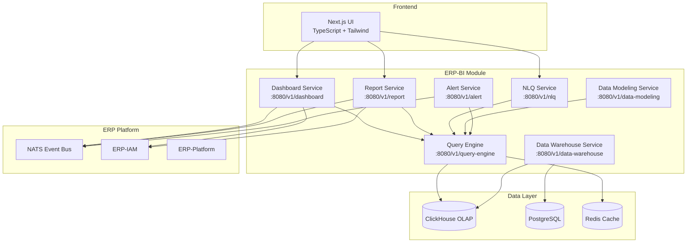

# ERP-BI Product Requirements Document (PRD)

| Field | Value |
|---|---|
| Module | ERP-BI (Business Intelligence & Analytics) |
| Version | 1.0.0 |
| Status | Approved |
| Owner | BI Product Team |
| Last Updated | 2026-02-23 |

---

## 1. Executive Summary

ERP-BI is a full-spectrum Business Intelligence and Analytics platform purpose-built for the ERP product line. It replaces the need for external BI tools by providing integrated dashboard building, report generation, data modeling, OLAP query execution, automated data warehousing, intelligent alerting, and natural language querying (NLQ) within a single, natively embedded module. The module is benchmarked against and designed to exceed the capabilities of Microsoft Power BI, Tableau, Looker, and Metabase across every feature dimension relevant to enterprise ERP analytics.

---

## 2. Problem Statement

Enterprise customers relying on external BI tools face several critical challenges:

- **Data fragmentation**: ERP data must be exported or replicated into external platforms, creating latency and governance gaps
- **Licensing cost**: Power BI Premium runs $4,995/month; Tableau Enterprise at $70/user/month; Looker at $5,000/month minimum
- **Integration tax**: Every external tool requires connectors, API middleware, and ongoing maintenance
- **Context loss**: External dashboards lack semantic awareness of ERP domain models
- **Security gaps**: Row-Level Security (RLS) and tenant isolation must be re-implemented in each external tool

ERP-BI eliminates all of these by embedding BI natively into the ERP platform with zero-configuration data access.

---

## 3. Competitive Analysis

### 3.1 Feature Comparison Matrix

| Capability | ERP-BI | Power BI | Tableau | Looker | Metabase |
|---|---|---|---|---|---|
| Drag-and-drop dashboard builder | Yes | Yes | Yes | Limited | Yes |
| Chart types | 30+ | 30+ | 24 | 15 | 18 |
| Real-time refresh | WebSocket | Limited | Extract-based | Limited | Polling |
| Cross-filtering | Yes | Yes | Yes | Yes | No |
| Embedded dashboards | Yes (white-label) | Yes ($) | Yes ($$$) | Yes ($) | Yes |
| White-labeling | Full | Limited | No | Partial | No |
| Paginated reports | Yes | Yes (separate) | No | No | No |
| Matrix/pivot tables | Yes | Yes | Yes | Yes | Basic |
| Sub-reports | Yes | Yes | No | No | No |
| Report scheduling | Yes | Yes | No | Yes | Yes |
| Delivery (Email/Slack/Webhook) | All three | Email only | Email only | Email/Slack | Email/Slack |
| Export PDF/Excel/CSV/PowerPoint | All four | All four | PDF/CSV | PDF/CSV | PDF/CSV |
| Semantic layer | Built-in | Composite model | Relationships | LookML | No |
| Calculated fields | Yes | DAX | Calculated fields | LookML | Custom columns |
| Hierarchies | Native | Yes | Yes | No | No |
| Data blending | Yes | Yes | Yes | Yes | No |
| Row-Level Security | ERP-native | Per-workspace | Per-user filter | Per-model | No |
| OLAP engine | ClickHouse | VertiPaq | Hyper | In-database | PostgreSQL |
| Star/snowflake schema | Automated | Manual | Manual | LookML | N/A |
| Materialized views | Yes | Import mode | Extracts | PDTs | No |
| Pre-aggregation | Yes | Composite model | No | Aggregate awareness | No |
| NLQ (AI to SQL) | Yes (Claude) | Q&A | Ask Data | No | No |
| Query caching | Multi-tier | Single-tier | Extract | PDT cache | Query cache |
| Governor limits | Configurable | Fixed | Fixed | Per-model | None |
| Automated ETL via CDC | Yes (all modules) | Dataflows | Prep | No | No |
| Schema management | Automated | Manual | Manual | LookML | N/A |
| Data lineage | Full graph | Limited | Catalog add-on | Field-level | No |
| Data quality monitoring | AI-powered | No | No | No | No |
| Threshold alerts | Yes | Yes | No | Yes | Yes |
| Anomaly detection (AI) | Yes | No | No | No | No |
| Trend alerts | Yes | No | No | No | No |
| Alert escalation | Yes | No | No | No | No |
| ERP-native integration | Zero-config | Connector required | Connector required | Connector required | Connector required |
| Multi-tenant isolation | Native | Workspace-level | Site-level | Model-level | No |
| AIDD compliance | Built-in | No | No | No | No |

### 3.2 Key Differentiators vs. Competition

**vs. Power BI**: ERP-BI eliminates the need for a separate Power BI Premium subscription ($60K/year). It provides native ERP data access without requiring Dataflows or gateway configuration. NLQ is powered by Claude (superior to Power BI Q&A). White-labeling is included at no extra cost.

**vs. Tableau**: ERP-BI provides paginated reporting (Tableau does not). Real-time refresh is WebSocket-based rather than extract-dependent. ClickHouse OLAP outperforms Hyper on large aggregation workloads. Multi-tenant RLS is native rather than bolted-on.

**vs. Looker**: ERP-BI semantic layer auto-generates from ERP schemas rather than requiring manual LookML modeling. NLQ goes beyond Looker's capabilities. Anomaly detection alerting has no Looker equivalent.

**vs. Metabase**: ERP-BI provides enterprise features Metabase lacks entirely: sub-reports, hierarchies, data blending, RLS, anomaly detection, data lineage, and governance.

---

## 4. User Personas

| Persona | Role | Needs |
|---|---|---|
| **Executive** | C-suite / VP | High-level KPI dashboards, trend visualization, anomaly alerts |
| **Analyst** | Business/Data Analyst | Ad-hoc queries, report building, data modeling, NLQ |
| **Developer** | BI Developer | Embedded dashboards, API access, custom visualizations |
| **Admin** | BI Administrator | Data governance, RLS, scheduling, delivery management |
| **End User** | Department Manager | Consume dashboards, drill-down, receive alerts |

---

## 5. Core Services Architecture

---

## 6. Functional Requirements

### 6.1 Dashboard Builder (FR-DASH)

| ID | Requirement | Priority |
|---|---|---|
| FR-DASH-01 | Drag-and-drop widget placement on flexible grid | P0 |
| FR-DASH-02 | Support 30+ chart types (bar, line, area, pie, donut, scatter, heatmap, treemap, funnel, gauge, geo-map, waterfall, sankey, etc.) | P0 |
| FR-DASH-03 | Real-time data refresh via WebSocket subscriptions | P0 |
| FR-DASH-04 | Multi-level drill-down with breadcrumb navigation | P0 |
| FR-DASH-05 | Cross-filtering between widgets on the same dashboard | P0 |
| FR-DASH-06 | Embeddable dashboards via iframe with JWT authentication | P1 |
| FR-DASH-07 | Full white-labeling (logo, colors, fonts, domain) | P1 |
| FR-DASH-08 | Dashboard templates library (50+ pre-built) | P1 |
| FR-DASH-09 | Mobile-responsive layout auto-adaptation | P0 |
| FR-DASH-10 | Dashboard versioning and change history | P2 |

### 6.2 Report Builder (FR-RPT)

| ID | Requirement | Priority |
|---|---|---|
| FR-RPT-01 | Paginated report designer with WYSIWYG editor | P0 |
| FR-RPT-02 | Tabular, matrix/pivot, and free-form report layouts | P0 |
| FR-RPT-03 | Sub-report embedding with parameter passing | P1 |
| FR-RPT-04 | Dynamic parameters with cascading filters | P0 |
| FR-RPT-05 | Report scheduling (cron-based, event-driven) | P0 |
| FR-RPT-06 | Delivery via email, Slack, and webhook | P0 |
| FR-RPT-07 | Export to PDF, Excel, CSV, and PowerPoint | P0 |
| FR-RPT-08 | Report bursting (per-tenant, per-department) | P1 |
| FR-RPT-09 | Report caching with TTL configuration | P1 |
| FR-RPT-10 | Conditional formatting and sparklines | P1 |

### 6.3 Data Modeling (FR-MDL)

| ID | Requirement | Priority |
|---|---|---|
| FR-MDL-01 | Semantic layer with business-friendly naming | P0 |
| FR-MDL-02 | Calculated fields with expression builder | P0 |
| FR-MDL-03 | Measures (SUM, AVG, COUNT, DISTINCT, etc.) | P0 |
| FR-MDL-04 | Dimensions with hierarchy support | P0 |
| FR-MDL-05 | Data blending across multiple data sources | P1 |
| FR-MDL-06 | Row-Level Security integrated with ERP-IAM | P0 |
| FR-MDL-07 | Model versioning and promotion workflow | P2 |

### 6.4 Query Engine (FR-QRY)

| ID | Requirement | Priority |
|---|---|---|
| FR-QRY-01 | ClickHouse OLAP backend for sub-second aggregations | P0 |
| FR-QRY-02 | Star and snowflake schema support | P0 |
| FR-QRY-03 | Materialized view management | P0 |
| FR-QRY-04 | Pre-aggregation tables with automatic refresh | P1 |
| FR-QRY-05 | NLQ: Natural language to SQL to chart pipeline | P0 |
| FR-QRY-06 | Multi-tier query caching (L1 in-process, L2 Redis) | P0 |
| FR-QRY-07 | Governor limits (max rows, max query time, concurrency) | P0 |

### 6.5 Data Warehouse (FR-DWH)

| ID | Requirement | Priority |
|---|---|---|
| FR-DWH-01 | Automated ETL from all ERP modules via CDC | P0 |
| FR-DWH-02 | Schema management with migration tracking | P0 |
| FR-DWH-03 | Full data lineage graph (source to dashboard) | P1 |
| FR-DWH-04 | Data quality monitoring with anomaly scoring | P1 |
| FR-DWH-05 | Incremental ingestion with exactly-once semantics | P0 |

### 6.6 Alerts (FR-ALT)

| ID | Requirement | Priority |
|---|---|---|
| FR-ALT-01 | Threshold-based alerts on any metric | P0 |
| FR-ALT-02 | AI anomaly detection alerts | P0 |
| FR-ALT-03 | Trend-based alerts (increasing/decreasing over N periods) | P1 |
| FR-ALT-04 | Scheduled evaluation (cron + event-driven) | P0 |
| FR-ALT-05 | Multi-channel notifications (email, Slack, webhook, in-app) | P0 |
| FR-ALT-06 | Escalation policies with timeout and re-routing | P1 |

### 6.7 NLQ Service (FR-NLQ)

| ID | Requirement | Priority |
|---|---|---|
| FR-NLQ-01 | Natural language input with intent parsing | P0 |
| FR-NLQ-02 | Text to SQL generation via Claude | P0 |
| FR-NLQ-03 | Automatic chart type suggestion from query results | P0 |
| FR-NLQ-04 | Query history with re-execution | P1 |
| FR-NLQ-05 | Guardrail: SQL injection prevention, read-only enforcement | P0 |

---

## 7. Non-Functional Requirements

| Category | Requirement | Target |
|---|---|---|
| Performance | Dashboard load time | < 2 seconds (p95) |
| Performance | Query response (1B rows) | < 5 seconds (p95) |
| Performance | NLQ response | < 3 seconds (p95) |
| Availability | Uptime SLA | 99.95% |
| Scalability | Concurrent dashboard users | 10,000+ |
| Scalability | Data warehouse volume | 100TB+ |
| Security | Tenant isolation | Row-level + schema-level |
| Security | Encryption | TLS 1.3 in-transit, AES-256 at-rest |
| Compliance | AIDD guardrails | Full enforcement |
| Compliance | SOC 2 Type II | Required |

---

## 8. Success Metrics

| Metric | Target | Measurement |
|---|---|---|
| Dashboard adoption rate | >80% of licensed users within 90 days | Telemetry |
| NLQ accuracy (SQL correctness) | >90% | Automated test suite |
| Report delivery success rate | >99.5% | Monitoring |
| Average query latency | <500ms (p50), <2s (p95) | APM |
| Customer satisfaction (CSAT) | >4.5/5 | Survey |

---

## 9. Milestones

| Phase | Deliverables | Timeline |
|---|---|---|
| Phase 1 - Foundation | Dashboard builder, query engine, ClickHouse integration | Q1 2026 |
| Phase 2 - Reports & Alerts | Report builder, alert service, delivery channels | Q2 2026 |
| Phase 3 - Intelligence | NLQ, anomaly detection, data lineage | Q3 2026 |
| Phase 4 - Enterprise | White-labeling, embedded analytics, advanced RLS | Q4 2026 |

---

## 10. Dependencies

- **ERP-Platform**: Subscription entitlements, tenant management
- **ERP-IAM**: Authentication, authorization, RLS policy definitions
- **ERP-AI**: Claude integration for NLQ, anomaly detection models
- **NATS**: Event backbone for CDC, alerts, and real-time updates
- **ClickHouse**: OLAP storage and query execution
- **Redis**: Query caching layer

---

## 11. Risks and Mitigations

| Risk | Probability | Impact | Mitigation |
|---|---|---|---|
| ClickHouse scaling under extreme concurrency | Medium | High | Pre-aggregation, read replicas, query governor |
| NLQ generating incorrect SQL | Medium | Medium | SQL validation, read-only mode, human review option |
| CDC lag causing stale data | Low | Medium | Monitoring, catchup mechanisms, staleness indicators |
| White-label CSS conflicts | Low | Low | Shadow DOM isolation, CSS modules |

---

## 12. Approval

| Role | Name | Date | Status |
|---|---|---|---|
| Product Owner | - | 2026-02-23 | Approved |
| Engineering Lead | - | 2026-02-23 | Approved |
| Architecture Review | - | 2026-02-23 | Approved |
