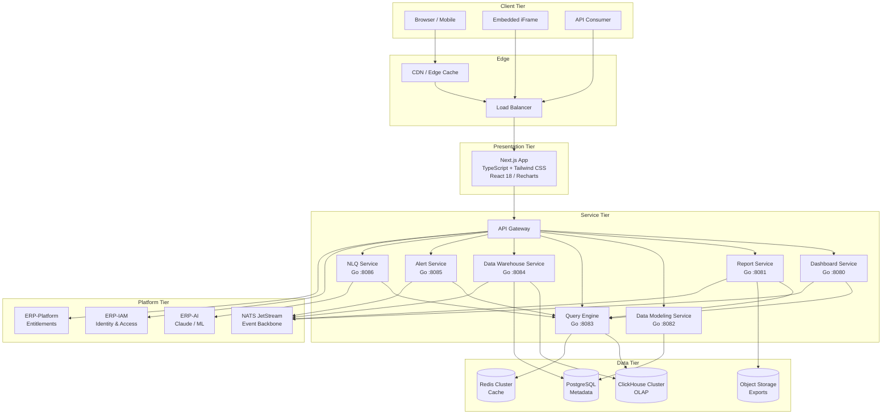
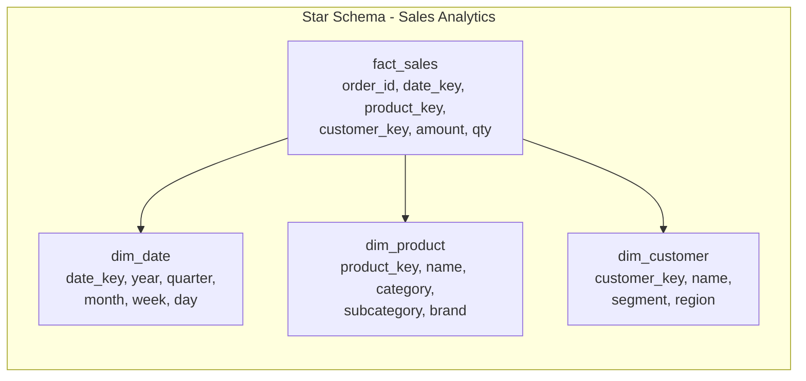
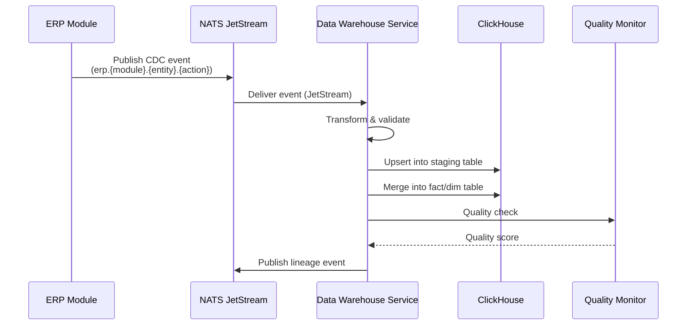
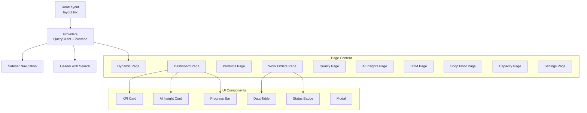
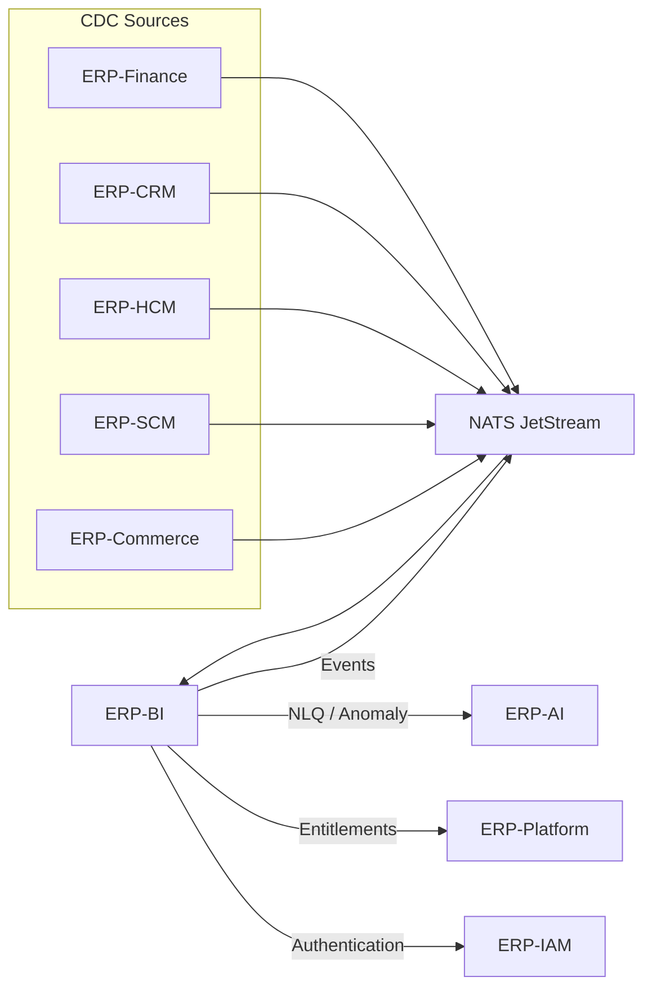
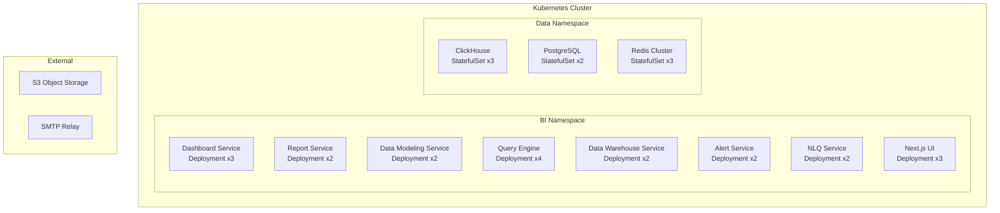

# ERP-BI Architecture Document

| Field | Value |
|---|---|
| Module | ERP-BI (Business Intelligence & Analytics) |
| Version | 1.0.0 |
| Status | Approved |
| Last Updated | 2026-02-23 |

---

## 1. Architecture Overview

ERP-BI follows a microservices architecture with seven distinct services, a Next.js frontend, and ClickHouse as the primary OLAP engine. The module integrates with the broader ERP platform through NATS event backbone, ERP-IAM for identity/authorization, and ERP-Platform for subscription entitlements.

---

## 2. Service Decomposition

### 2.1 Dashboard Service

| Attribute | Value |
|---|---|
| Language | Go 1.22 |
| Base Path | `/v1/dashboard` |
| Port | 8080 |
| Health Check | `/healthz` |
| Event Topics | `erp.bi.dashboard.{created,updated,deleted,listed,read}` |

**Responsibilities**: Dashboard CRUD, widget layout management, real-time subscription management, template library, embedding token generation, white-label configuration.

**Key Endpoints**:
- `GET /v1/dashboard` - List dashboards (paginated, filtered by tenant)
- `POST /v1/dashboard` - Create dashboard
- `GET /v1/dashboard/{id}` - Get dashboard by ID
- `PUT /v1/dashboard/{id}` - Update dashboard
- `DELETE /v1/dashboard/{id}` - Delete dashboard

### 2.2 Report Service

| Attribute | Value |
|---|---|
| Language | Go 1.22 |
| Base Path | `/v1/report` |
| Port | 8081 |
| Event Topics | `erp.bi.report.{created,updated,deleted,listed,read}` |

**Responsibilities**: Report definition CRUD, report execution, scheduling, delivery (email/Slack/webhook), export rendering (PDF/Excel/CSV/PowerPoint), sub-report resolution, parameter injection.

### 2.3 Data Modeling Service

| Attribute | Value |
|---|---|
| Language | Go 1.22 |
| Base Path | `/v1/data-modeling` |
| Port | 8082 |
| Event Topics | `erp.bi.data-modeling.{created,updated,deleted,listed,read}` |

**Responsibilities**: Semantic model management, calculated field definitions, measure/dimension registry, hierarchy configuration, data blending rules, RLS policy binding.

### 2.4 Query Engine

| Attribute | Value |
|---|---|
| Language | Go 1.22 |
| Base Path | `/v1/query-engine` |
| Port | 8083 |
| Event Topics | `erp.bi.query-engine.{created,updated,deleted,listed,read}` |

**Responsibilities**: SQL generation from semantic models, ClickHouse query execution, materialized view management, pre-aggregation scheduling, query caching (L1/L2), governor enforcement, query plan optimization.

### 2.5 Data Warehouse Service

| Attribute | Value |
|---|---|
| Language | Go 1.22 |
| Base Path | `/v1/data-warehouse` |
| Port | 8084 |
| Event Topics | `erp.bi.data-warehouse.{created,updated,deleted,listed,read}` |

**Responsibilities**: CDC event consumption from all ERP modules, ETL pipeline orchestration, ClickHouse schema management, data lineage tracking, data quality monitoring, incremental ingestion.

### 2.6 Alert Service

| Attribute | Value |
|---|---|
| Language | Go 1.22 |
| Base Path | `/v1/alert` |
| Port | 8085 |
| Event Topics | `erp.bi.alert.{created,updated,deleted,listed,read}` |

**Responsibilities**: Alert rule CRUD, threshold evaluation, AI anomaly detection integration, trend analysis, scheduled/event-driven evaluation, notification dispatch, escalation management.

### 2.7 NLQ Service

| Attribute | Value |
|---|---|
| Language | Go 1.22 |
| Base Path | `/v1/nlq` |
| Port | 8086 |
| Event Topics | `erp.bi.nlq.{created,updated,deleted,listed,read}` |

**Responsibilities**: Natural language parsing, intent classification, text-to-SQL translation (via Claude), chart type recommendation, query history, SQL validation and sanitization.

---

## 3. Data Architecture

### 3.1 ClickHouse Schema Strategy

**Storage Engine**: `MergeTree` family with `ReplacingMergeTree` for dimension tables and `SummingMergeTree` for pre-aggregation tables.

**Partitioning**: Monthly partitions on fact tables by date column.

**Sharding**: Distributed tables across ClickHouse cluster nodes for horizontal scaling.

### 3.2 CDC Pipeline

### 3.3 Query Caching Strategy

| Cache Tier | Technology | TTL | Scope |
|---|---|---|---|
| L1 - In-Process | Go map + sync.RWMutex | 30 seconds | Per-service instance |
| L2 - Distributed | Redis Cluster | 5 minutes | Cross-instance |
| L3 - Materialized | ClickHouse MV | Configured refresh | Global |

---

## 4. Frontend Architecture

### 4.1 Technology Stack

| Technology | Purpose |
|---|---|
| Next.js 14 | React framework with App Router |
| TypeScript 5.5 | Type safety |
| Tailwind CSS 3.4 | Utility-first styling |
| Recharts 2.12 | Chart rendering |
| TanStack Query 5.45 | Server state management |
| Zustand 4.5 | Client state management |
| Prisma 5.15 | ORM for PostgreSQL metadata |
| Zod 3.23 | Schema validation |
| Lucide React | Icon library |

### 4.2 Component Hierarchy

---

## 5. Integration Architecture

### 5.1 Multi-Tenant Isolation

Every API request requires `X-Tenant-ID` header. The service validates tenant context against ERP-IAM tokens and enforces:

1. **Schema-level isolation**: Separate ClickHouse databases per tenant for enterprise tier
2. **Row-level isolation**: Tenant ID column filter for shared-schema deployments
3. **Cache-level isolation**: Redis key namespacing by tenant ID

### 5.2 Event Topology

| Event Pattern | Example | Purpose |
|---|---|---|
| `erp.bi.{service}.created` | `erp.bi.dashboard.created` | Resource lifecycle events |
| `erp.bi.{service}.updated` | `erp.bi.report.updated` | Audit trail |
| `erp.{module}.{entity}.{action}` | `erp.finance.invoice.created` | CDC ingestion trigger |
| `erp.bi.alert.triggered` | - | Alert notification dispatch |

### 5.3 Platform Integration

---

## 6. Deployment Architecture

**Container Registry**: Harbor / ECR
**CI/CD**: GitHub Actions with Makefile targets (`make test`, `make test-integration`, `make test-e2e`)
**Observability**: OpenTelemetry traces, Prometheus metrics, Loki logs

---

## 7. Security Architecture

| Layer | Mechanism |
|---|---|
| Network | mTLS between services, NetworkPolicies |
| Authentication | JWT tokens from ERP-IAM, X-Tenant-ID validation |
| Authorization | RBAC + ABAC policies, RLS enforcement |
| Data | AES-256 encryption at rest, TLS 1.3 in transit |
| Query | Read-only mode for NLQ, SQL injection prevention |
| Audit | Full audit trail via NATS events |
| Compliance | AIDD guardrails enforcement (erp/aidd.guardrails.yaml) |

---

## 8. Scalability Strategy

| Dimension | Approach |
|---|---|
| Read throughput | Horizontal scaling of Query Engine, ClickHouse read replicas |
| Write throughput | CDC batching, ClickHouse async inserts |
| Storage | ClickHouse partitioning, S3 cold storage tiering |
| Concurrency | Governor limits, connection pooling, request queuing |
| Cache | Redis Cluster with consistent hashing |
