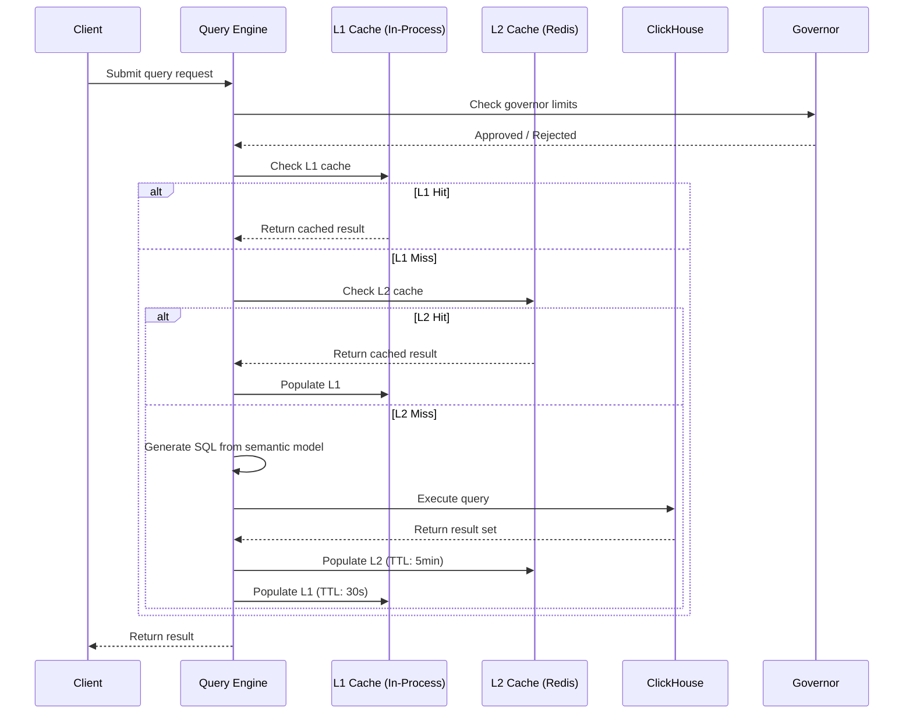
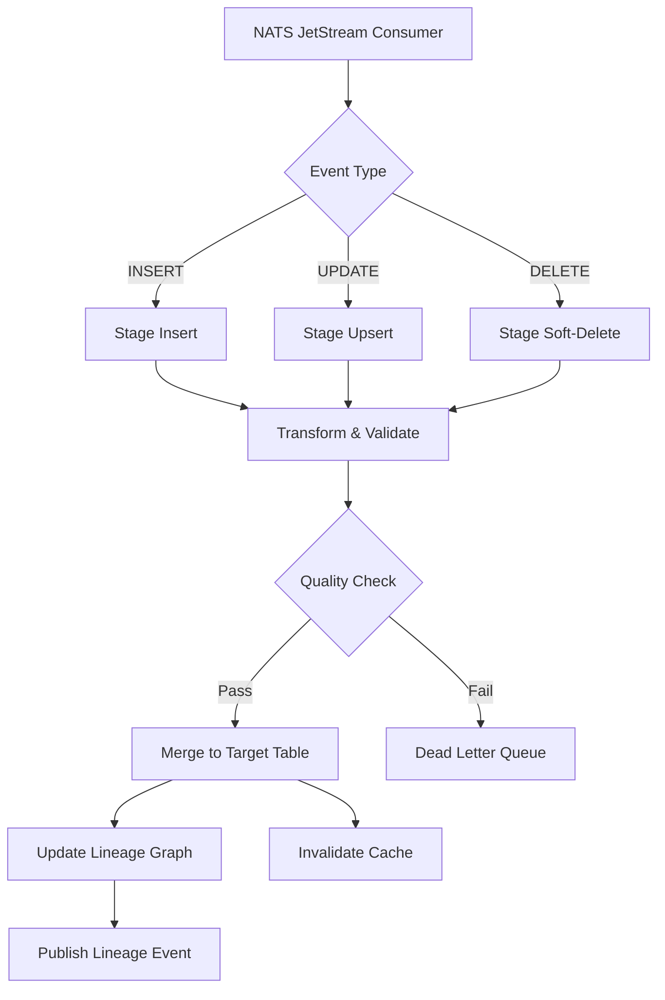
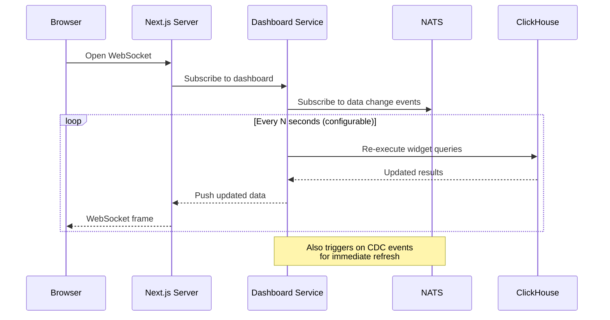
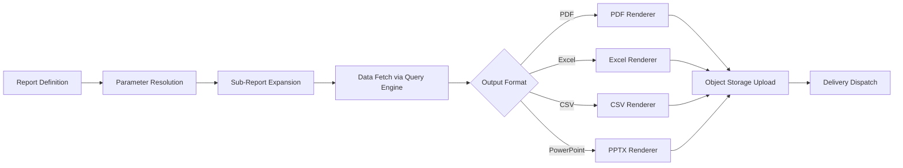
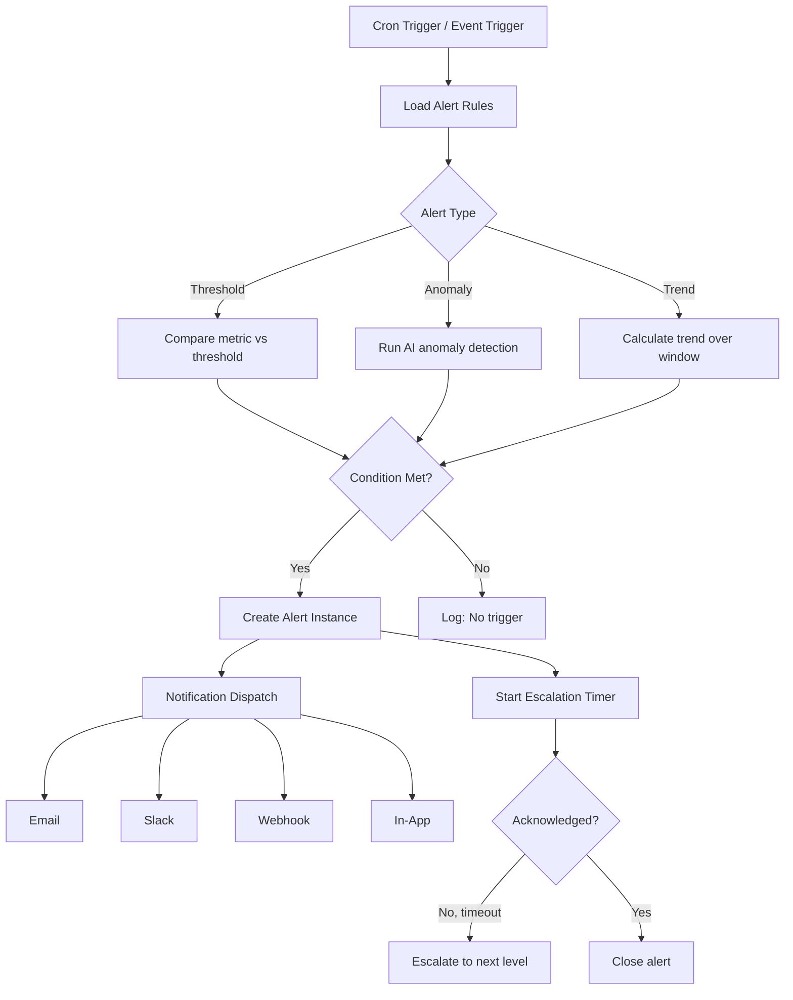

# ERP-BI Technical Design Document

| Field | Value |
|---|---|
| Module | ERP-BI |
| Version | 1.0.0 |
| Last Updated | 2026-02-23 |

---

## 1. Overview

This document provides detailed technical design specifications for all seven ERP-BI services, the frontend application, and cross-cutting concerns including caching, concurrency, and data transformation pipelines.

---

## 2. Query Engine Technical Design

### 2.1 Query Pipeline



### 2.2 Governor Limits Configuration

```typescript
interface GovernorConfig {
  maxRowsPerQuery: number;       // Default: 1,000,000
  maxQueryTimeMs: number;        // Default: 30,000
  maxConcurrentQueries: number;  // Default: 50 per tenant
  maxQuerySizeBytes: number;     // Default: 10MB
  maxJoinDepth: number;          // Default: 5
  enableCostEstimation: boolean; // Default: true
  costThreshold: number;         // Default: 1,000,000 (estimated rows scanned)
}
```

### 2.3 SQL Generation from Semantic Model

The Query Engine translates semantic model queries into optimized ClickHouse SQL:

1. **Field resolution**: Map dimension/measure names to physical columns
2. **Join graph**: Build optimal join path from star/snowflake schema
3. **Filter push-down**: Move WHERE clauses as close to source tables as possible
4. **Pre-aggregation routing**: Check if a materialized view satisfies the query
5. **RLS injection**: Append tenant/user-specific WHERE clauses

---

## 3. NLQ Technical Design

### 3.1 NLQ Pipeline

```mermaid
graph LR
    A[Natural Language Input] --> B[Intent Classification]
    B --> C[Entity Extraction]
    C --> D[Schema Context Assembly]
    D --> E[Claude SQL Generation]
    E --> F[SQL Validation]
    F --> G[Query Execution]
    G --> H[Chart Type Selection]
    H --> I[Visualization Render]
```



### 3.2 Prompt Engineering Strategy

The NLQ service constructs prompts with:

1. **Schema context**: Table names, column names, data types, relationships
2. **Sample data**: 3-5 sample rows per relevant table
3. **Business glossary**: Semantic model names mapped to physical columns
4. **Constraints**: Read-only (SELECT only), no DDL/DML, max 1000 rows
5. **Examples**: Few-shot examples of similar queries

### 3.3 SQL Validation Rules

| Rule | Action |
|---|---|
| Contains DDL (CREATE, ALTER, DROP) | Reject |
| Contains DML (INSERT, UPDATE, DELETE) | Reject |
| Contains system tables | Reject |
| Estimated cost > threshold | Warn + require confirmation |
| Missing tenant filter | Auto-inject |
| Cross-tenant data access | Reject |

---

## 4. Data Warehouse ETL Design

### 4.1 CDC Event Processing



### 4.2 Schema Management

Schemas are versioned and tracked. Each ERP module's CDC events define the source schema. The Data Warehouse Service maintains:

- **Source registry**: Module, entity, schema version, last sync timestamp
- **Transform rules**: Column mappings, type conversions, derived fields
- **Target schema**: ClickHouse table definitions with engine and partitioning config
- **Migration log**: Schema changes with rollback capability

---

## 5. Dashboard Builder Technical Design

### 5.1 Widget System

```typescript
interface DashboardWidget {
  id: string;
  type: WidgetType;
  position: { x: number; y: number; w: number; h: number };
  config: {
    dataSource: string;        // Semantic model ID
    dimensions: string[];      // Dimension field IDs
    measures: string[];        // Measure field IDs
    filters: FilterConfig[];   // Widget-level filters
    chartConfig: ChartConfig;  // Chart-specific settings
    refreshInterval?: number;  // Seconds, 0 = manual only
  };
  interactions: {
    crossFilter: boolean;
    drillDown: DrillDownConfig[];
    onClick: ClickAction;
  };
}

type WidgetType =
  | 'bar' | 'line' | 'area' | 'pie' | 'donut'
  | 'scatter' | 'heatmap' | 'treemap' | 'funnel'
  | 'gauge' | 'geo-map' | 'waterfall' | 'sankey'
  | 'table' | 'pivot' | 'kpi' | 'text'
  | 'sparkline' | 'bullet' | 'radar' | 'sunburst'
  | 'timeline' | 'calendar' | 'box-plot' | 'histogram'
  | 'parallel-coordinates' | 'chord' | 'force-graph'
  | 'candlestick' | 'combination';
```

### 5.2 Real-Time Refresh Architecture



---

## 6. Report Builder Technical Design

### 6.1 Report Rendering Pipeline



### 6.2 Scheduling System

Reports use cron expressions stored in PostgreSQL. The Alert Service also doubles as the scheduler, evaluating:

- `0 8 * * MON` - Every Monday at 8 AM
- `0 */6 * * *` - Every 6 hours
- Event-driven: Triggered by `erp.bi.data-warehouse.sync.completed`

---

## 7. Alert Engine Technical Design

### 7.1 Alert Evaluation Flow



---

## 8. Data Model (PostgreSQL Metadata)

The Prisma schema defines the metadata layer:

- **Product**: SKU, category, cost, price, stock levels
- **BOMItem**: Parent-child product relationships with quantities
- **WorkOrder**: Production orders with status lifecycle
- **WorkCenter**: Machine definitions with capacity and status
- **Operation**: Work order steps with sequencing
- **MachineMetric**: Time-series sensor readings with anomaly scores
- **QualityRecord**: Inspection results with AI prediction flags
- **DemandForecast**: AI-generated forecasts with confidence intervals
- **AIInsight**: Generated insights across 8 categories with severity

---

## 9. AI Integration Points

| Feature | AI Service | Model | Latency Target |
|---|---|---|---|
| NLQ (text-to-SQL) | ERP-AI Copilot | Claude | < 3s |
| Anomaly detection | Local (statistical) | Z-Score + IQR | < 100ms |
| Demand forecasting | Local (ensemble) | Holt-Winters + WMA + LR | < 500ms |
| Predictive maintenance | Local (statistical) | Trend analysis + thresholds | < 200ms |
| Quality prediction | Local (statistical) | Historical pattern matching | < 200ms |
| Capacity optimization | Local (algorithmic) | Constraint solver | < 1s |

---

## 10. Error Handling Strategy

| Error Category | Handling | Retry | Alert |
|---|---|---|---|
| ClickHouse timeout | Return cached/partial, retry | 3x exponential backoff | Yes, if persistent |
| CDC event processing failure | Dead letter queue | 5x with backoff | Yes |
| NLQ SQL generation failure | Return friendly error, suggest alternatives | 1x with rephrased prompt | No |
| Report rendering failure | Retry, then notify subscriber | 3x | Yes |
| Cache failure (Redis down) | Bypass cache, direct query | N/A | Yes |
