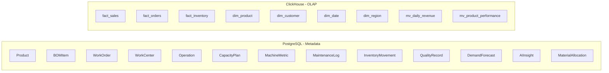
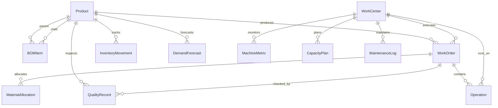

# ERP-BI Database Schema Documentation

| Field | Value |
|---|---|
| Module | ERP-BI |
| Version | 1.0.0 |
| Databases | PostgreSQL (metadata), ClickHouse (OLAP) |
| ORM | Prisma 5.15 |
| Last Updated | 2026-02-23 |

---

## 1. Overview

ERP-BI uses a dual-database architecture:

- **PostgreSQL**: Stores metadata (dashboard definitions, report configs, alert rules, semantic models, user preferences). Managed via Prisma ORM.
- **ClickHouse**: Stores analytical data (fact tables, dimension tables, materialized views, pre-aggregation tables). Managed via the Data Warehouse Service.



---

## 2. PostgreSQL Schema (Prisma)

### 2.1 Product

| Column | Type | Constraints | Description |
|---|---|---|---|
| id | String (CUID) | PK | Unique identifier |
| name | String | NOT NULL | Product name |
| sku | String | UNIQUE, NOT NULL | Stock keeping unit |
| description | String | NULLABLE | Product description |
| category | String | NOT NULL, INDEXED | Product category |
| unitCost | Float | DEFAULT 0 | Cost per unit |
| unitPrice | Float | DEFAULT 0 | Selling price |
| leadTimeDays | Int | DEFAULT 0 | Manufacturing lead time |
| minStock | Int | DEFAULT 0 | Minimum stock threshold |
| currentStock | Int | DEFAULT 0 | Current inventory |
| unit | String | DEFAULT 'pcs' | Unit of measure |
| isActive | Boolean | DEFAULT true | Active flag |
| createdAt | DateTime | DEFAULT now() | Creation timestamp |
| updatedAt | DateTime | Auto-updated | Last update timestamp |

**Relationships**: `bomParent[]`, `bomChild[]`, `workOrders[]`, `inventoryMovements[]`, `demandForecasts[]`, `qualityRecords[]`

**Indexes**: `sku`, `category`

### 2.2 BOMItem (Bill of Materials)

| Column | Type | Constraints | Description |
|---|---|---|---|
| id | String (CUID) | PK | Unique identifier |
| parentId | String | FK -> Product, NOT NULL | Parent product |
| childId | String | FK -> Product, NOT NULL | Child component |
| quantity | Float | NOT NULL | Required quantity |
| unit | String | DEFAULT 'pcs' | Unit of measure |
| scrapFactor | Float | DEFAULT 0 | Expected scrap % |
| level | Int | DEFAULT 1 | BOM level depth |
| notes | String | NULLABLE | Notes |
| isActive | Boolean | DEFAULT true | Active flag |

**Unique Constraint**: `(parentId, childId)`
**Indexes**: `parentId`, `childId`
**Cascade**: DELETE on parent Product cascades

### 2.3 WorkOrder

| Column | Type | Constraints | Description |
|---|---|---|---|
| id | String (CUID) | PK | Unique identifier |
| orderNumber | String | UNIQUE, NOT NULL | WO number (e.g., WO-2602-0001) |
| productId | String | FK -> Product | Target product |
| quantity | Int | NOT NULL | Ordered quantity |
| completedQty | Int | DEFAULT 0 | Completed units |
| defectQty | Int | DEFAULT 0 | Defective units |
| status | WorkOrderStatus | DEFAULT PLANNED | Lifecycle status |
| priority | Priority | DEFAULT MEDIUM | Priority level |
| plannedStart | DateTime | NOT NULL | Planned start date |
| plannedEnd | DateTime | NOT NULL | Planned end date |
| actualStart | DateTime | NULLABLE | Actual start date |
| actualEnd | DateTime | NULLABLE | Actual end date |
| workCenterId | String | FK -> WorkCenter, NULLABLE | Assigned work center |

**Enums**:
- `WorkOrderStatus`: PLANNED, RELEASED, IN_PROGRESS, ON_HOLD, COMPLETED, CANCELLED
- `Priority`: LOW, MEDIUM, HIGH, CRITICAL

### 2.4 WorkCenter

| Column | Type | Constraints | Description |
|---|---|---|---|
| id | String (CUID) | PK | Unique identifier |
| name | String | NOT NULL | Center name |
| code | String | UNIQUE, NOT NULL | Center code (e.g., CNC-001) |
| type | WorkCenterType | NOT NULL | Machine type |
| capacityPerHour | Float | DEFAULT 0 | Output capacity |
| costPerHour | Float | DEFAULT 0 | Operating cost |
| efficiency | Float | DEFAULT 100 | Efficiency % |
| status | MachineStatus | DEFAULT IDLE | Current status |

**Enums**:
- `WorkCenterType`: ASSEMBLY, CNC, WELDING, PAINTING, PACKAGING, INSPECTION, MOLDING, STAMPING
- `MachineStatus`: RUNNING, IDLE, MAINTENANCE, BREAKDOWN, SETUP, OFFLINE

### 2.5 MachineMetric

| Column | Type | Constraints | Description |
|---|---|---|---|
| id | String (CUID) | PK | Unique identifier |
| workCenterId | String | FK -> WorkCenter | Machine reference |
| timestamp | DateTime | DEFAULT now() | Reading time |
| temperature | Float | NULLABLE | Temperature reading |
| vibration | Float | NULLABLE | Vibration level |
| powerConsumption | Float | NULLABLE | Power usage |
| speed | Float | NULLABLE | Operating speed |
| pressure | Float | NULLABLE | Pressure reading |
| outputRate | Float | NULLABLE | Output rate |
| uptime | Float | NULLABLE | Uptime % |
| anomalyScore | Float | NULLABLE | AI anomaly score (0-1) |
| anomalyType | String | NULLABLE | Detected anomaly type |

**Index**: `(workCenterId, timestamp)` -- Composite for time-series queries

### 2.6 AIInsight

| Column | Type | Constraints | Description |
|---|---|---|---|
| id | String (CUID) | PK | Unique identifier |
| category | InsightCategory | NOT NULL | Insight type |
| title | String | NOT NULL | Summary title |
| description | String | NOT NULL | Detailed explanation |
| severity | InsightSeverity | NOT NULL | Alert level |
| confidence | Float | DEFAULT 0 | Model confidence (0-1) |
| metadata | String (JSON) | NULLABLE | Structured data |
| isRead | Boolean | DEFAULT false | Read status |
| isActioned | Boolean | DEFAULT false | Action taken |
| expiresAt | DateTime | NULLABLE | Expiration time |

**Enums**:
- `InsightCategory`: DEMAND_FORECAST, ANOMALY_DETECTION, PREDICTIVE_MAINTENANCE, QUALITY_PREDICTION, CAPACITY_OPTIMIZATION, INVENTORY_OPTIMIZATION, SCHEDULE_OPTIMIZATION, COST_REDUCTION
- `InsightSeverity`: INFO, WARNING, CRITICAL, OPPORTUNITY

---

## 3. ClickHouse Schema (OLAP)

### 3.1 Fact Tables

```sql
CREATE TABLE fact_sales (
    order_id String,
    date_key Date,
    product_key String,
    customer_key String,
    region_key String,
    amount Decimal(18,2),
    quantity UInt32,
    discount Decimal(5,2),
    cost Decimal(18,2),
    profit Decimal(18,2),
    tenant_id String,
    ingested_at DateTime DEFAULT now()
) ENGINE = MergeTree()
PARTITION BY toYYYYMM(date_key)
ORDER BY (tenant_id, date_key, product_key)
TTL date_key + INTERVAL 5 YEAR;
```

### 3.2 Dimension Tables

```sql
CREATE TABLE dim_product (
    id String,
    name String,
    sku String,
    category String,
    subcategory String,
    brand String,
    tenant_id String,
    valid_from DateTime,
    valid_to DateTime DEFAULT '9999-12-31'
) ENGINE = ReplacingMergeTree(valid_from)
ORDER BY (tenant_id, id);
```

### 3.3 Materialized Views

```sql
CREATE MATERIALIZED VIEW mv_daily_revenue
ENGINE = SummingMergeTree()
PARTITION BY toYYYYMM(date_key)
ORDER BY (tenant_id, date_key, product_key)
AS SELECT
    date_key,
    product_key,
    tenant_id,
    sum(amount) as total_revenue,
    sum(quantity) as total_quantity,
    count() as order_count
FROM fact_sales
GROUP BY date_key, product_key, tenant_id;
```

---

## 4. Entity Relationship Diagram



---

## 5. Migration Strategy

| Phase | Action |
|---|---|
| Initial | `prisma db push` to create PostgreSQL schema |
| Seed | `tsx prisma/seed.ts` to populate demo data |
| CDC Sync | Data Warehouse Service initializes ClickHouse schema |
| Ongoing | Prisma migrations for PostgreSQL, versioned DDL for ClickHouse |
