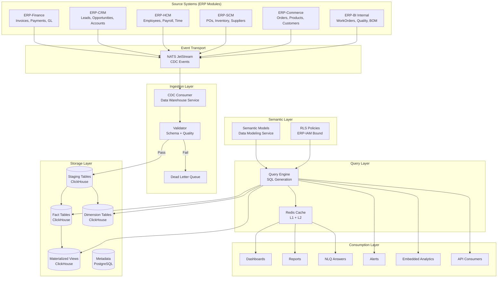
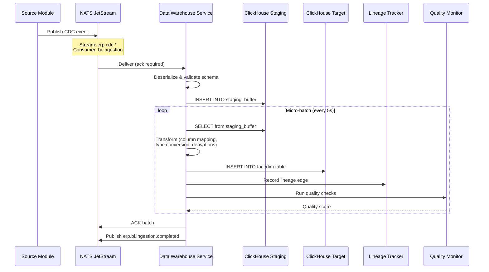
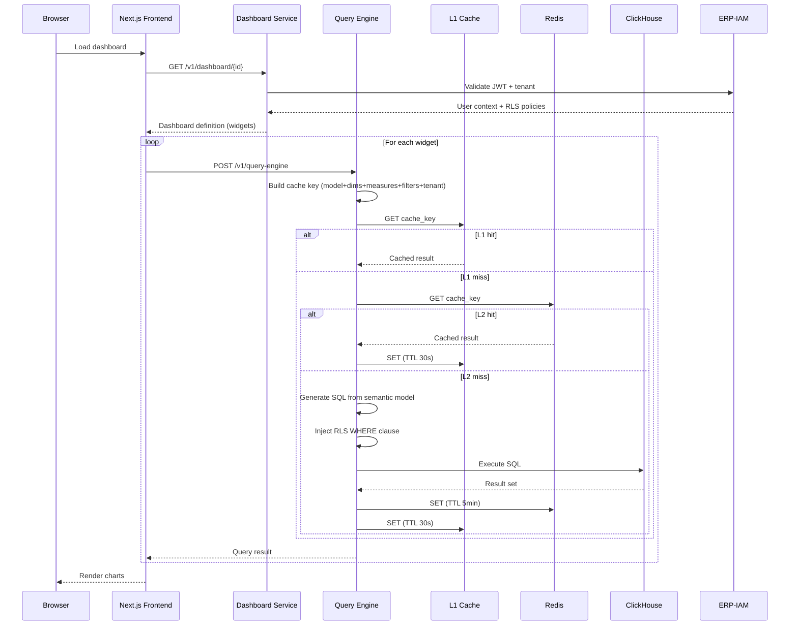
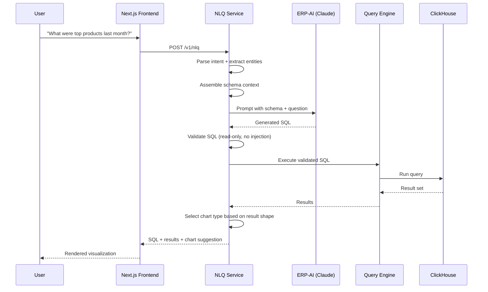
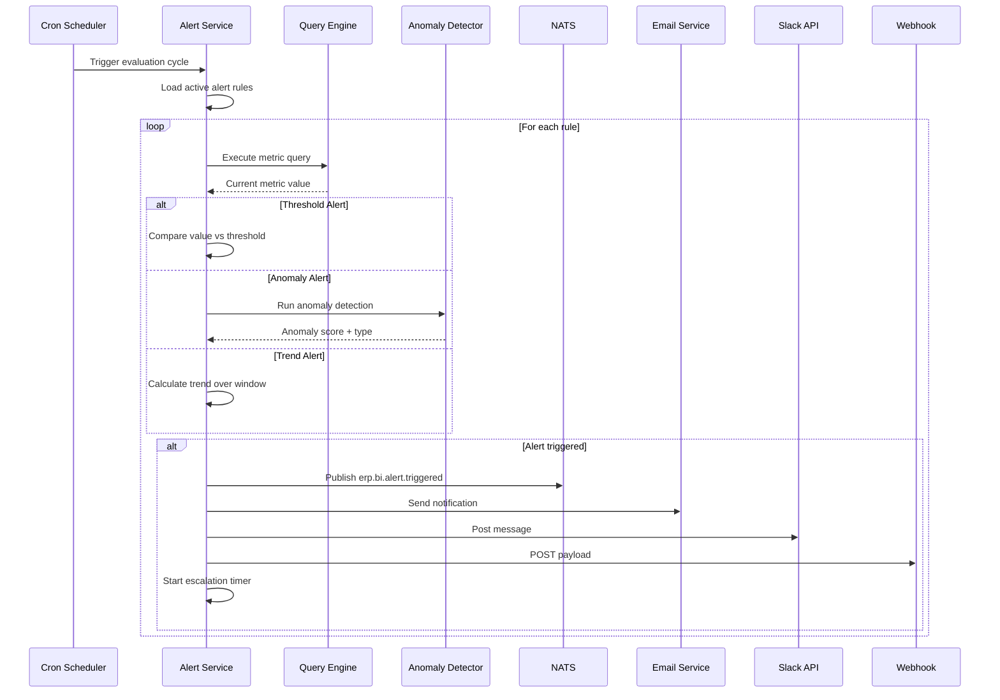
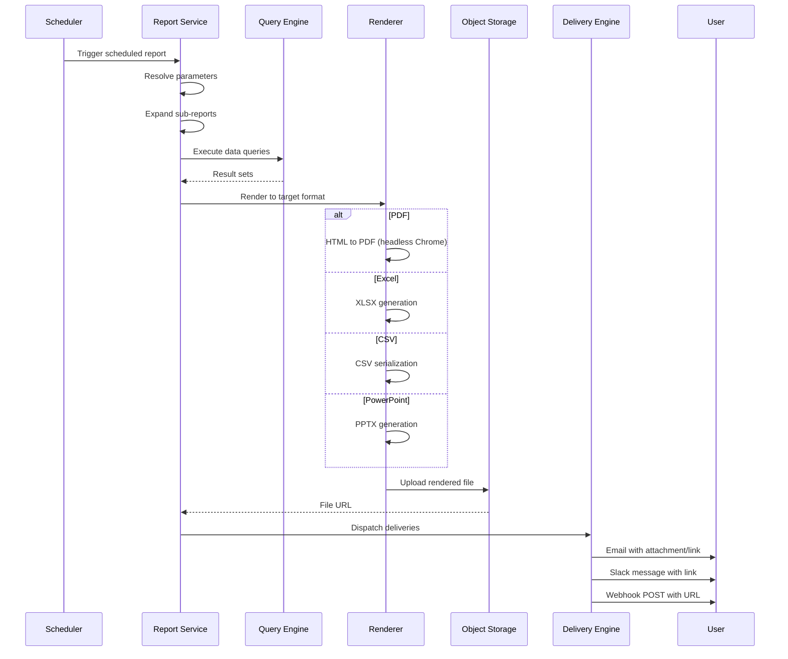
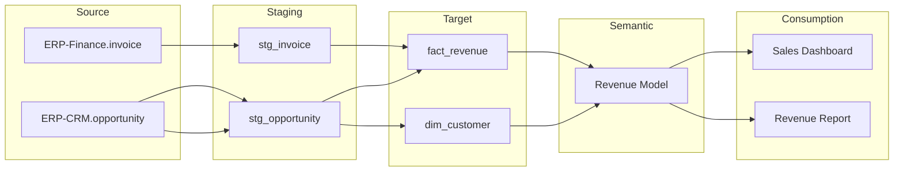

# ERP-BI Data Flow Documentation

| Field | Value |
|---|---|
| Module | ERP-BI |
| Version | 1.0.0 |
| Last Updated | 2026-02-23 |

---

## 1. End-to-End Data Flow



---

## 2. CDC Event Flow

### 2.1 Event Structure

Each CDC event from an ERP module follows the canonical format:

```json
{
  "event_id": "evt_abc123",
  "event_type": "erp.finance.invoice.created",
  "tenant_id": "tenant_001",
  "timestamp": "2026-02-23T10:00:00Z",
  "version": "1.0",
  "payload": {
    "id": "inv_789",
    "amount": 15000.00,
    "currency": "USD",
    "customer_id": "cust_456",
    "line_items": [...]
  },
  "metadata": {
    "source_module": "ERP-Finance",
    "source_entity": "invoice",
    "action": "created",
    "correlation_id": "corr_xyz"
  }
}
```

### 2.2 Event Processing Pipeline



---

## 3. Query Data Flow

### 3.1 Dashboard Query Flow



### 3.2 NLQ Data Flow



---

## 4. Alert Data Flow



---

## 5. Report Delivery Data Flow



---

## 6. Data Lineage Tracking



Every transformation step records a lineage edge in the metadata database, enabling full provenance tracking from source ERP record to final dashboard widget.
