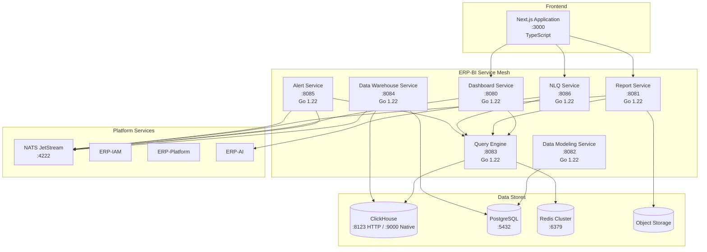
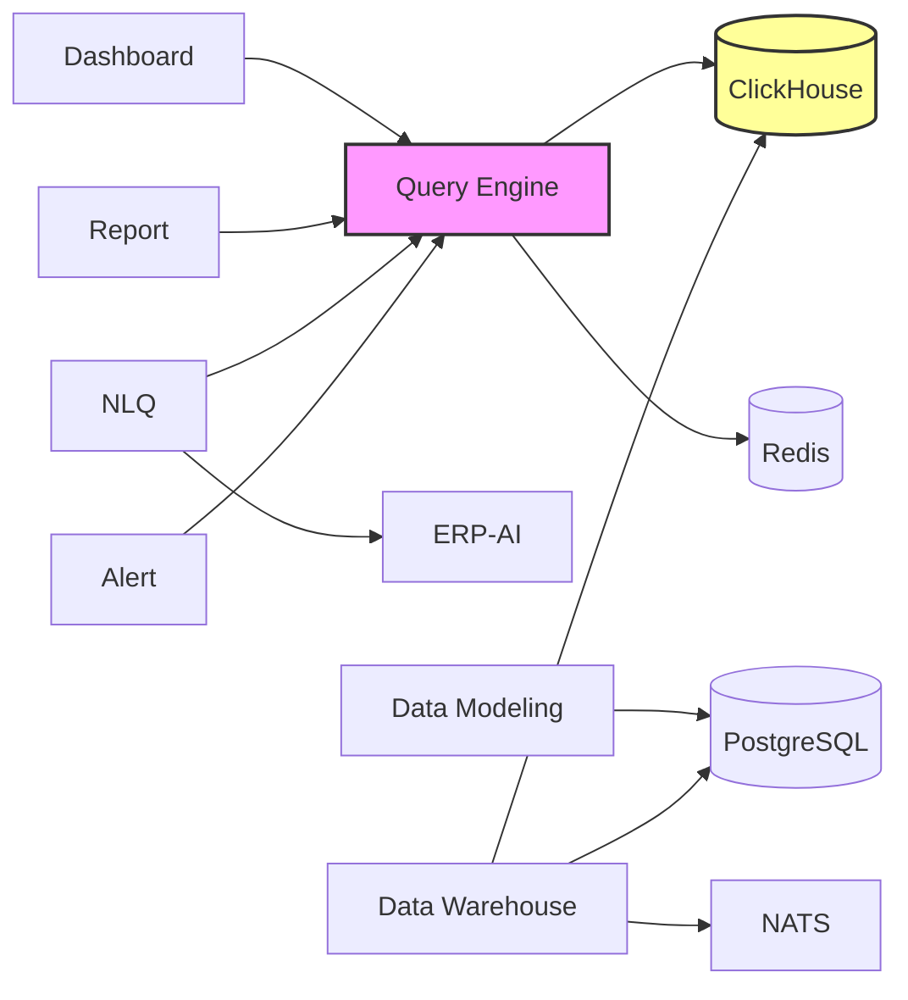
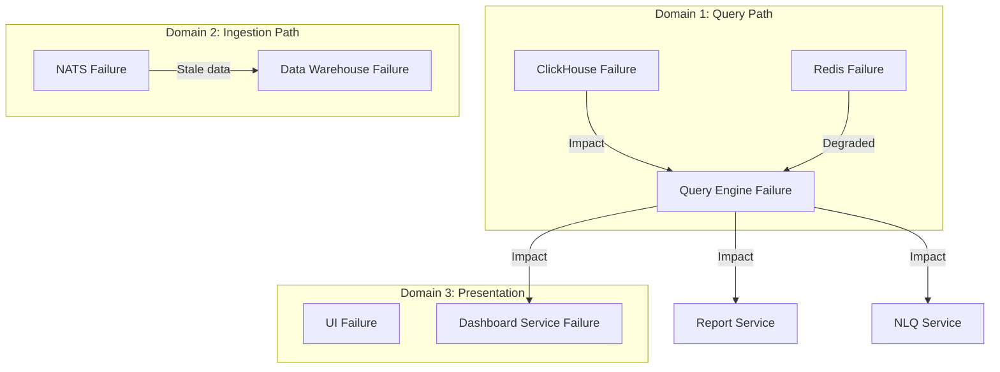

# ERP-BI Service Map

| Field | Value |
|---|---|
| Module | ERP-BI |
| Version | 1.0.0 |
| Last Updated | 2026-02-23 |

---

## 1. Service Topology

---

## 2. Service Registry

| Service | Port | Base Path | Health | Language | Replicas |
|---|---|---|---|---|---|
| dashboard-service | 8080 | /v1/dashboard | /healthz | Go 1.22 | 3 |
| report-service | 8081 | /v1/report | /healthz | Go 1.22 | 2 |
| data-modeling-service | 8082 | /v1/data-modeling | /healthz | Go 1.22 | 2 |
| query-engine | 8083 | /v1/query-engine | /healthz | Go 1.22 | 4 |
| data-warehouse-service | 8084 | /v1/data-warehouse | /healthz | Go 1.22 | 2 |
| alert-service | 8085 | /v1/alert | /healthz | Go 1.22 | 2 |
| nlq-service | 8086 | /v1/nlq | /healthz | Go 1.22 | 2 |
| nextjs-ui | 3000 | / | /api/health | TypeScript | 3 |

---

## 3. Service Dependencies

**Critical path**: Query Engine is the most critical service -- all consumer services depend on it. ClickHouse is the single OLAP data store.

---

## 4. Inter-Service Communication

| From | To | Protocol | Pattern |
|---|---|---|---|
| Dashboard Service | Query Engine | HTTP/REST | Synchronous |
| Report Service | Query Engine | HTTP/REST | Synchronous |
| NLQ Service | Query Engine | HTTP/REST | Synchronous |
| NLQ Service | ERP-AI | HTTP/REST | Synchronous |
| Alert Service | Query Engine | HTTP/REST | Synchronous |
| Data Warehouse Service | NATS | NATS protocol | Async (consumer) |
| Dashboard Service | NATS | NATS protocol | Async (publisher) |
| Report Service | NATS | NATS protocol | Async (publisher) |
| Alert Service | NATS | NATS protocol | Async (pub/sub) |
| All services | ERP-IAM | HTTP/REST | Synchronous (auth) |

---

## 5. Event Topics

| Topic | Publisher | Subscribers | Description |
|---|---|---|---|
| erp.bi.dashboard.created | Dashboard Service | Audit, Analytics | Dashboard created |
| erp.bi.dashboard.updated | Dashboard Service | Audit, Cache invalidation | Dashboard modified |
| erp.bi.dashboard.deleted | Dashboard Service | Audit, Cleanup | Dashboard removed |
| erp.bi.report.created | Report Service | Audit, Scheduler | Report definition created |
| erp.bi.report.executed | Report Service | Audit, Analytics | Report execution completed |
| erp.bi.alert.triggered | Alert Service | Notification dispatch | Alert condition met |
| erp.bi.data-warehouse.sync.completed | Data Warehouse Service | Cache invalidation, Reports | ETL batch completed |
| erp.bi.nlq.created | NLQ Service | Audit, Analytics | NLQ query executed |
| erp.{module}.{entity}.{action} | ERP Modules | Data Warehouse Service | CDC events |

---

## 6. Failure Domains

| Failure | Impact | Mitigation |
|---|---|---|
| ClickHouse down | All queries fail | Read replicas, circuit breaker, cached results |
| Redis down | Cache miss, higher latency | Bypass cache, direct ClickHouse query |
| NATS down | No new data ingestion | Buffer in DWS, replay on recovery |
| Query Engine down | Dashboards/reports/NLQ unavailable | Auto-scale, health-based routing |
| NLQ Service down | NLQ unavailable | Graceful degradation, manual query mode |
