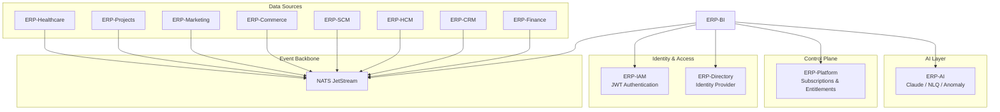
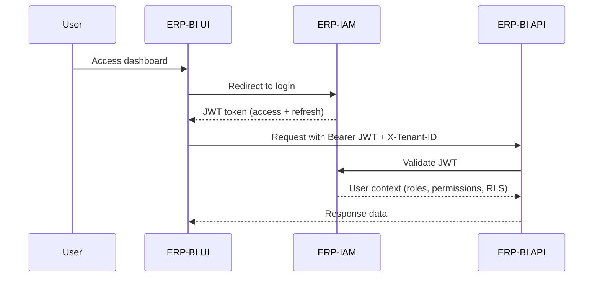
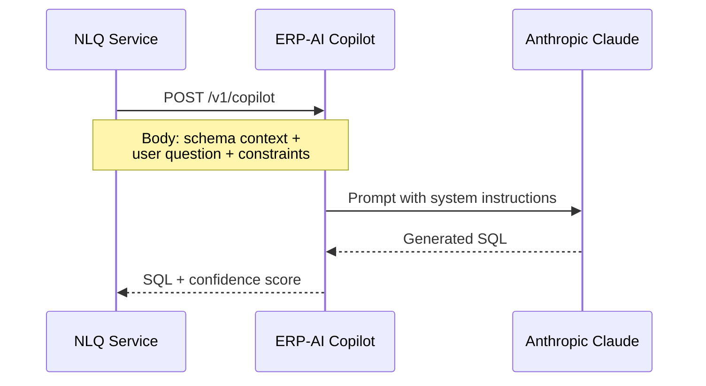

# ERP-BI Integration Guide

| Field | Value |
|---|---|
| Module | ERP-BI |
| Version | 1.0.0 |
| Last Updated | 2026-02-23 |

---

## 1. Overview

ERP-BI integrates with the entire ERP ecosystem. This guide covers integration patterns for consuming data from ERP modules, authenticating via ERP-IAM, leveraging ERP-AI for NLQ, and embedding dashboards in external applications.

---

## 2. Platform Integration Map



---

## 3. Authentication Integration

### 3.1 JWT Token Flow



### 3.2 Required Headers

| Header | Value | Required |
|---|---|---|
| Authorization | Bearer `<jwt_token>` | Yes |
| X-Tenant-ID | Tenant identifier | Yes |
| X-Request-ID | Correlation ID | Recommended |
| Accept | application/json | Recommended |

### 3.3 RLS Policy Binding

RLS policies are defined in ERP-IAM and applied by the Query Engine:

```json
{
  "policy": "department_filter",
  "type": "row_level_security",
  "condition": "department_id IN (:user_departments)",
  "applies_to": ["fact_sales", "fact_expenses"],
  "binding": "user.claims.departments"
}
```

---

## 4. CDC Data Integration

### 4.1 Subscribing to Module Events

The Data Warehouse Service subscribes to NATS JetStream subjects:

```
erp.finance.>       # All Finance events
erp.crm.>           # All CRM events
erp.hcm.>           # All HCM events
erp.scm.>           # All SCM events
erp.commerce.>       # All Commerce events
```

### 4.2 Event Contract

Every ERP module must publish CDC events in the canonical format:

```json
{
  "event_id": "string (UUID)",
  "event_type": "erp.{module}.{entity}.{action}",
  "tenant_id": "string",
  "timestamp": "ISO-8601",
  "version": "1.0",
  "payload": {},
  "metadata": {
    "source_module": "string",
    "source_entity": "string",
    "action": "created | updated | deleted",
    "correlation_id": "string"
  }
}
```

### 4.3 Adding a New Data Source

To integrate a new ERP module with ERP-BI:

1. **Register source**: Add module to Data Warehouse Service source registry
2. **Define schema mapping**: Map source entity fields to ClickHouse columns
3. **Configure transforms**: Set up type conversions, derivations, enrichments
4. **Create target tables**: Define ClickHouse fact/dimension tables
5. **Subscribe to events**: Add NATS subject filter
6. **Create semantic model**: Define measures, dimensions, hierarchies
7. **Build dashboards**: Create dashboards using the new model

---

## 5. ERP-AI Integration

### 5.1 NLQ via Claude

The NLQ Service calls ERP-AI's Copilot Service for text-to-SQL generation:



### 5.2 Anomaly Detection

ERP-BI includes a local statistical anomaly detection engine (Z-Score + IQR) for real-time metric monitoring. For advanced anomaly detection, it can also leverage ERP-AI's ML Pipeline Service.

---

## 6. Embedded Analytics

### 6.1 iframe Embedding

```html
<iframe
  src="https://bi.erp.example.com/embed/dashboard/dash_abc123?token=jwt_embed_token"
  width="100%"
  height="600"
  frameborder="0"
  allow="fullscreen"
></iframe>
```

### 6.2 White-Label Configuration

```json
{
  "branding": {
    "logo": "https://company.com/logo.svg",
    "primaryColor": "#1a73e8",
    "fontFamily": "Inter, sans-serif",
    "customDomain": "analytics.company.com",
    "hideNavigation": true,
    "hideExport": false
  }
}
```

---

## 7. Webhook Integration

### 7.1 Alert Webhooks

When an alert triggers, ERP-BI posts to configured webhook URLs:

```json
{
  "event": "alert.triggered",
  "alert_id": "alt_123",
  "alert_name": "Revenue Drop",
  "severity": "critical",
  "metric_value": 42000,
  "threshold": 50000,
  "timestamp": "2026-02-23T10:30:00Z",
  "dashboard_url": "https://bi.erp.example.com/dashboard/dash_abc123"
}
```

### 7.2 Report Delivery Webhooks

```json
{
  "event": "report.delivered",
  "report_id": "rpt_456",
  "execution_id": "exec_789",
  "format": "pdf",
  "download_url": "https://storage.erp.example.com/reports/exec_789.pdf",
  "expires_at": "2026-02-24T10:30:00Z"
}
```

---

## 8. Module Manifest

From `erp/module.manifest.yaml`:

```yaml
api_version: v1
module_id: erp_bi
repository: ERP-BI
sku: erp.bi
subscription:
  standalone: true
  suite: true
integration:
  control_plane: ERP-Platform
  identity_provider: ERP-Directory
  event_backbone: NATS
aidd:
  guardrails_file: erp/aidd.guardrails.yaml
```
