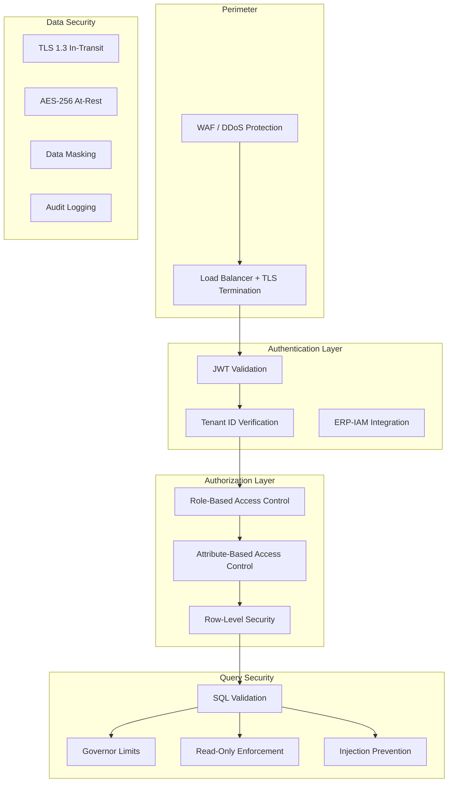
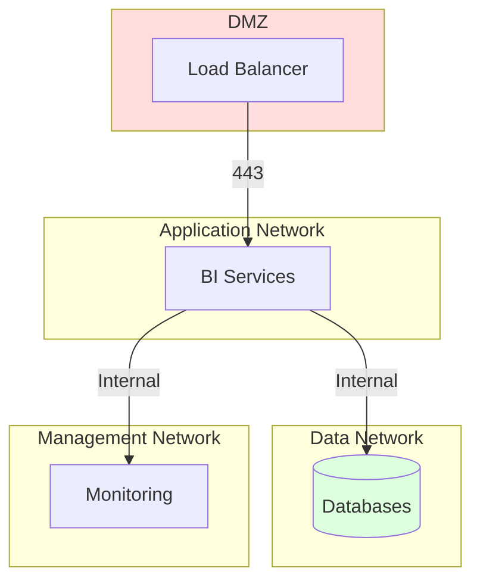

# ERP-BI Security Architecture

| Field | Value |
|---|---|
| Module | ERP-BI |
| Version | 1.0.0 |
| Last Updated | 2026-02-23 |

---

## 1. Security Model Overview



---

## 2. Authentication

### 2.1 JWT Validation
- Tokens issued by ERP-IAM with RS256 signing
- Token contains: `sub` (user ID), `tenant_id`, `roles[]`, `permissions[]`, `departments[]`
- Access token TTL: 15 minutes; Refresh token TTL: 7 days
- Token validation on every API request by the API gateway

### 2.2 Tenant Isolation
- `X-Tenant-ID` header required on all requests
- Validated against JWT `tenant_id` claim (must match)
- All database queries scoped by tenant_id
- Cross-tenant data access is architecturally impossible

---

## 3. Authorization

### 3.1 RBAC Roles

| Role | Dashboards | Reports | Data Models | Alerts | Admin |
|---|---|---|---|---|---|
| BI Viewer | View | View/Export | - | Subscribe | - |
| BI Analyst | View/Create | View/Create/Export | View | Create | - |
| BI Developer | Full CRUD | Full CRUD | Full CRUD | Full CRUD | - |
| BI Admin | Full CRUD | Full CRUD | Full CRUD | Full CRUD | Full |

### 3.2 Row-Level Security
- RLS policies defined in ERP-IAM, enforced by Query Engine
- Injected as WHERE clauses into every ClickHouse query
- Cannot be bypassed by any API or service call
- Examples: department filter, region filter, cost center filter

---

## 4. Data Security

### 4.1 Encryption
| Scope | Method |
|---|---|
| In transit (service-to-service) | mTLS with cert rotation |
| In transit (client-to-server) | TLS 1.3 |
| At rest (ClickHouse) | AES-256 disk encryption |
| At rest (PostgreSQL) | AES-256 disk encryption |
| At rest (Redis) | AES-256 encryption at rest |
| At rest (Object Storage) | Server-side encryption (SSE-S3) |

### 4.2 Data Masking
- PII fields can be masked based on user role
- Masking rules defined in semantic model
- Example: SSN shows as `***-**-1234` for non-admin roles

---

## 5. Query Security

### 5.1 NLQ SQL Validation
All SQL generated by NLQ undergoes:
1. **Whitelist check**: Only SELECT statements allowed
2. **Table access check**: Only authorized tables per semantic model
3. **Injection scan**: Parameterized queries, no string concatenation
4. **Cost estimation**: Reject queries exceeding cost threshold
5. **Tenant filter**: Automatic injection of tenant WHERE clause

### 5.2 Governor Limits
Prevent resource exhaustion and denial-of-service:
- Max rows per query: 1,000,000
- Max query time: 30 seconds
- Max concurrent queries per tenant: 50
- Max join depth: 5 tables

---

## 6. Audit Trail

All actions generate audit events published to NATS:

```json
{
  "event_type": "erp.bi.audit",
  "action": "dashboard.viewed",
  "user_id": "user_123",
  "tenant_id": "tenant_001",
  "resource": "dash_abc123",
  "ip_address": "192.168.1.100",
  "user_agent": "Mozilla/5.0...",
  "timestamp": "2026-02-23T10:00:00Z"
}
```

---

## 7. AIDD Compliance

ERP-BI enforces AIDD (AI-Driven Development) guardrails defined in `erp/aidd.guardrails.yaml`:
- NLQ queries are classified as supervised actions (human sees generated SQL)
- Anomaly detection alerts are classified as autonomous (auto-generated)
- No prohibited actions (no write operations on production data)

---

## 8. Network Security



- Kubernetes NetworkPolicies restrict inter-namespace traffic
- Services only accessible within cluster (no external ports exposed)
- Database access restricted to BI namespace only
- All egress traffic to external services (SMTP, Slack) via egress gateway
