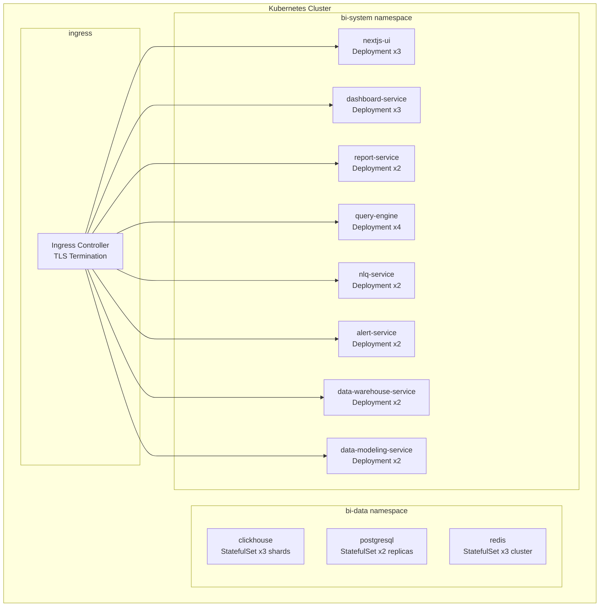
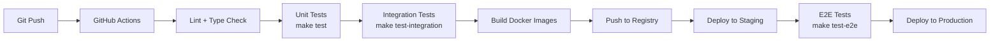

# ERP-BI Deployment Guide

| Field | Value |
|---|---|
| Module | ERP-BI |
| Version | 1.0.0 |
| Last Updated | 2026-02-23 |

---

## 1. Deployment Architecture



---

## 2. Prerequisites

| Component | Version | Purpose |
|---|---|---|
| Kubernetes | >= 1.28 | Container orchestration |
| Helm | >= 3.14 | Chart deployment |
| ClickHouse | >= 24.1 | OLAP engine |
| PostgreSQL | >= 16 | Metadata store |
| Redis | >= 7.2 | Cache layer |
| NATS | >= 2.10 | Event backbone |
| Go | >= 1.22 | Service runtime |
| Node.js | >= 20 LTS | Frontend build |

---

## 3. Environment Variables

| Variable | Service | Required | Description |
|---|---|---|---|
| PORT | All | No | Service port (default: 8080) |
| MODULE_NAME | All | No | Module identifier (default: ERP-BI) |
| DATABASE_URL | UI/Prisma | Yes | PostgreSQL connection string |
| CLICKHOUSE_URL | Query Engine, DWS | Yes | ClickHouse connection string |
| REDIS_URL | Query Engine | Yes | Redis connection string |
| NATS_URL | DWS, AS, DS, RS | Yes | NATS connection string |
| IAM_URL | All | Yes | ERP-IAM base URL |
| AI_URL | NLQ Service | Yes | ERP-AI base URL |
| S3_BUCKET | Report Service | Yes | Object storage bucket |
| SMTP_HOST | Alert Service | Yes | Email relay host |
| SLACK_WEBHOOK | Alert Service | No | Slack notification URL |

---

## 4. Docker Build

Each service has a Dockerfile. Build command:

```bash
# Build a specific service
docker build -t erp-bi/dashboard-service:latest -f services/dashboard-service/Dockerfile .

# Build all services
for svc in dashboard-service report-service data-modeling-service query-engine data-warehouse-service alert-service nlq-service; do
  docker build -t erp-bi/$svc:latest -f services/$svc/Dockerfile .
done

# Build frontend
docker build -t erp-bi/ui:latest -f Dockerfile.ui .
```

---

## 5. Kubernetes Deployment

### 5.1 Namespace Setup

```bash
kubectl create namespace bi-system
kubectl create namespace bi-data
```

### 5.2 Helm Values (example)

```yaml
replicaCount:
  dashboardService: 3
  reportService: 2
  dataModelingService: 2
  queryEngine: 4
  dataWarehouseService: 2
  alertService: 2
  nlqService: 2
  ui: 3

resources:
  queryEngine:
    requests:
      cpu: 500m
      memory: 1Gi
    limits:
      cpu: 2000m
      memory: 4Gi
  default:
    requests:
      cpu: 250m
      memory: 512Mi
    limits:
      cpu: 1000m
      memory: 2Gi

autoscaling:
  enabled: true
  minReplicas: 2
  maxReplicas: 10
  targetCPUUtilization: 70
```

### 5.3 Health Checks

All services expose `/healthz` for liveness and readiness probes:

```yaml
livenessProbe:
  httpGet:
    path: /healthz
    port: 8080
  initialDelaySeconds: 10
  periodSeconds: 15
readinessProbe:
  httpGet:
    path: /healthz
    port: 8080
  initialDelaySeconds: 5
  periodSeconds: 10
```

---

## 6. Database Initialization

### 6.1 PostgreSQL Schema

```bash
# Generate Prisma client
npm run db:generate

# Push schema to database
npm run db:push

# Seed demo data
npm run db:seed
```

### 6.2 ClickHouse Initialization

The Data Warehouse Service auto-creates schemas on first startup. Manual initialization:

```sql
CREATE DATABASE IF NOT EXISTS erp_bi ON CLUSTER '{cluster}';
-- Fact and dimension tables are created by DWS service
```

---

## 7. CI/CD Pipeline



---

## 8. Monitoring & Observability

| Tool | Purpose | Endpoint |
|---|---|---|
| Prometheus | Metrics collection | /metrics |
| Grafana | Dashboards | - |
| Loki | Log aggregation | - |
| OpenTelemetry | Distributed tracing | OTLP exporter |
| PagerDuty | Incident management | Webhook integration |

---

## 9. Rollback Procedure

```bash
# Check current revision
helm history erp-bi -n bi-system

# Rollback to previous version
helm rollback erp-bi <revision> -n bi-system

# Verify rollback
kubectl get pods -n bi-system
```

---

## 10. Scaling Guidelines

| Scenario | Action |
|---|---|
| High dashboard load | Scale query-engine replicas (4 -> 8) |
| Report generation backlog | Scale report-service replicas |
| CDC ingestion lag | Scale data-warehouse-service replicas |
| ClickHouse query latency | Add ClickHouse read replicas |
| Redis cache pressure | Scale Redis cluster nodes |
