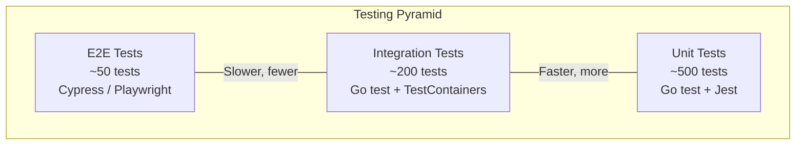
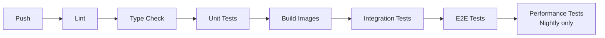

# ERP-BI Testing Strategy

| Field | Value |
|---|---|
| Module | ERP-BI |
| Version | 1.0.0 |
| Last Updated | 2026-02-23 |

---

## 1. Testing Pyramid

---

## 2. Unit Tests

### 2.1 Backend (Go)
- **Framework**: Go standard `testing` package
- **Command**: `make test`
- **Coverage target**: >= 80%
- **Scope**: Individual functions, handlers, transformations

| Service | Test Areas |
|---|---|
| Query Engine | SQL generation, cache key computation, governor enforcement |
| Dashboard Service | Widget layout validation, cross-filter resolution |
| Report Service | Parameter injection, scheduling logic |
| Data Modeling Service | Semantic model validation, RLS policy binding |
| Data Warehouse Service | CDC event parsing, schema mapping |
| Alert Service | Threshold evaluation, trend calculation |
| NLQ Service | Intent parsing, SQL validation, injection prevention |

### 2.2 Frontend (TypeScript)
- **Framework**: Jest + React Testing Library
- **Scope**: Component rendering, hooks, utility functions

| Component | Test Areas |
|---|---|
| KPICard | Rendering, change calculation, trend display |
| DataTable | Sorting, pagination, filtering |
| AIInsightCard | Severity badges, confidence display |
| Forecasting | linearRegression, detectSeasonality, holtSmoothing, generateForecast |
| Anomaly Detection | zScore, calcStats, detectAnomalies, predictMaintenance |

---

## 3. Integration Tests

- **Framework**: Go test with TestContainers
- **Command**: `make test-integration`
- **Scope**: Service-to-database, service-to-service

| Test Scenario | Services Involved | Dependencies |
|---|---|---|
| Dashboard CRUD lifecycle | Dashboard Service | PostgreSQL |
| Query execution pipeline | Query Engine | ClickHouse, Redis |
| CDC event ingestion | Data Warehouse Service | NATS, ClickHouse |
| Report generation | Report Service | Query Engine, S3 |
| Alert evaluation cycle | Alert Service | Query Engine |
| NLQ end-to-end | NLQ Service | ERP-AI mock, Query Engine |

---

## 4. E2E Tests

- **Framework**: Playwright / Cypress
- **Command**: `make test-e2e`
- **Scope**: Full user workflows through UI

| Test Scenario | Steps |
|---|---|
| Dashboard creation | Login -> New Dashboard -> Add widgets -> Save -> Verify |
| NLQ query | Login -> Open NLQ -> Type question -> Verify chart |
| Report scheduling | Create report -> Set schedule -> Trigger -> Verify delivery |
| Alert workflow | Create alert -> Trigger condition -> Verify notification |
| Cross-filtering | Open dashboard -> Click chart element -> Verify filter propagation |

---

## 5. Performance Tests

| Metric | Tool | Target |
|---|---|---|
| Dashboard load time | k6 | < 2s (p95) |
| Query latency (1B rows) | k6 | < 5s (p95) |
| NLQ response time | k6 | < 3s (p95) |
| Concurrent users | k6 | 10,000 |
| CDC throughput | Custom | 100,000 events/second |

---

## 6. AI-Specific Tests

### 6.1 Forecasting Accuracy
- Test with known time series datasets (M3 competition data)
- Verify MAPE < 20% on standard datasets
- Validate confidence interval coverage

### 6.2 Anomaly Detection Accuracy
- Test with injected anomalies in synthetic data
- Verify true positive rate > 90%
- Verify false positive rate < 5%

### 6.3 NLQ Accuracy
- Test suite of 100 natural language questions
- Verify SQL correctness > 90%
- Verify chart type suggestion accuracy > 85%

---

## 7. Test Data Management

### 7.1 Seed Data
The `prisma/seed.ts` file generates demo data including:
- Products with BOM structures
- Work orders across all statuses
- Work centers with machine metrics
- Quality records with AI predictions
- Demand forecasts with confidence intervals
- AI insights across all categories

### 7.2 Test Fixtures
- ClickHouse test fixtures loaded via SQL scripts
- NATS test events from JSON fixture files
- Redis test data seeded before integration tests

---

## 8. CI Test Pipeline

