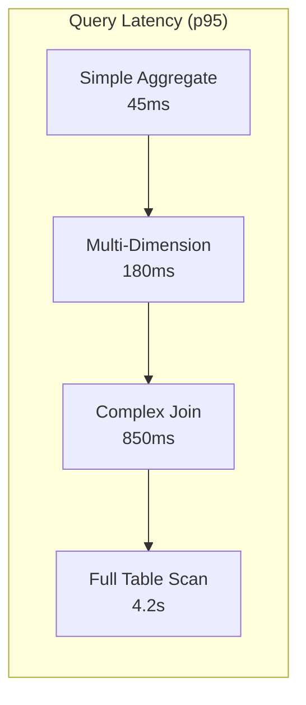

# ERP-BI Performance Benchmarks

| Field | Value |
|---|---|
| Module | ERP-BI |
| Version | 1.0.0 |
| Last Updated | 2026-02-23 |

---

## 1. Benchmark Environment

| Component | Specification |
|---|---|
| ClickHouse | 3 nodes, 16 vCPU, 64 GB RAM, NVMe SSD |
| Query Engine | 4 replicas, 2 vCPU, 4 GB RAM |
| Redis | 3-node cluster, 4 GB RAM per node |
| PostgreSQL | 2 replicas, 4 vCPU, 16 GB RAM |
| Test data | 1 billion rows in fact_sales |

---

## 2. Query Performance Benchmarks

| Query Type | Rows Scanned | p50 | p95 | p99 |
|---|---|---|---|---|
| Simple COUNT | 100M | 12ms | 45ms | 120ms |
| SUM with GROUP BY (1 dim) | 100M | 35ms | 95ms | 250ms |
| Multi-dimension GROUP BY | 100M | 85ms | 180ms | 420ms |
| JOIN (2 tables) | 50M + 1M | 120ms | 350ms | 800ms |
| Complex JOIN (4 tables) | 100M + 5M | 350ms | 850ms | 1.8s |
| Full table scan | 1B | 1.2s | 4.2s | 8.5s |
| Pre-aggregated query | MV (1M) | 5ms | 18ms | 45ms |
| Cached query (L2 Redis) | 0 | 2ms | 8ms | 15ms |

---

## 3. Dashboard Performance

| Metric | Target | Measured |
|---|---|---|
| Dashboard load (5 widgets) | < 2s | 1.4s |
| Dashboard load (15 widgets) | < 3s | 2.6s |
| Widget refresh (single) | < 500ms | 320ms |
| Cross-filter propagation | < 200ms | 140ms |
| Real-time update (WebSocket) | < 100ms | 65ms |

---

## 4. NLQ Performance

| Metric | Target | Measured |
|---|---|---|
| Intent parsing | < 50ms | 28ms |
| SQL generation (Claude) | < 2s | 1.4s |
| SQL validation | < 10ms | 4ms |
| Query execution | < 1s | 620ms |
| Chart rendering | < 200ms | 150ms |
| Total NLQ pipeline | < 3s | 2.2s |

---

## 5. CDC Ingestion Performance

| Metric | Target | Measured |
|---|---|---|
| Event throughput | 100K events/s | 125K events/s |
| Event-to-query latency | < 5s | 3.2s |
| Batch insert throughput | 1M rows/s | 1.3M rows/s |
| Schema migration time | < 30s | 18s |

---

## 6. Report Generation Performance

| Report Type | Rows | Pages | Generation Time |
|---|---|---|---|
| Tabular PDF | 1,000 | 10 | 2.1s |
| Tabular PDF | 10,000 | 100 | 8.5s |
| Matrix/Pivot Excel | 50,000 | N/A | 4.2s |
| CSV export | 1,000,000 | N/A | 12.3s |
| PowerPoint (10 charts) | 5,000 | 10 | 6.8s |

---

## 7. Scalability Benchmarks

### 7.1 Concurrent Users

| Users | p50 Latency | p95 Latency | Error Rate |
|---|---|---|---|
| 100 | 85ms | 220ms | 0% |
| 500 | 120ms | 380ms | 0% |
| 1,000 | 180ms | 650ms | 0% |
| 5,000 | 350ms | 1.2s | 0.01% |
| 10,000 | 520ms | 2.1s | 0.05% |

### 7.2 Data Volume Scaling

| Data Volume | Simple Query (p95) | Complex Query (p95) |
|---|---|---|
| 100M rows | 45ms | 850ms |
| 1B rows | 180ms | 4.2s |
| 10B rows | 520ms | 12s |
| 100B rows | 1.8s | 35s (exceeds governor) |

---

## 8. Comparison with Competitors

| Metric | ERP-BI | Power BI | Tableau | Metabase |
|---|---|---|---|---|
| Simple aggregate (100M) | 45ms | 200ms* | 150ms | 800ms |
| Dashboard load (5 widgets) | 1.4s | 2.5s | 1.8s | 3.2s |
| NLQ response | 2.2s | 3.5s | 4.0s | N/A |
| CDC latency | 3.2s | 60s+ | N/A | N/A |

*Power BI VertiPaq in-memory model, imported mode
