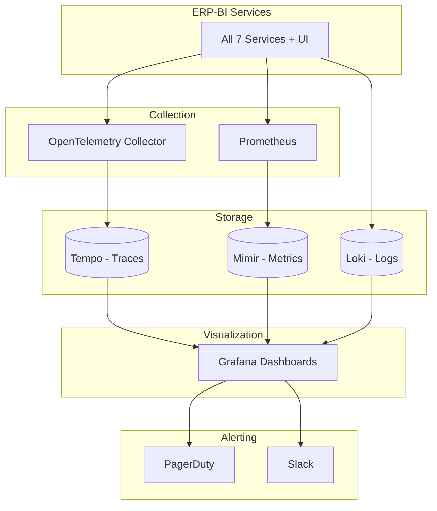
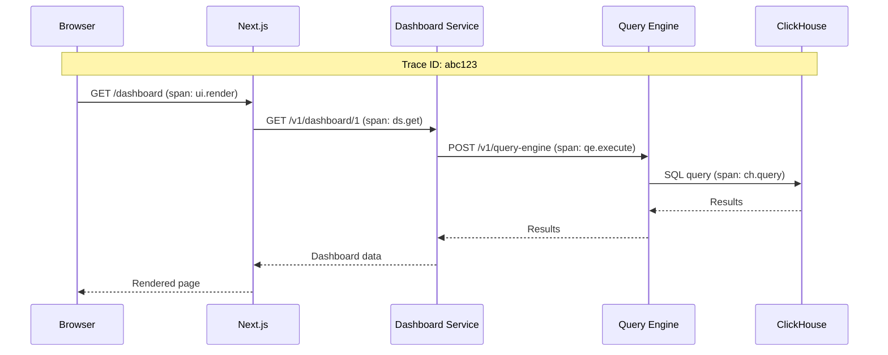

# ERP-BI Monitoring & Observability

| Field | Value |
|---|---|
| Module | ERP-BI |
| Version | 1.0.0 |
| Last Updated | 2026-02-23 |

---

## 1. Observability Stack



---

## 2. Key Metrics

### 2.1 Service-Level Indicators (SLIs)

| SLI | Description | Target (SLO) |
|---|---|---|
| Availability | % of successful health checks | 99.95% |
| Latency (dashboard) | p95 dashboard load time | < 2s |
| Latency (query) | p95 query execution time | < 5s |
| Latency (NLQ) | p95 NLQ pipeline time | < 3s |
| Error rate | % of 5xx responses | < 0.1% |
| Throughput | Requests per second | > 1,000 |

### 2.2 Business Metrics

| Metric | Description |
|---|---|
| Active dashboards | Count of dashboards accessed in last 7 days |
| NLQ success rate | % of NLQ queries returning valid results |
| Report delivery rate | % of scheduled reports delivered successfully |
| Alert accuracy | % of triggered alerts that were actionable |
| CDC freshness | Time since last successful sync per module |

### 2.3 Infrastructure Metrics

| Metric | Source | Alert Threshold |
|---|---|---|
| CPU utilization | Prometheus | > 80% for 5 min |
| Memory utilization | Prometheus | > 85% for 5 min |
| ClickHouse query queue | ClickHouse metrics | > 50 queued queries |
| Redis memory | Redis INFO | > 90% of maxmemory |
| NATS consumer lag | NATS metrics | > 10,000 pending messages |
| Disk usage (ClickHouse) | Node exporter | > 80% capacity |

---

## 3. Distributed Tracing

### 3.1 Trace Context Propagation



### 3.2 Span Attributes

| Attribute | Description |
|---|---|
| `bi.service` | Service name |
| `bi.tenant_id` | Tenant identifier |
| `bi.query_id` | Query identifier |
| `bi.cache_hit` | L1/L2/miss |
| `bi.rows_returned` | Row count |
| `bi.execution_time_ms` | Query execution time |

---

## 4. Logging Standards

### 4.1 Log Format

```json
{
  "timestamp": "2026-02-23T10:00:00Z",
  "level": "info",
  "service": "query-engine",
  "module": "ERP-BI",
  "trace_id": "abc123",
  "tenant_id": "tenant_001",
  "message": "Query executed successfully",
  "fields": {
    "query_id": "qry_456",
    "execution_time_ms": 142,
    "rows_returned": 1000,
    "cache_hit": false
  }
}
```

### 4.2 Log Levels

| Level | Usage |
|---|---|
| debug | Detailed diagnostic information |
| info | Normal operations (query executed, dashboard loaded) |
| warn | Degraded performance, approaching limits |
| error | Failed operations, service errors |

---

## 5. Alerting Rules

| Alert | Condition | Severity | Channel |
|---|---|---|---|
| Service Down | Health check fails for 2 min | Critical | PagerDuty |
| High Latency | p95 > 5s for 5 min | Warning | Slack |
| Error Spike | Error rate > 1% for 5 min | Critical | PagerDuty |
| ClickHouse Overloaded | Queue > 100 for 3 min | Warning | Slack |
| CDC Lag | Lag > 5 min | Warning | Slack |
| Disk Full | > 90% | Critical | PagerDuty |
| Cache Failure | Redis unreachable for 1 min | Warning | Slack |

---

## 6. Grafana Dashboards

| Dashboard | Panels | Purpose |
|---|---|---|
| BI Overview | Service health, request rate, error rate, latency | Operational overview |
| Query Performance | Query latency histogram, cache hit ratio, ClickHouse metrics | Query optimization |
| CDC Pipeline | Event throughput, lag, error rate, quality scores | Data freshness |
| NLQ Analytics | Success rate, latency breakdown, popular queries | NLQ quality |
| Alert Monitoring | Alert trigger rate, notification delivery, escalations | Alert effectiveness |
| Report Delivery | Execution count, delivery success, rendering time | Report health |
