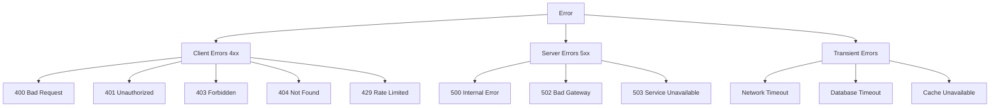
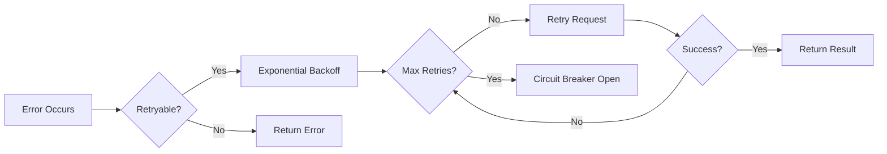

# ERP-BI Error Handling Guide

| Field | Value |
|---|---|
| Module | ERP-BI |
| Version | 1.0.0 |
| Last Updated | 2026-02-23 |

---

## 1. Error Handling Philosophy

ERP-BI follows a defensive error handling strategy: fail fast on invalid input, retry on transient failures, degrade gracefully on dependency failures, and always provide meaningful error messages to clients.

---

## 2. Error Classification



---

## 3. Error Response Format

All errors follow a consistent JSON format:

```json
{
  "error": {
    "code": "QUERY_TIMEOUT",
    "message": "Query exceeded maximum execution time of 30 seconds",
    "details": {
      "query_id": "qry_abc123",
      "execution_time_ms": 30012,
      "limit_ms": 30000
    },
    "trace_id": "trace_xyz789",
    "timestamp": "2026-02-23T10:00:00Z"
  }
}
```

---

## 4. Service-Specific Error Handling

### 4.1 Query Engine Errors

| Error Code | HTTP Status | Cause | Handling |
|---|---|---|---|
| QUERY_TIMEOUT | 408 | ClickHouse query exceeded time limit | Return partial results if available, suggest adding filters |
| GOVERNOR_EXCEEDED | 429 | Rate limit or concurrent query limit | Queue request, return retry-after header |
| INVALID_MODEL | 400 | Referenced semantic model not found | Return model suggestions |
| CH_UNAVAILABLE | 503 | ClickHouse cluster unreachable | Return cached result, circuit breaker |
| CACHE_FAILURE | 200 (degraded) | Redis unavailable | Bypass cache, direct query |

### 4.2 NLQ Errors

| Error Code | HTTP Status | Cause | Handling |
|---|---|---|---|
| NLQ_PARSE_FAILURE | 400 | Cannot understand natural language input | Suggest rephrased queries |
| NLQ_SQL_INVALID | 422 | Generated SQL fails validation | Retry with rephrased prompt |
| NLQ_SQL_UNSAFE | 403 | Generated SQL contains prohibited operations | Block and log |
| AI_UNAVAILABLE | 503 | ERP-AI service unreachable | Return suggestion to use manual query |

### 4.3 Data Warehouse Errors

| Error Code | HTTP Status | Cause | Handling |
|---|---|---|---|
| CDC_PARSE_ERROR | N/A | Cannot parse CDC event | Send to dead letter queue |
| SCHEMA_MISMATCH | N/A | Source schema changed unexpectedly | Alert, pause ingestion |
| QUALITY_CHECK_FAIL | N/A | Data quality below threshold | Quarantine data, alert |

---

## 5. Retry Strategy



| Dependency | Max Retries | Base Delay | Max Delay | Circuit Breaker Threshold |
|---|---|---|---|---|
| ClickHouse | 3 | 100ms | 5s | 5 failures in 30s |
| Redis | 1 | 0ms | 0ms | Bypass (no retry) |
| NATS | 5 | 200ms | 10s | 10 failures in 60s |
| ERP-AI | 1 | 0ms | 0ms | 3 failures in 30s |
| S3 | 3 | 500ms | 5s | 5 failures in 60s |

---

## 6. Graceful Degradation

| Dependency Failure | Degraded Behavior |
|---|---|
| ClickHouse read replicas down | Route to primary (higher latency) |
| All ClickHouse down | Serve from Redis cache (stale data) |
| Redis down | Direct ClickHouse queries (slower) |
| ERP-AI down | NLQ unavailable, manual queries still work |
| NATS down | No new data, existing data queryable |
| S3 down | Reports generated but not downloadable |

---

## 7. Dead Letter Queue

Failed CDC events and failed notifications are routed to a dead letter queue:

```json
{
  "original_event": { ... },
  "error": "Schema mismatch: expected 'amount' (Float64), got String",
  "failed_at": "2026-02-23T10:00:00Z",
  "retry_count": 5,
  "service": "data-warehouse-service",
  "tenant_id": "tenant_001"
}
```

DLQ events are monitored and can be replayed after the root cause is resolved.
