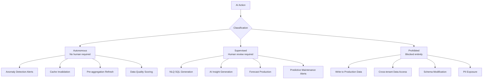
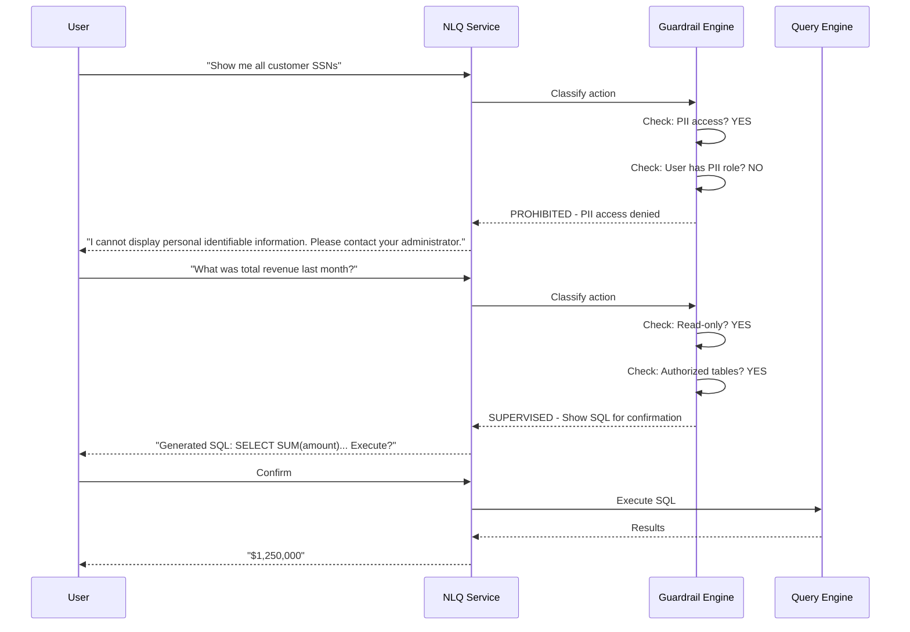

# ERP-BI AIDD Guardrails

| Field | Value |
|---|---|
| Module | ERP-BI |
| Version | 1.0.0 |
| Policy File | erp/aidd.guardrails.yaml |
| Last Updated | 2026-02-23 |

---

## 1. AIDD Framework Overview

AI-Driven Development (AIDD) guardrails ensure that all AI-powered features in ERP-BI operate within safe, auditable, and compliant boundaries. Every AI action is classified into one of three categories.



---

## 2. Action Classification

### 2.1 Autonomous Actions

These actions execute without human intervention:

| Action | Risk Level | Monitoring |
|---|---|---|
| Anomaly score computation | Low | Logged, sampled audit |
| Alert evaluation and notification | Low | Full audit trail |
| Cache population/invalidation | Low | Metrics only |
| Pre-aggregation table refresh | Low | Execution log |
| Data quality score computation | Low | Quality dashboard |

### 2.2 Supervised Actions

These actions require human review before execution:

| Action | Review Mechanism | Timeout |
|---|---|---|
| NLQ: Generated SQL execution | User sees SQL before execution | 30s user confirmation |
| AI Insights: Displayed to user | User marks as read/actioned | No timeout |
| Demand forecasts: Published | Analyst review before distribution | 24h review window |
| Maintenance predictions: Escalated | Maintenance team review | 4h escalation |

### 2.3 Prohibited Actions

These actions are architecturally blocked:

| Action | Enforcement |
|---|---|
| Write operations on ERP module data | Query Engine enforces SELECT-only |
| Cross-tenant data access | Tenant ID filter in every query |
| DDL operations via NLQ | SQL validation rejects DDL |
| Exposing raw PII to NLQ | Data masking in semantic model |
| Modifying ClickHouse schema via API | No DDL endpoints exposed |

---

## 3. NLQ Guardrails



---

## 4. Bias and Fairness

| Concern | Mitigation |
|---|---|
| Forecast bias toward historical patterns | Regular MAPE evaluation, ensemble methods |
| Anomaly detection false positives | Configurable sensitivity, human review |
| NLQ favoring certain query patterns | Diverse training examples, fairness testing |
| Alert fatigue from over-triggering | Escalation policies, de-duplication |

---

## 5. Explainability

Every AI-generated output includes:
- **Confidence score**: 0-1 scale indicating model certainty
- **Method attribution**: Which algorithm or model produced the result
- **Input summary**: What data was used to generate the output
- **Reasoning trace**: For NLQ, the generated SQL is shown to the user

---

## 6. Compliance Audit

All AI actions are logged to the NATS audit stream:

```json
{
  "event_type": "erp.bi.aidd.audit",
  "action": "nlq.sql_generated",
  "classification": "supervised",
  "user_id": "user_123",
  "tenant_id": "tenant_001",
  "input": "What was total revenue last month?",
  "output": "SELECT SUM(amount) FROM fact_sales WHERE...",
  "confidence": 0.94,
  "approved": true,
  "timestamp": "2026-02-23T10:00:00Z"
}
```

Audit logs are retained for 7 years per compliance requirements.
