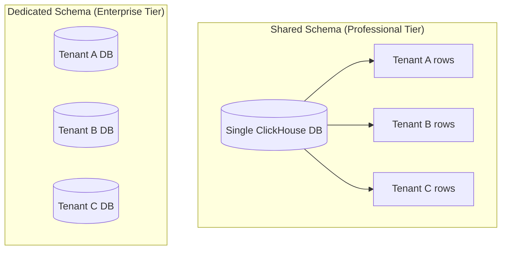
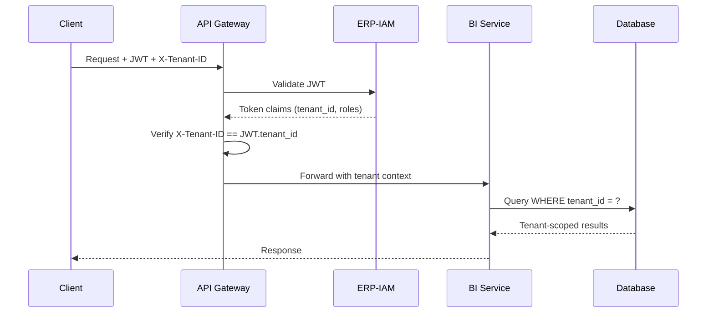
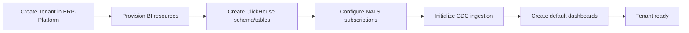

# ERP-BI Multi-Tenancy Architecture

| Field | Value |
|---|---|
| Module | ERP-BI |
| Version | 1.0.0 |
| Last Updated | 2026-02-23 |

---

## 1. Tenancy Model

ERP-BI supports two multi-tenancy models depending on the subscription tier:



---

## 2. Tenant Isolation Mechanisms

| Layer | Shared Schema | Dedicated Schema |
|---|---|---|
| ClickHouse | `tenant_id` column filter | Separate database |
| PostgreSQL | `tenant_id` column filter | Separate schema |
| Redis | Key prefix `{tenant_id}:` | Separate Redis DB |
| NATS | Subject filter `erp.{tenant_id}.*` | Separate stream |
| Object Storage | Prefix `{tenant_id}/` | Separate bucket |

---

## 3. Request Flow with Tenant Context



---

## 4. Tenant-Scoped Caching

Cache keys are always namespaced by tenant:

```
{tenant_id}:{service}:{resource}:{hash}

Example:
tenant_001:query-engine:model_sales:abc123def456
```

Cache eviction is per-tenant. One tenant's cache operations never affect another.

---

## 5. Resource Limits per Tenant

| Resource | Free | Professional | Enterprise |
|---|---|---|---|
| Dashboards | 5 | 50 | Unlimited |
| Reports | 10 | 100 | Unlimited |
| Scheduled reports | 2 | 20 | Unlimited |
| Alert rules | 5 | 50 | Unlimited |
| NLQ queries/day | 20 | 200 | Unlimited |
| Data storage | 1 GB | 100 GB | 10 TB |
| Users | 5 | 50 | Unlimited |
| API rate (req/min) | 60 | 300 | 1,000 |

---

## 6. Tenant Onboarding



---

## 7. Tenant Data Deletion

When a tenant is decommissioned:
1. Stop CDC ingestion for tenant
2. Delete all ClickHouse data (DROP TABLE or DELETE WHERE tenant_id)
3. Delete PostgreSQL metadata
4. Purge Redis cache keys
5. Delete Object Storage files
6. Publish `erp.bi.tenant.decommissioned` event
7. Retain audit logs per retention policy
