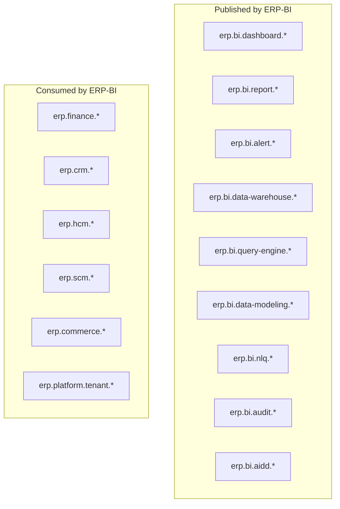

# ERP-BI Event Catalog

| Field | Value |
|---|---|
| Module | ERP-BI |
| Backbone | NATS JetStream |
| Version | 1.0.0 |
| Last Updated | 2026-02-23 |

---

## 1. Event Topology

---

## 2. Published Events

### 2.1 Dashboard Events

| Event | Payload | Publisher |
|---|---|---|
| erp.bi.dashboard.created | `{id, name, tenant_id, created_by}` | Dashboard Service |
| erp.bi.dashboard.updated | `{id, changes, tenant_id, updated_by}` | Dashboard Service |
| erp.bi.dashboard.deleted | `{id, tenant_id, deleted_by}` | Dashboard Service |
| erp.bi.dashboard.listed | `{tenant_id, count, filters}` | Dashboard Service |
| erp.bi.dashboard.read | `{id, tenant_id, user_id}` | Dashboard Service |

### 2.2 Report Events

| Event | Payload |
|---|---|
| erp.bi.report.created | `{id, name, type, schedule}` |
| erp.bi.report.updated | `{id, changes}` |
| erp.bi.report.deleted | `{id}` |
| erp.bi.report.executed | `{id, execution_id, format, rows, duration_ms}` |
| erp.bi.report.delivered | `{id, execution_id, channel, recipient}` |

### 2.3 Alert Events

| Event | Payload |
|---|---|
| erp.bi.alert.created | `{id, name, type, condition}` |
| erp.bi.alert.triggered | `{id, name, severity, metric_value, threshold}` |
| erp.bi.alert.acknowledged | `{id, acknowledged_by, timestamp}` |
| erp.bi.alert.escalated | `{id, level, escalated_to}` |
| erp.bi.alert.resolved | `{id, resolved_by, resolution}` |

### 2.4 Data Warehouse Events

| Event | Payload |
|---|---|
| erp.bi.data-warehouse.sync.started | `{source, entities, mode}` |
| erp.bi.data-warehouse.sync.completed | `{source, rows_ingested, duration_ms}` |
| erp.bi.data-warehouse.sync.failed | `{source, error, retry_count}` |
| erp.bi.data-warehouse.quality.scored | `{source, entity, score, issues}` |

### 2.5 NLQ Events

| Event | Payload |
|---|---|
| erp.bi.nlq.created | `{question, generated_sql, confidence, user_id}` |
| erp.bi.nlq.executed | `{question, rows_returned, duration_ms}` |
| erp.bi.nlq.failed | `{question, error, suggestion}` |

### 2.6 Audit Events

| Event | Payload |
|---|---|
| erp.bi.audit.action | `{action, user_id, tenant_id, resource, ip, timestamp}` |
| erp.bi.aidd.audit | `{action, classification, input, output, confidence, approved}` |

---

## 3. Consumed Events

### 3.1 CDC Events (Data Warehouse Service)

| Source | Events | Processing |
|---|---|---|
| ERP-Finance | `erp.finance.invoice.*`, `erp.finance.payment.*`, `erp.finance.journal.*` | Transform to fact_revenue, fact_expenses |
| ERP-CRM | `erp.crm.lead.*`, `erp.crm.opportunity.*`, `erp.crm.account.*` | Transform to fact_pipeline, dim_customer |
| ERP-HCM | `erp.hcm.employee.*`, `erp.hcm.payroll.*` | Transform to fact_workforce |
| ERP-SCM | `erp.scm.purchase_order.*`, `erp.scm.inventory.*` | Transform to fact_procurement |
| ERP-Commerce | `erp.commerce.order.*`, `erp.commerce.product.*` | Transform to fact_sales |

### 3.2 Platform Events

| Source | Events | Processing |
|---|---|---|
| ERP-Platform | `erp.platform.tenant.created` | Provision BI resources |
| ERP-Platform | `erp.platform.tenant.deleted` | Decommission BI resources |
| ERP-Platform | `erp.platform.subscription.changed` | Update tier limits |

---

## 4. Event Schema Version

All events include a `version` field. ERP-BI supports:
- Version 1.0: Current format
- Forward compatibility: Unknown fields are ignored
- Backward compatibility: Missing optional fields use defaults
