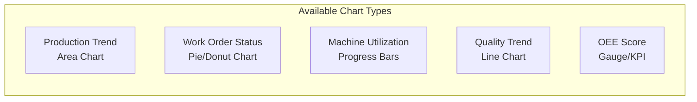

# ERP-BI User Guide

| Field | Value |
|---|---|
| Module | ERP-BI |
| Audience | End Users, Analysts, Managers |
| Version | 1.0.0 |
| Last Updated | 2026-02-23 |

---

## 1. Getting Started

### 1.1 Accessing ERP-BI

1. Navigate to your organization's ERP portal
2. Click **Business Intelligence** in the left navigation
3. You will see the Manufacturing Dashboard as the default landing page

### 1.2 Navigation

The sidebar provides access to all BI sections:
- **Dashboard**: Main KPI overview
- **Products**: Product catalog and BOM
- **Work Orders**: Production order management
- **Shop Floor**: Machine monitoring
- **Capacity**: Capacity planning
- **Quality**: Quality control records
- **AI Insights**: AI-generated recommendations
- **BOM**: Bill of Materials explorer
- **Settings**: User preferences

---

## 2. Dashboard Features

### 2.1 KPI Cards

The dashboard displays real-time KPI cards showing:
- **Active Work Orders**: Count with month-over-month change
- **Machine Utilization**: Average utilization percentage
- **Production Output**: Units produced this month
- **Quality Rate**: Pass rate percentage
- **AI Alerts**: Active alerts with severity breakdown

### 2.2 Charts

### 2.3 Cross-Filtering

Click on any chart element to filter all other widgets on the same dashboard. For example, clicking "Electronics" in a category pie chart will filter all other charts to show only Electronics data.

### 2.4 Drill-Down

Click on aggregated values to drill down into detail. The breadcrumb navigation shows your drill-down path and lets you navigate back to any level.

---

## 3. Natural Language Querying (NLQ)

### 3.1 How to Use NLQ

1. Click the NLQ icon (chat bubble) in the header
2. Type your question in plain English
3. Review the generated SQL (for supervised mode)
4. Click "Execute" to run the query
5. View the automatically selected chart visualization

### 3.2 Example Questions

- "What were the top 10 products by revenue last quarter?"
- "Show me monthly production trends for the past year"
- "Which work centers have utilization below 70%?"
- "What is the average defect rate by product category?"
- "How many work orders are overdue?"

### 3.3 Tips for Better Results

- Be specific about time periods ("last month", "Q4 2025")
- Name the metrics you want ("revenue", "quantity", "defect rate")
- Specify groupings ("by department", "by product category")
- Use comparison language ("compare", "vs", "top 10", "bottom 5")

---

## 4. Reports

### 4.1 Creating a Report

1. Navigate to **Reports** section
2. Click **New Report**
3. Select report type (Tabular, Matrix, Free-form)
4. Choose a data source (semantic model)
5. Drag dimensions and measures into the report layout
6. Add parameters for dynamic filtering
7. Preview and save

### 4.2 Scheduling Reports

1. Open the report configuration
2. Click **Schedule**
3. Set the cron schedule (e.g., "Every Monday at 8 AM")
4. Choose delivery channels (Email, Slack, Webhook)
5. Select export format (PDF, Excel, CSV, PowerPoint)
6. Save the schedule

### 4.3 Exporting Reports

Click the export button and choose your format:
- **PDF**: Formatted document with charts
- **Excel**: Spreadsheet with data and pivot tables
- **CSV**: Raw data for further analysis
- **PowerPoint**: Presentation-ready slides

---

## 5. Alerts

### 5.1 Creating an Alert

1. Navigate to **Alerts** section
2. Click **New Alert**
3. Choose alert type:
   - **Threshold**: Trigger when metric crosses a value
   - **Anomaly**: AI detects unusual patterns
   - **Trend**: Metric trending up/down over time
4. Configure the condition and notification channels
5. Set escalation rules if needed
6. Activate the alert

### 5.2 Receiving Notifications

Alerts are delivered via:
- In-app notification bell
- Email with alert details and dashboard link
- Slack message in configured channel
- Webhook POST to configured URL

---

## 6. AI Insights

The AI Insights panel shows automatically generated recommendations:

| Severity | Meaning |
|---|---|
| INFO | Informational observation |
| WARNING | Requires attention |
| CRITICAL | Immediate action needed |
| OPPORTUNITY | Potential improvement identified |

Each insight includes:
- **Title**: Brief summary
- **Description**: Detailed explanation with data
- **Confidence**: AI model certainty (0-100%)
- **Category**: Type of insight (Demand Forecast, Anomaly, etc.)

---

## 7. OEE (Overall Equipment Effectiveness)

The OEE dashboard shows three components:
- **Availability**: Uptime vs scheduled time
- **Performance**: Actual output vs theoretical capacity
- **Quality**: Good units vs total units produced

OEE Score = Availability x Performance x Quality

World-class OEE target: > 85%
