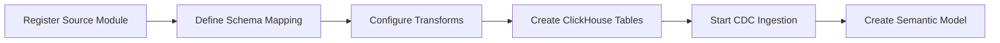
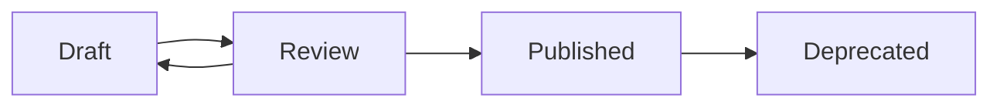

# ERP-BI Administration Guide

| Field | Value |
|---|---|
| Module | ERP-BI |
| Audience | BI Administrators |
| Version | 1.0.0 |
| Last Updated | 2026-02-23 |

---

## 1. Admin Responsibilities

BI Administrators manage data governance, user access, data source configuration, report distribution, alert management, and system health monitoring.

---

## 2. Data Source Management

### 2.1 Adding Data Sources



### 2.2 Monitoring Data Freshness

The admin dashboard shows last sync time per data source:

| Source Module | Last Sync | Status | Lag |
|---|---|---|---|
| ERP-Finance | 2 min ago | Healthy | 0 |
| ERP-CRM | 5 min ago | Healthy | 0 |
| ERP-HCM | 3 min ago | Healthy | 0 |
| ERP-SCM | 15 min ago | Warning | 10 min |

---

## 3. User & Role Management

### 3.1 Role Assignment

Assign roles via ERP-IAM integration:

| Role | Capabilities |
|---|---|
| BI Viewer | View dashboards, view/export reports |
| BI Analyst | Create dashboards, create reports, use NLQ |
| BI Developer | Full CRUD on all resources, semantic model editing |
| BI Admin | All developer capabilities + admin functions |

### 3.2 Row-Level Security Configuration

1. Navigate to Settings > Security
2. Define RLS policies mapping IAM attributes to data filters
3. Test RLS with the policy tester (simulate user context)
4. Apply to semantic models

---

## 4. Semantic Model Administration

### 4.1 Model Lifecycle



### 4.2 Best Practices

- Use business-friendly names for measures and dimensions
- Document every calculated field with examples
- Test RLS policies before publishing
- Version models (do not modify published models in-place)

---

## 5. Report Administration

### 5.1 Report Distribution Management

- View all scheduled reports across the organization
- Pause/resume schedules
- Monitor delivery success rates
- Configure retry policies for failed deliveries

### 5.2 Storage Management

- Reports stored in object storage with configurable retention
- Default retention: 90 days
- Archive policy: Move to cold storage after 30 days

---

## 6. Alert Administration

### 6.1 Global Alert Policies

- Set maximum alerts per tenant to prevent alert fatigue
- Configure de-duplication windows (suppress identical alerts)
- Manage escalation chains
- Review alert effectiveness metrics

### 6.2 Alert Suppression

During planned maintenance or known events, suppress alerts:

```json
{
  "suppression": {
    "start": "2026-03-01T00:00:00Z",
    "end": "2026-03-01T06:00:00Z",
    "reason": "Planned ClickHouse maintenance",
    "scope": ["all"]
  }
}
```

---

## 7. ClickHouse Administration

### 7.1 Table Management

| Task | Command |
|---|---|
| Check table sizes | `SELECT table, formatReadableSize(total_bytes) FROM system.tables` |
| Optimize table | `OPTIMIZE TABLE fact_sales FINAL` |
| Check partitions | `SELECT partition FROM system.parts WHERE table = 'fact_sales'` |
| Drop old partitions | `ALTER TABLE fact_sales DROP PARTITION '202401'` |

### 7.2 Performance Tuning

- Monitor `system.query_log` for slow queries
- Create materialized views for frequently queried aggregations
- Adjust partition granularity based on query patterns
- Use `SAMPLE` for approximate queries on very large tables

---

## 8. Backup & Recovery

| Component | Backup Method | Frequency | Retention |
|---|---|---|---|
| PostgreSQL | pg_dump | Daily | 30 days |
| ClickHouse | clickhouse-backup | Daily | 14 days |
| Redis | RDB snapshots | Hourly | 7 days |
| Object Storage | Cross-region replication | Continuous | 90 days |
| NATS | JetStream file-based persistence | Continuous | 7 days |

---

## 9. Troubleshooting

| Issue | Diagnosis | Resolution |
|---|---|---|
| Dashboard not loading | Check Query Engine health, ClickHouse status | Restart Query Engine, check ClickHouse logs |
| Stale data | Check CDC ingestion lag | Restart Data Warehouse Service, check NATS |
| NLQ not working | Check ERP-AI connectivity | Verify AI_URL, check ERP-AI health |
| Alert not firing | Check Alert Service health, verify rule config | Review alert condition, check schedule |
| Report delivery failure | Check SMTP/Slack configuration | Test notification channels, check credentials |
