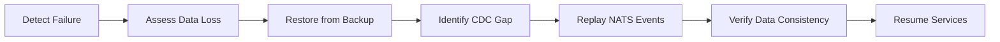

# ERP-BI Disaster Recovery Plan

| Field | Value |
|---|---|
| Module | ERP-BI |
| RPO | 1 hour |
| RTO | 4 hours |
| Last Updated | 2026-02-23 |

---

## 1. Recovery Objectives

| Metric | Target |
|---|---|
| Recovery Point Objective (RPO) | 1 hour (maximum data loss) |
| Recovery Time Objective (RTO) | 4 hours (time to restore) |
| Minimum Service Level | Dashboard viewing (read-only, cached data) |

---

## 2. Backup Strategy

```mermaid
graph TB
    subgraph "Continuous"
        NATS[NATS JetStream<br/>File-based persistence<br/>7-day retention]
        S3[Object Storage<br/>Cross-region replication]
    end

    subgraph "Hourly"
        Redis[Redis RDB Snapshots]
    end

    subgraph "Daily"
        PG[PostgreSQL pg_dump]
        CH[ClickHouse Backup]
    end

    subgraph "Weekly"
        FULL[Full system backup<br/>(all components)]
    end
```

---

## 3. Failure Scenarios

### 3.1 Single Service Failure

| Scenario | Impact | Recovery | RTO |
|---|---|---|---|
| Query Engine pod crash | Auto-restart by Kubernetes | Automatic (liveness probe) | < 30s |
| Report Service failure | Reports delayed | Pod restart + queue replay | < 2 min |
| NLQ Service failure | NLQ unavailable | Pod restart | < 1 min |

### 3.2 Data Store Failure

| Scenario | Impact | Recovery | RTO |
|---|---|---|---|
| ClickHouse node failure | Degraded read performance | Replica promotion | < 5 min |
| ClickHouse cluster failure | All queries fail | Restore from backup + CDC replay | < 4 hours |
| PostgreSQL failure | Metadata unavailable | Replica promotion or restore | < 15 min |
| Redis cluster failure | Cache miss, higher latency | Auto-rebuild from ClickHouse | < 5 min |

### 3.3 Infrastructure Failure

| Scenario | Impact | Recovery | RTO |
|---|---|---|---|
| Single AZ failure | Partial service disruption | Multi-AZ failover | < 10 min |
| Region failure | Complete service outage | Cross-region DR activation | < 4 hours |
| NATS failure | No CDC, no events | NATS cluster recovery | < 5 min |

---

## 4. Recovery Procedures

### 4.1 ClickHouse Full Recovery



1. Restore latest ClickHouse backup
2. Identify timestamp of last backup
3. Replay NATS JetStream events from backup timestamp
4. Verify row counts match expected values
5. Re-enable Query Engine connections
6. Invalidate Redis cache

### 4.2 PostgreSQL Recovery

1. Promote read replica to primary (if available)
2. Or restore from latest pg_dump
3. Regenerate Prisma client
4. Restart all services that use PostgreSQL

### 4.3 Full System Recovery (Region Failure)

1. Activate DR region infrastructure
2. Restore PostgreSQL from cross-region backup
3. Restore ClickHouse from cross-region backup
4. Replay NATS events from persistent storage
5. Update DNS to point to DR region
6. Verify all services healthy
7. Resume CDC ingestion

---

## 5. Testing Schedule

| Test Type | Frequency | Scope |
|---|---|---|
| Backup verification | Weekly | Restore to test environment |
| Service failover | Monthly | Kill random service, verify recovery |
| Data store failover | Quarterly | Simulate ClickHouse/PostgreSQL failure |
| Full DR drill | Annually | Complete region failover |

---

## 6. Communication Plan

| Event | Notify | Channel | Timeline |
|---|---|---|---|
| Service degradation | Engineering team | Slack #bi-incidents | Immediate |
| Data store failure | Engineering + PM | Slack + PagerDuty | Within 5 min |
| Region failure | All stakeholders | Slack + Email + Status page | Within 15 min |
| Recovery complete | All stakeholders | Slack + Email + Status page | Upon completion |
