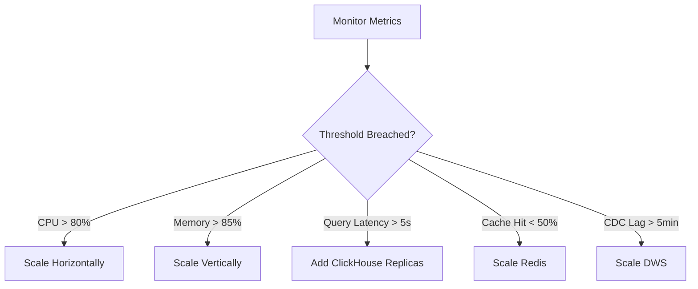

# ERP-BI Capacity Planning Guide

| Field | Value |
|---|---|
| Module | ERP-BI |
| Version | 1.0.0 |
| Last Updated | 2026-02-23 |

---

## 1. Resource Sizing Matrix

### 1.1 Small Deployment (< 100 users, < 10 GB data)

| Component | Instances | CPU | Memory | Storage |
|---|---|---|---|---|
| ClickHouse | 1 | 4 vCPU | 16 GB | 100 GB SSD |
| PostgreSQL | 1 | 2 vCPU | 8 GB | 50 GB |
| Redis | 1 | 1 vCPU | 4 GB | N/A |
| Query Engine | 2 | 500m | 1 GB | N/A |
| Other Services | 1 each | 250m | 512 MB | N/A |
| Next.js UI | 2 | 500m | 1 GB | N/A |

### 1.2 Medium Deployment (100-1,000 users, 10-100 GB data)

| Component | Instances | CPU | Memory | Storage |
|---|---|---|---|---|
| ClickHouse | 3 (cluster) | 8 vCPU | 32 GB | 500 GB NVMe |
| PostgreSQL | 2 (primary + replica) | 4 vCPU | 16 GB | 100 GB |
| Redis | 3 (cluster) | 2 vCPU | 8 GB | N/A |
| Query Engine | 4 | 1 vCPU | 2 GB | N/A |
| Other Services | 2 each | 500m | 1 GB | N/A |
| Next.js UI | 3 | 1 vCPU | 2 GB | N/A |

### 1.3 Large Deployment (1,000-10,000 users, 100 GB-10 TB data)

| Component | Instances | CPU | Memory | Storage |
|---|---|---|---|---|
| ClickHouse | 6 (2 shards x 3 replicas) | 16 vCPU | 64 GB | 2 TB NVMe |
| PostgreSQL | 3 (primary + 2 replicas) | 8 vCPU | 32 GB | 500 GB |
| Redis | 6 (cluster) | 4 vCPU | 16 GB | N/A |
| Query Engine | 8 | 2 vCPU | 4 GB | N/A |
| Other Services | 3 each | 1 vCPU | 2 GB | N/A |
| Next.js UI | 5 | 2 vCPU | 4 GB | N/A |

---

## 2. Scaling Triggers

| Metric | Threshold | Action |
|---|---|---|
| Query Engine CPU | > 80% for 5 min | Add 2 replicas |
| ClickHouse query queue | > 50 pending | Add read replica |
| Redis memory | > 85% of max | Scale cluster |
| CDC consumer lag | > 5 min | Scale DWS replicas |
| Report generation queue | > 20 pending | Scale Report Service |

---

## 3. Storage Growth Projections

| Data Volume | Monthly Growth | 1-Year Projection | 3-Year Projection |
|---|---|---|---|
| Small (10 GB) | 2 GB/month | 34 GB | 82 GB |
| Medium (100 GB) | 20 GB/month | 340 GB | 820 GB |
| Large (1 TB) | 100 GB/month | 2.2 TB | 4.6 TB |

**Mitigation**: ClickHouse compression (typically 10:1), partition TTL (drop old partitions), cold storage tiering.

---

## 4. Cost Estimation

| Tier | Monthly Infrastructure Cost | Per-User Cost |
|---|---|---|
| Small | $500-$1,000 | $10-$20/user |
| Medium | $2,000-$5,000 | $5-$10/user |
| Large | $10,000-$25,000 | $2-$5/user |

Significantly lower than external BI tools (Power BI Premium: $4,995/month, Tableau: $70/user/month).
