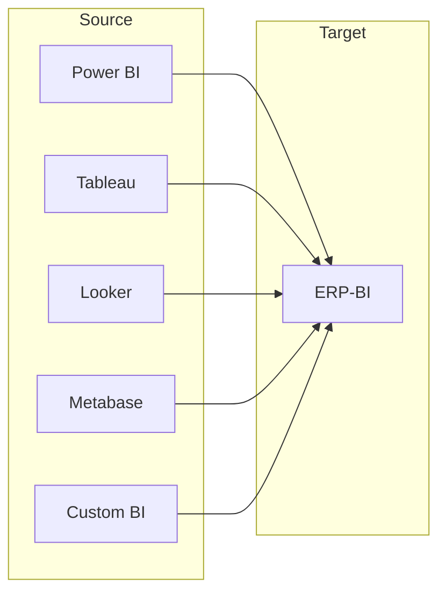
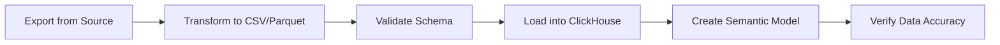

# ERP-BI Migration Guide

| Field | Value |
|---|---|
| Module | ERP-BI |
| Version | 1.0.0 |
| Last Updated | 2026-02-23 |

---

## 1. Migration Scenarios



---

## 2. Migration from Power BI

### 2.1 Data Model Migration

| Power BI Concept | ERP-BI Equivalent |
|---|---|
| Dataset (Import mode) | ClickHouse fact/dimension tables |
| Dataset (DirectQuery) | ClickHouse with query pass-through |
| Composite model | Semantic model with blending |
| DAX measures | Calculated fields (SQL expressions) |
| Relationships | Join definitions in semantic model |
| RLS roles | ERP-IAM RLS policies |

### 2.2 Report Migration

| Power BI Feature | ERP-BI Equivalent |
|---|---|
| Power BI Desktop reports | Dashboard Builder |
| Paginated Reports (SSRS) | Report Builder |
| Power BI dashboards | Dashboard with pinned widgets |
| Bookmarks | Saved filter states |
| Drill-through | Drill-down with navigation |

### 2.3 Migration Steps

1. Export Power BI dataset definitions (TMDL format)
2. Map tables to ClickHouse schema
3. Convert DAX measures to SQL expressions
4. Recreate RLS policies in ERP-IAM
5. Rebuild reports in ERP-BI Report Builder
6. Rebuild dashboards in Dashboard Builder
7. Migrate scheduled refreshes to CDC pipeline
8. Migrate subscriptions to alert/delivery system
9. Parallel run for validation
10. Cutover

---

## 3. Migration from Tableau

### 3.1 Concept Mapping

| Tableau Concept | ERP-BI Equivalent |
|---|---|
| Tableau Server/Cloud | ERP-BI platform |
| Workbook | Dashboard |
| Worksheet | Widget |
| Data Source | Semantic model |
| Extract (.hyper) | ClickHouse tables |
| Calculated field | Calculated field |
| Parameters | Report/Dashboard parameters |
| Tableau Prep | Data Warehouse Service (ETL) |

---

## 4. Migration from Looker

### 4.1 Concept Mapping

| Looker Concept | ERP-BI Equivalent |
|---|---|
| LookML project | Semantic model |
| LookML view | Dimension/measure definition |
| LookML explore | Semantic model join graph |
| Derived table (PDT) | Materialized view |
| Look | Saved query with visualization |
| Dashboard | Dashboard |
| Schedule | Report schedule |

---

## 5. Data Migration

### 5.1 Historical Data Import



### 5.2 Bulk Import Commands

```bash
# Import CSV to ClickHouse
clickhouse-client --query="INSERT INTO fact_sales FORMAT CSV" < sales_data.csv

# Import Parquet
clickhouse-client --query="INSERT INTO fact_sales FORMAT Parquet" < sales_data.parquet
```

---

## 6. Validation Checklist

| Check | Method |
|---|---|
| Row counts match | Compare COUNT(*) between source and target |
| Aggregate values match | Compare SUM/AVG on key metrics |
| Dashboard visuals match | Side-by-side screenshot comparison |
| RLS policies work | Test with different user roles |
| Scheduled reports deliver | Trigger test execution |
| Alert rules fire | Inject test data that triggers alerts |
| NLQ works on migrated data | Test 20 standard questions |

---

## 7. Rollback Plan

If migration validation fails:
1. Keep source BI system running in parallel
2. Route users back to source system
3. Investigate discrepancies
4. Fix and re-migrate
5. Re-validate

Recommended parallel run period: 2-4 weeks.
