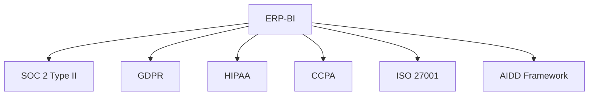

# ERP-BI Compliance Matrix

| Field | Value |
|---|---|
| Module | ERP-BI |
| Version | 1.0.0 |
| Last Updated | 2026-02-23 |

---

## 1. Regulatory Compliance

---

## 2. SOC 2 Type II Controls

| Control | Implementation |
|---|---|
| CC1: Control Environment | RBAC roles, documented policies |
| CC2: Communication | Audit logging, event catalog |
| CC3: Risk Assessment | AIDD guardrails, governor limits |
| CC5: Control Activities | JWT auth, RLS, tenant isolation |
| CC6: Logical Access | ERP-IAM integration, MFA |
| CC7: System Operations | Health checks, monitoring, alerting |
| CC8: Change Management | CI/CD pipeline, version control |
| CC9: Risk Mitigation | DR plan, backups, encryption |

---

## 3. GDPR Compliance

| Requirement | Implementation |
|---|---|
| Right to Access | Data export via report builder |
| Right to Erasure | Tenant data deletion procedure |
| Data Minimization | Semantic model controls what data is exposed |
| Purpose Limitation | RLS restricts access to authorized data |
| Data Protection | AES-256 encryption, TLS 1.3 |
| Breach Notification | Alert service with escalation |
| DPO Contact | Configured in platform settings |
| Cross-border Transfer | Data residency controls per tenant |

---

## 4. HIPAA Compliance (Healthcare tenants)

| Safeguard | Implementation |
|---|---|
| Access Control | ERP-IAM RBAC + ABAC |
| Audit Controls | Full audit trail via NATS |
| Integrity Controls | Data quality monitoring, checksums |
| Transmission Security | TLS 1.3, mTLS |
| PHI Handling | Data masking in semantic models |
| BAA | Available for enterprise tier |

---

## 5. Data Residency

| Region | ClickHouse Location | PostgreSQL Location | Compliance |
|---|---|---|---|
| US | us-east-1 | us-east-1 | SOC 2, CCPA |
| EU | eu-west-1 | eu-west-1 | GDPR, SOC 2 |
| APAC | ap-southeast-1 | ap-southeast-1 | Local regulations |

---

## 6. AIDD Compliance Audit

| Audit Point | Frequency | Evidence |
|---|---|---|
| AI action classification | Continuous | AIDD audit events |
| NLQ SQL validation | Every query | Validation logs |
| Anomaly detection accuracy | Monthly | Precision/recall metrics |
| Bias assessment | Quarterly | Fairness reports |
| Guardrails effectiveness | Quarterly | Prohibited action block rate |

---

## 7. Data Retention

| Data Type | Retention | After Retention |
|---|---|---|
| Analytical data (ClickHouse) | Configurable (default: 5 years) | Partition drop |
| Metadata (PostgreSQL) | Unlimited | N/A |
| Cache (Redis) | TTL-based (minutes) | Auto-eviction |
| Reports (Object Storage) | 90 days | Deletion |
| Audit logs | 7 years | Archive to cold storage |
| NATS events | 7 days (stream) | Auto-purge |
