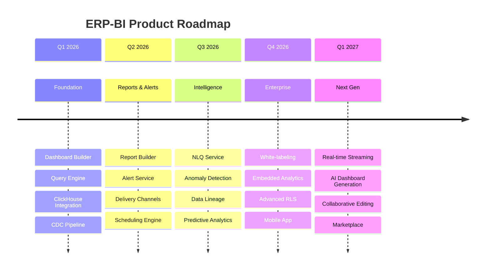

# ERP-BI Product Roadmap

| Field | Value |
|---|---|
| Module | ERP-BI |
| Version | 1.0.0 |
| Last Updated | 2026-02-23 |

---

## 1. Roadmap Vision

---

## 2. Q1 2026 -- Foundation (Current)

| Feature | Status | Owner |
|---|---|---|
| Dashboard Builder (drag-and-drop) | Shipped | Frontend Team |
| 30+ chart types | Shipped | Frontend Team |
| Query Engine with ClickHouse | Shipped | Platform Team |
| CDC Pipeline (all ERP modules) | Shipped | Data Team |
| PostgreSQL metadata layer | Shipped | Backend Team |
| Prisma schema and seed data | Shipped | Backend Team |
| Health check endpoints | Shipped | All Teams |
| Multi-tenant isolation | Shipped | Platform Team |

---

## 3. Q2 2026 -- Reports & Alerts

| Feature | Priority | Effort |
|---|---|---|
| Paginated report designer | P0 | Large |
| Matrix/pivot tables | P0 | Medium |
| Sub-report embedding | P1 | Medium |
| Report scheduling (cron) | P0 | Medium |
| Email/Slack/webhook delivery | P0 | Medium |
| PDF/Excel/CSV/PowerPoint export | P0 | Large |
| Threshold-based alerts | P0 | Medium |
| AI anomaly detection alerts | P0 | Medium |
| Trend-based alerts | P1 | Small |
| Escalation policies | P1 | Small |

---

## 4. Q3 2026 -- Intelligence

| Feature | Priority | Effort |
|---|---|---|
| NLQ: text to SQL via Claude | P0 | Large |
| NLQ: auto chart suggestion | P0 | Medium |
| Full data lineage graph | P1 | Large |
| Data quality monitoring | P1 | Medium |
| Enhanced anomaly detection (ML) | P1 | Large |
| Demand forecasting improvements | P2 | Medium |

---

## 5. Q4 2026 -- Enterprise

| Feature | Priority | Effort |
|---|---|---|
| Full white-labeling | P1 | Large |
| Embedded analytics (iframe + SDK) | P1 | Large |
| Advanced RLS (column-level, dynamic) | P1 | Medium |
| Dashboard versioning | P2 | Medium |
| Report bursting | P2 | Medium |
| Mobile-native experience | P2 | Large |

---

## 6. Q1 2027 -- Next Generation

| Feature | Priority | Effort |
|---|---|---|
| Real-time streaming dashboards | P1 | Large |
| AI-generated dashboards (from NLQ) | P1 | Large |
| Collaborative dashboard editing | P2 | Medium |
| Dashboard marketplace / templates | P2 | Medium |
| Custom visualization SDK | P2 | Large |
| Geo-spatial analytics | P2 | Large |

---

## 7. Competitive Gap Closure Timeline

| Gap vs. Competitor | Target Close Date |
|---|---|
| Power BI Q&A parity | Q3 2026 (NLQ launch) |
| Tableau Prep parity | Q1 2026 (CDC pipeline) |
| Looker LookML parity | Q2 2026 (semantic layer) |
| Power BI Composite model | Q2 2026 (data blending) |
| Tableau mobile | Q4 2026 (mobile app) |
