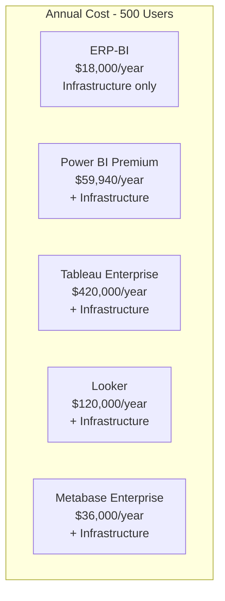

# ERP-BI Cost Analysis

| Field | Value |
|---|---|
| Module | ERP-BI |
| Version | 1.0.0 |
| Last Updated | 2026-02-23 |

---

## 1. Total Cost of Ownership (TCO) vs. Alternatives

### 1.1 Annual Cost Comparison (500 Users)

### 1.2 Detailed Breakdown

| Cost Category | ERP-BI | Power BI | Tableau | Looker | Metabase |
|---|---|---|---|---|---|
| Licensing | $0 (included) | $59,940 | $420,000 | $120,000 | $36,000 |
| Infrastructure | $18,000 | $12,000 | $15,000 | $10,000 | $8,000 |
| Integration/Connectors | $0 (native) | $15,000 | $20,000 | $15,000 | $10,000 |
| Admin FTE (0.5) | $50,000 | $50,000 | $60,000 | $60,000 | $40,000 |
| Training | $5,000 | $10,000 | $15,000 | $20,000 | $5,000 |
| **Total Annual** | **$73,000** | **$146,940** | **$530,000** | **$225,000** | **$99,000** |
| **Per User/Month** | **$12.17** | **$24.49** | **$88.33** | **$37.50** | **$16.50** |

---

## 2. Infrastructure Cost Breakdown

### 2.1 Medium Deployment (500 users, 100 GB data)

| Component | Monthly Cost |
|---|---|
| ClickHouse Cluster (3 nodes) | $800 |
| PostgreSQL (2 replicas) | $200 |
| Redis Cluster (3 nodes) | $150 |
| Kubernetes cluster (services) | $300 |
| Object Storage (S3) | $25 |
| NATS (shared with platform) | $0 (allocated) |
| CDN / Load Balancer | $50 |
| Monitoring (Grafana Cloud) | $75 |
| **Total Monthly** | **$1,600** |
| **Total Annual** | **$19,200** |

### 2.2 Scaling Cost Model

| Users | Data Volume | Monthly Infra | Annual Infra |
|---|---|---|---|
| 50 | 10 GB | $500 | $6,000 |
| 500 | 100 GB | $1,600 | $19,200 |
| 5,000 | 1 TB | $5,000 | $60,000 |
| 50,000 | 10 TB | $15,000 | $180,000 |

---

## 3. ROI Analysis

### 3.1 Cost Savings vs. Power BI (500 users)

| Category | Annual Saving |
|---|---|
| License elimination | $59,940 |
| Reduced integration cost | $15,000 |
| Reduced admin overhead | $0 |
| Faster time-to-insight (productivity) | $25,000 est. |
| **Total Annual Saving** | **$99,940** |
| **3-Year ROI** | **411%** |

### 3.2 Cost Savings vs. Tableau (500 users)

| Category | Annual Saving |
|---|---|
| License elimination | $420,000 |
| Reduced integration cost | $20,000 |
| Reduced admin overhead | $10,000 |
| **Total Annual Saving** | **$450,000** |
| **3-Year ROI** | **1,849%** |

---

## 4. Build vs. Buy Justification

| Factor | Build (ERP-BI) | Buy (External) |
|---|---|---|
| Upfront development | $500K (one-time) | $0 |
| Annual licensing | $0 | $60K-$420K |
| Integration maintenance | $0 (native) | $15K-$20K/year |
| Feature alignment | 100% ERP-focused | Generic BI |
| Data freshness | Real-time CDC | Batch/hourly |
| Tenant isolation | Native | Bolted-on |
| Break-even | 12-18 months | N/A |

---

## 5. Hidden Cost Savings

| Hidden Cost (External BI) | ERP-BI Eliminates |
|---|---|
| Gateway/connector maintenance | Zero-config native access |
| Data duplication storage | CDC incremental only |
| Security re-implementation | RLS from ERP-IAM |
| Separate admin training | Unified ERP admin |
| Vendor lock-in risk | Open standards |
