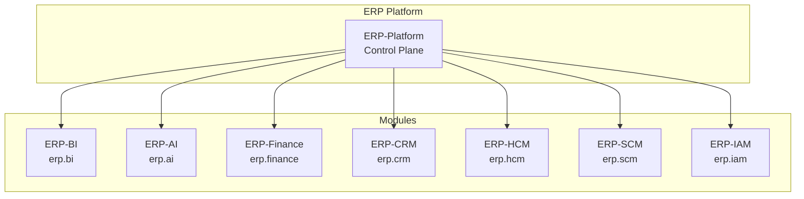

# ERP-BI Module Manifest Documentation

| Field | Value |
|---|---|
| Module | ERP-BI |
| Version | 1.0.0 |
| Last Updated | 2026-02-23 |

---

## 1. Manifest Definition

The module manifest at `erp/module.manifest.yaml` defines ERP-BI's identity and integration contracts within the ERP platform:

```yaml
api_version: v1
module_id: erp_bi
repository: ERP-BI
sku: erp.bi
subscription:
  standalone: true
  suite: true
integration:
  control_plane: ERP-Platform
  identity_provider: ERP-Directory
  event_backbone: NATS
aidd:
  guardrails_file: erp/aidd.guardrails.yaml
```

---

## 2. Field Descriptions

| Field | Value | Description |
|---|---|---|
| api_version | v1 | Manifest schema version |
| module_id | erp_bi | Unique module identifier across the ERP platform |
| repository | ERP-BI | Source repository name |
| sku | erp.bi | Billing SKU for subscription management |
| subscription.standalone | true | Can be purchased independently |
| subscription.suite | true | Included in the ERP suite bundle |
| integration.control_plane | ERP-Platform | Central control plane for entitlements |
| integration.identity_provider | ERP-Directory | Identity/authentication provider |
| integration.event_backbone | NATS | Messaging infrastructure |
| aidd.guardrails_file | erp/aidd.guardrails.yaml | AIDD policy configuration |

---

## 3. Module Identity in the ERP Ecosystem



---

## 4. Subscription Models

### 4.1 Standalone Mode
- Customer purchases ERP-BI independently
- Connects to any data source via API
- Limited CDC without other ERP modules
- Full feature set available

### 4.2 Suite Mode
- Included in the ERP suite subscription
- Automatic CDC from all licensed ERP modules
- Shared authentication via ERP-IAM
- Cross-module analytics out of the box

---

## 5. Integration Contracts

### 5.1 ERP-Platform Contract
- Receives subscription entitlements and tier limits
- Reports usage metrics for billing
- Participates in tenant lifecycle events

### 5.2 ERP-Directory Contract
- Delegates authentication to ERP-Directory
- Receives JWT tokens with user claims
- Binds RLS policies to directory attributes

### 5.3 NATS Event Contract
- Publishes events on `erp.bi.*` subjects
- Consumes events from `erp.{module}.*` subjects
- Uses JetStream for durable delivery

### 5.4 AIDD Contract
- All AI features governed by `erp/aidd.guardrails.yaml`
- Audit events published for compliance
- Classification enforced at service boundaries

---

## 6. Service Registry

| Service | Docker Image | Helm Chart | Port |
|---|---|---|---|
| dashboard-service | erp-bi/dashboard-service | charts/bi/dashboard | 8080 |
| report-service | erp-bi/report-service | charts/bi/report | 8081 |
| data-modeling-service | erp-bi/data-modeling-service | charts/bi/data-modeling | 8082 |
| query-engine | erp-bi/query-engine | charts/bi/query-engine | 8083 |
| data-warehouse-service | erp-bi/data-warehouse-service | charts/bi/data-warehouse | 8084 |
| alert-service | erp-bi/alert-service | charts/bi/alert | 8085 |
| nlq-service | erp-bi/nlq-service | charts/bi/nlq | 8086 |
| nextjs-ui | erp-bi/ui | charts/bi/ui | 3000 |

---

## 7. Dependencies

| Dependency | Type | Required |
|---|---|---|
| ERP-Platform | Control plane | Yes |
| ERP-IAM / ERP-Directory | Identity | Yes |
| NATS JetStream | Messaging | Yes |
| ClickHouse | OLAP database | Yes |
| PostgreSQL | Metadata database | Yes |
| Redis | Cache | Yes (degraded without) |
| ERP-AI | NLQ / Anomaly | No (NLQ degraded without) |
| S3-compatible storage | Report storage | Yes |
| SMTP relay | Email delivery | No (email disabled without) |
