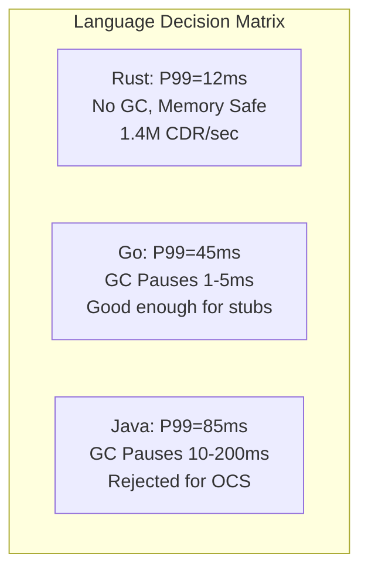

# ADR-001: Rust as Primary Language for BSS/OSS Platform
> Version: 1.0 | Last Updated: 2026-02-23 | Status: Accepted
> Classification: Internal | Author: AIDD System

---

## Status

Accepted

## Context

The ERP-BSS-OSS platform requires a language capable of:
- Sub-millisecond latency for real-time Online Charging System (OCS) operations
- Processing 1.4M+ CDRs per second in the mediation pipeline
- Zero-downtime operation (no garbage collection pauses during billing runs)
- Compile-time prevention of financial calculation errors
- Memory safety without runtime overhead

Candidate languages evaluated: Rust, Go, Java, C++, Erlang/Elixir.

## Decision

Use **Rust** as the primary language for all performance-critical services and shared crates. Use **Go** as a secondary language for lightweight microservice stubs that may later be rewritten in Rust.

## Rationale

1. **No GC pauses:** The OCS charging engine must respond in < 1ms. Java/Go GC pauses of 1-200ms are unacceptable for real-time balance operations.
2. **Type-safe financial math:** `rust_decimal` crate with `i64` cents prevents floating-point rounding errors that cause billing inaccuracies.
3. **Ownership model:** Prevents data races in concurrent balance modifications at compile time.
4. **Performance:** Axum on Tokio achieves 167K TPS, exceeding the 150K TPS target.
5. **Small binaries:** Distroless container images under 30 MB reduce attack surface and deployment time.

## Consequences

### Positive
- Best-in-class performance for telecom workloads
- Compile-time correctness guarantees
- Small, secure container images

### Negative
- Smaller talent pool than Java/Go
- Longer compile times (mitigated by incremental compilation and sccache)
- Steeper learning curve for new team members (mitigated by Go stubs as entry point)

## Alternatives Considered

| Language | Rejected Reason |
|----------|----------------|
| Java | GC pauses unacceptable for OCS; memory overhead |
| Go | GC pauses marginal for OCS; no `rust_decimal` equivalent |
| C++ | Memory safety issues; no modern package manager |
| Erlang/Elixir | Performance insufficient for CDR mediation volume |
