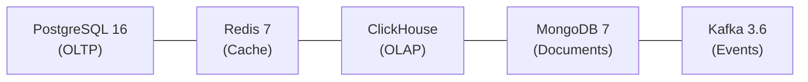

# ADR-002: Polyglot Persistence Strategy
> Version: 1.0 | Last Updated: 2026-02-23 | Status: Accepted
> Classification: Internal | Author: AIDD System

---

## Status

Accepted

## Context

A telecom BSS/OSS platform has fundamentally different data access patterns across its domains:
- **OLTP:** Customer, order, and billing records require ACID transactions
- **Cache:** Balance lookups and rate limiting require sub-millisecond latency
- **OLAP:** CDR analytics and revenue reports require columnar aggregation over billions of rows
- **Documents:** Audit logs and network alarms have variable schemas
- **Events:** Domain events require durable, ordered, replayable streams

A single database cannot optimally serve all these patterns.

## Decision

Adopt a polyglot persistence strategy with five data technologies:

| Database | Use Case | Access Pattern |
|----------|----------|---------------|
| PostgreSQL 16 | Customers, orders, invoices, balances, inventory | ACID transactions, complex queries |
| Redis 7 | Balance cache, session store, rate limiter, distributed locks | Key-value, sub-millisecond |
| ClickHouse | CDR analytics, revenue reports, churn indicators | Columnar aggregation, billions of rows |
| MongoDB 7 | Audit logs, network alarms, dynamic configuration | Flexible schema, append-heavy |
| Kafka 3.6 | Domain events, CDR pipeline | Ordered, durable, replayable streams |

## Rationale

1. **PostgreSQL for OLTP:** ACID compliance mandatory for financial transactions (billing, payments). SQLx compile-time query checking prevents SQL errors. Migration path to YugabyteDB for distributed SQL.
2. **Redis for caching:** Balance lookups at 0.3ms (vs 5ms PostgreSQL). Supports distributed locking for concurrent balance modifications.
3. **ClickHouse for analytics:** Processes CDR aggregation queries over billions of rows in seconds. MergeTree engine with partition pruning.
4. **MongoDB for documents:** Flexible schema for network alarms (varying attributes per vendor). Append-only audit collections.
5. **Kafka for events:** Durable event log with replay capability. Consumer groups enable independent scaling per service.

## Consequences

### Positive
- Each workload uses the optimal database technology
- Independent scaling of OLTP, cache, and analytics layers
- No single point of failure

### Negative
- Increased operational complexity (5 database technologies to manage)
- Eventual consistency between PostgreSQL and ClickHouse (acceptable for analytics)
- Team must maintain expertise across multiple databases

## Migration Path

- PostgreSQL -> YugabyteDB (wire-compatible, distributed SQL)
- Redis -> DragonflyDB (wire-compatible, higher throughput)
- Kafka -> Redpanda (wire-compatible, simpler operations)
